# **Access control**

## **Access control là gì?**

- Kiểm soát truy cập (hoặc ủy quyền) là việc áp dụng các ràng buộc về việc ai có thể thực hiện các hành động đã cố gắng hoặc truy cập tài nguyên mà họ đã request. Trong ngữ cảnh của các ứng dụng web, kiểm soát truy cập phụ thuộc vào xác thực và quản lý phiên:
  - `Authentication`: Xác thực xác định người dùng và xác nhận rằng đúng là họ đang yêu cầu.
  - `Session management`: Quản lý phiên xác định những request HTTP tiếp theo được thực hiện bởi cùng người dùng đó.
  - `Access control`: Kiểm soát truy cập xác định xem người dùng có được phép thực hiện hành động mà họ đang cố gắng thực hiện hay không.

- **Broken access controls** là một lỗ hổng bảo mật thường gặp và nghiêm trọng. Thiết kế và quản lý các điều khiển truy cập là một vấn đề phức tạp, áp dụng các ràng buộc về kinh doanh, tổ chức và pháp lý đối với việc triển khai kỹ thuật. Các quyết định thiết kế kiểm soát truy cập phải do con người đưa ra chứ không phải công nghệ và khả năng xảy ra lỗi rất cao.

  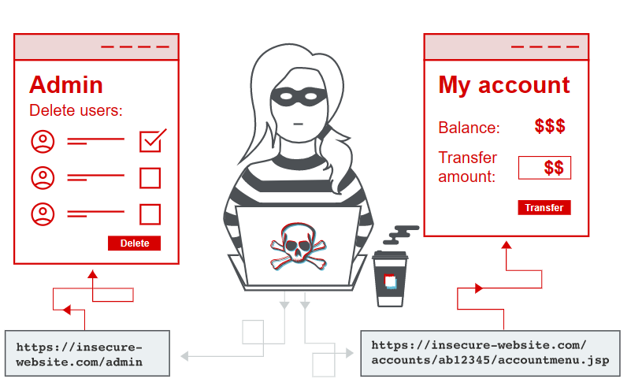

## **Tìm hiểu Access control**

> **Vertical access controls (Kiểm soát truy cập theo chiều dọc)**

- Kiểm soát truy cập theo chiều dọc là các cơ chế hạn chế quyền truy cập vào chức năng nhạy cảm không có sẵn cho các loại người dùng khác.

- Với các điều khiển truy cập theo chiều dọc, các loại người dùng khác nhau có quyền truy cập vào các chức năng ứng dụng khác nhau.
- Ví dụ: quản trị viên có thể sửa đổi hoặc xóa tài khoản của bất kỳ người dùng nào, trong khi người dùng bình thường không có quyền truy cập vào các hành động này. Kiểm soát truy cập theo chiều dọc có thể là triển khai chi tiết hơn của các mô hình bảo mật được thiết kế để thực thi các chính sách kinh doanh như phân chia nhiệm vụ và đặc quyền tối thiểu.

> **Horizontal access controls (Kiểm soát truy cập theo chiều ngang)**

- Kiểm soát truy cập theo chiều ngang là các cơ chế hạn chế quyền truy cập vào tài nguyên đối với những người dùng được phép truy cập cụ thể vào các tài nguyên đó.

- Với các điều khiển truy cập theo chiều ngang, những người dùng khác nhau có quyền truy cập vào một tập hợp con các tài nguyên cùng loại.
- Ví dụ: một ứng dụng ngân hàng sẽ cho phép người dùng xem các giao dịch và thực hiện thanh toán từ tài khoản của chính họ chứ không phải tài khoản của bất kỳ người dùng nào khác.

> **Context-dependent access controls (Kiểm soát quyền truy cập phụ thuộc vào ngữ cảnh)**

- Kiểm soát truy cập phụ thuộc vào ngữ cảnh hạn chế quyền truy cập vào chức năng và tài nguyên dựa trên trạng thái của ứng dụng hoặc tương tác của người dùng với nó.

- Kiểm soát truy cập phụ thuộc vào ngữ cảnh ngăn người dùng thực hiện các hành động sai thứ tự.
- Ví dụ: một trang web bán lẻ có thể ngăn người dùng sửa đổi nội dung trong giỏ hàng của họ sau khi họ đã thanh toán.

## **Lab broken access controls**

> ### **Vertical access controls**

> #### **Unprotected functionality (Chức năng không được bảo vệ)**

- Về cơ bản nhất, sự leo thang đặc quyền theo chiều dọc phát sinh khi một ứng dụng không thực thi bất kỳ biện pháp bảo vệ nào đối với chức năng nhạy cảm.
- Ví dụ: các chức năng quản trị có thể được liên kết từ trang chào mừng của quản trị viên chứ không phải từ trang chào mừng của người dùng. Tuy nhiên, người dùng có thể chỉ cần truy cập các chức năng quản trị bằng cách duyệt trực tiếp đến URL quản trị có liên quan.

- Trong một số trường hợp, URL quản trị có thể được tiết lộ ở các vị trí khác, chẳng hạn như tệp robots.txt

- Ví dụ tôi có một bài lab sau:

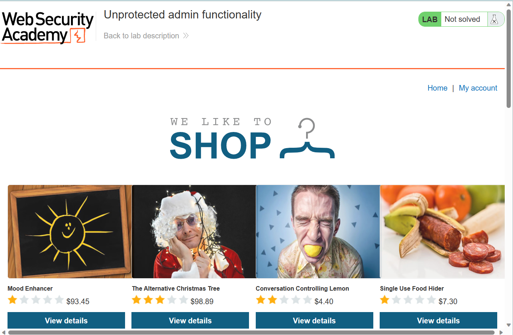

- Khi tôi truy nhập vào `robots.txt` tôi nhận được thông tin sau. Và khi tôi truy nhập vào thông tin mà robots.txt cung cấp tôi đã vào được quyền admin. Đây là một lab chứng tỏ chức năng admin không được bảo vệ.

```
User-agent: *
Disallow: /administrator-panel
```

- Trong một số trường hợp, chức năng nhạy cảm không được bảo vệ mạnh mẽ mà được che giấu bằng cách cung cấp cho nó một URL khó dự đoán hơn, hoặc url sẽ bị rò rỉ qua javascript.

- Ví dụ:

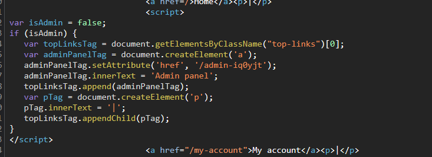

> #### **Parameter-based access control methods (Phương pháp kiểm soát quyền truy cập dựa trên tham số)**

- Một số ứng dụng xác định vai trò hoặc quyền truy cập của người dùng khi đăng nhập, sau đó lưu trữ thông tin này ở vị trí do người dùng kiểm soát, chẳng hạn như trường ẩn, cookie hoặc tham số chuỗi truy vấn đặt trước. Ứng dụng đưa ra các quyết định kiểm soát truy cập tiếp theo dựa trên giá trị đã gửi. Ví dụ:

```
https://insecure-website.com/login/home.jsp?admin=true
https://insecure-website.com/login/home.jsp?role=1
```

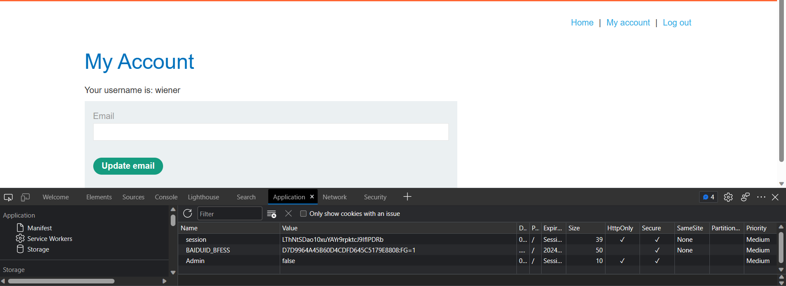

- Có một lab tôi đã sửa roleid và nhận được quyền admin:

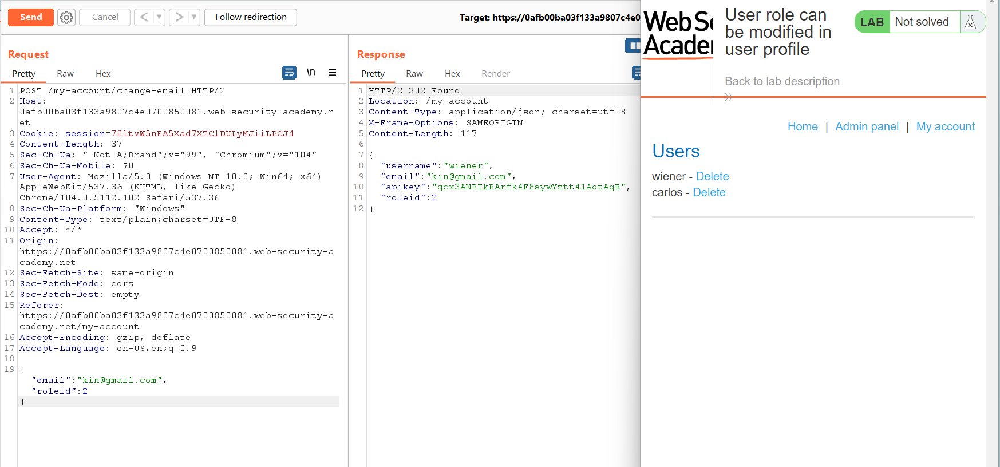

> #### **Broken access control resulting from platform misconfiguration**

- Một số ứng dụng thực thi kiểm soát truy cập ở lớp nền tảng bằng cách hạn chế quyền truy cập vào các URL và phương thức HTTP cụ thể dựa trên vai trò của người dùng. Ví dụ: một ứng dụng có thể định cấu hình các quy tắc như sau:

```
DENY: POST, /admin/deleteUser, managers
```

- Một số khung ứng dụng hỗ trợ nhiều tiêu đề HTTP không chuẩn khác nhau có thể được sử dụng để ghi đè URL trong request ban đầu, chẳng hạn như `X-Original-URL` và `X-Rewrite-URL`.
- Nếu một trang web sử dụng các biện pháp kiểm soát giao diện người dùng nghiêm ngặt để hạn chế quyền truy cập dựa trên URL, nhưng ứng dụng cho phép ghi đè URL thông qua tiêu đề request, thì có thể bỏ qua các biện pháp kiểm soát truy cập bằng cách sử dụng một request như sau:

```
POST / HTTP/1.1
X-Original-URL: /admin/deleteUser
```

- Ví dụ tôi có một trang admin không có quyền truy cập


- Nhưng khi tôi thêm `X-Original-URL: admin` tôi đã vào được trang web admin.

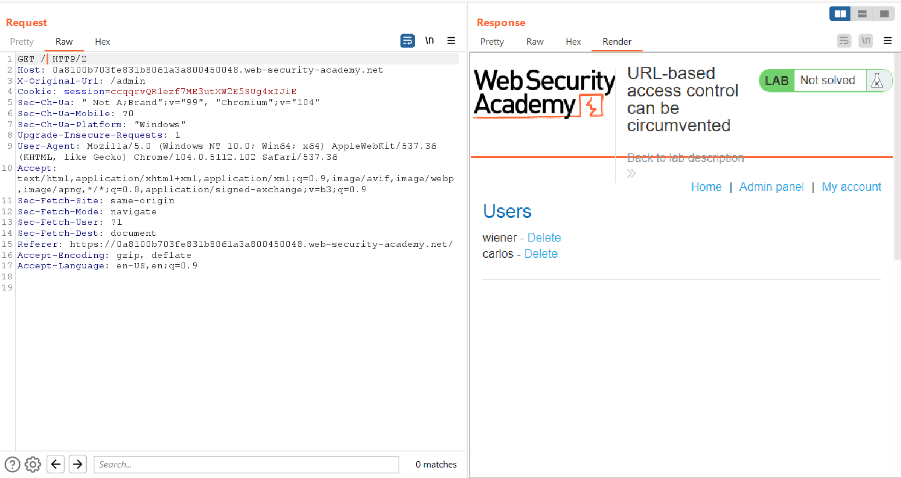

- Một ví dụ khi tôi thay đổi phương thức POST thành GET:

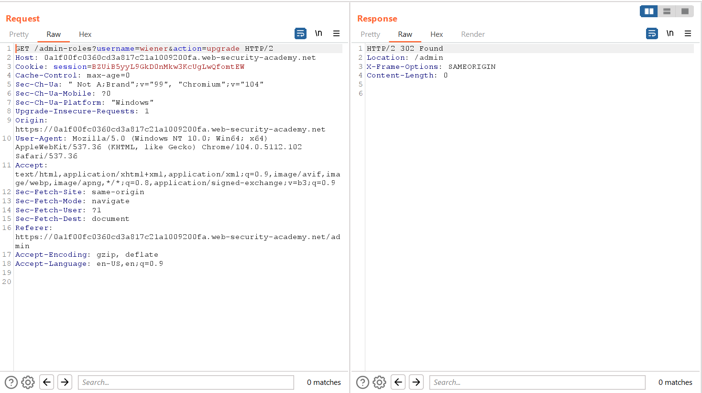

> ### **Horizontal privilege escalation**

- Leo thang đặc quyền theo chiều ngang phát sinh khi người dùng có thể có quyền truy cập vào tài nguyên thuộc về người dùng khác, thay vì tài nguyên thuộc loại đó của chính họ. Ví dụ: nếu một nhân viên lẽ ra chỉ có thể truy cập hồ sơ việc làm và bảng lương của chính họ, nhưng trên thực tế cũng có thể truy cập hồ sơ của các nhân viên khác, thì đây là hành vi leo thang đặc quyền theo chiều ngang.

- Các cuộc tấn công leo thang đặc quyền theo chiều ngang có thể sử dụng các loại phương pháp khai thác tương tự như leo thang đặc quyền theo chiều dọc.

- Ví dụ tôi có thể đổi id để lấy api key của người khác qua tham số id:

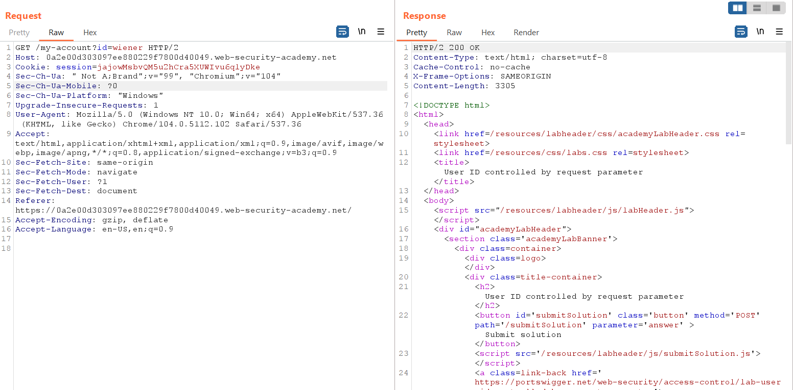

- Trong một số ứng dụng, tham số có thể khai thác không có giá trị có thể dự đoán được. Ví dụ: thay vì số tăng dần, ứng dụng có thể sử dụng số nhận dạng duy nhất toàn cầu (GUID) để nhận dạng người dùng. Tại đây, kẻ tấn công có thể không đoán được hoặc dự đoán mã định danh cho người dùng khác. Tuy nhiên, GUID thuộc về người dùng khác có thể được tiết lộ ở nơi khác trong ứng dụng nơi người dùng được tham chiếu, chẳng hạn như thông báo hoặc đánh giá của người dùng.

- Ví dụ ta thấy GUID của calors qua bài blog:

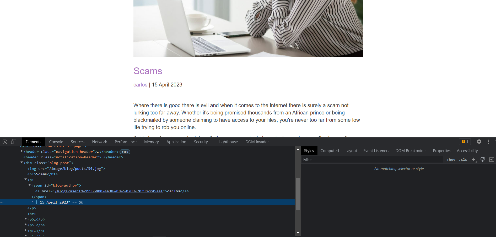

- Trong một số trường hợp, một ứng dụng sẽ phát hiện khi người dùng không được phép truy cập tài nguyên và trả về một chuyển hướng đến trang đăng nhập. Tuy nhiên, phản hồi chứa chuyển hướng vẫn có thể bao gồm một số dữ liệu nhạy cảm thuộc về người dùng được nhắm mục tiêu, vì vậy cuộc tấn công vẫn thành công.

> ### **Horizontal to vertical privilege escalation**

- Thông thường, một cuộc tấn công leo thang đặc quyền theo chiều ngang có thể biến thành một cuộc tấn công leo thang đặc quyền theo chiều dọc, bằng cách xâm phạm một người dùng có nhiều đặc quyền hơn. Ví dụ: leo thang theo chiều ngang có thể cho phép kẻ tấn công đặt lại hoặc chiếm được mật khẩu của người dùng khác. Nếu kẻ tấn công nhắm mục tiêu một người dùng quản trị và xâm phạm tài khoản của họ, thì họ có thể có quyền truy cập quản trị và do đó thực hiện leo thang đặc quyền theo chiều dọc.

- Nếu người dùng mục tiêu là quản trị viên ứng dụng thì kẻ tấn công sẽ có quyền truy cập vào trang tài khoản quản trị. Trang này có thể tiết lộ mật khẩu của quản trị viên hoặc cung cấp phương tiện thay đổi mật khẩu hoặc có thể cung cấp quyền truy cập trực tiếp vào chức năng đặc quyền.

- Ví dụ tôi sửa id thành admin và thấy được mật khẩu admin và sau đó tôi đăng nhập lại bằng tài khoản admin và xóa tài khoản người dùng:

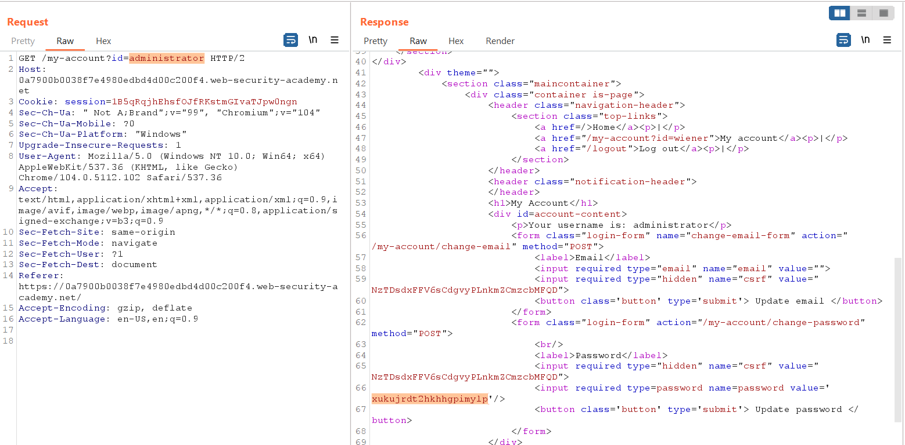

> #### **Insecure direct object references (Tham chiếu đối tượng trực tiếp không an toàn)**

- IDOR phát sinh khi một ứng dụng sử dụng đầu vào do người dùng cung cấp để truy cập trực tiếp vào các đối tượng và kẻ tấn công có thể sửa đổi đầu vào để có được quyền truy cập trái phép. Nó đã được phổ biến bởi sự xuất hiện của nó trong Top Ten của OWASP 2007 mặc dù đây chỉ là một ví dụ về nhiều lỗi triển khai có thể dẫn đến việc kiểm soát truy cập bị phá vỡ.

- Lỗ hổng IDOR với tham chiếu trực tiếp đến các đối tượng cơ sở dữ liệu:
- Hãy xem xét một trang web sử dụng URL sau để truy cập trang tài khoản khách hàng, bằng cách truy xuất thông tin từ cơ sở dữ liệu phía sau:

  ```
  https://insecure-website.com/customer_account?customer_number=132355
  ```

> #### **Access control vulnerabilities in multi-step processes**

- Nhiều trang web thực hiện các chức năng quan trọng qua một loạt các bước. Điều này thường được thực hiện khi cần nắm bắt nhiều đầu vào hoặc tùy chọn khác nhau hoặc khi người dùng cần xem xét và xác nhận chi tiết trước khi thực hiện hành động. Ví dụ: chức năng quản trị để cập nhật chi tiết người dùng có thể bao gồm các bước sau:

  - Tải biểu mẫu chứa thông tin chi tiết cho một người dùng cụ thể.
  - Gửi các thay đổi.
  - Xem lại các thay đổi và xác nhận.

- Đôi khi, một trang web sẽ triển khai các biện pháp kiểm soát truy cập nghiêm ngặt đối với một số bước này, nhưng lại bỏ qua các bước khác.
- Ví dụ: giả sử các biện pháp kiểm soát truy cập được áp dụng chính xác cho bước đầu tiên và bước thứ hai, nhưng không áp dụng cho bước thứ ba.
- Thực tế, trang web giả định rằng người dùng sẽ chỉ đến bước 3 nếu họ đã hoàn thành các bước đầu tiên, được kiểm soát đúng cách. Tại đây, kẻ tấn công có thể giành quyền truy cập trái phép vào chức năng bằng cách bỏ qua hai bước đầu tiên và trực tiếp gửi request cho bước thứ ba với các tham số bắt buộc.

- Ví dụ khi tôi muốn update một người dùng trở thành admin thì có cần thêm một yếu tố xác thực.

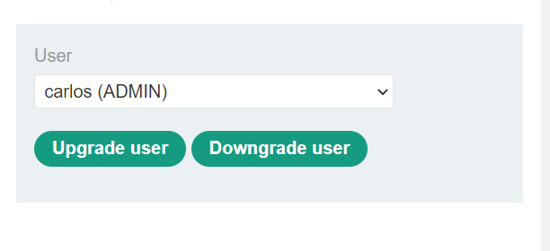


- Thì tôi có thể tấn công bằng cách vượt qua các bước trên và nhắm đến request cuối cùng như sau:

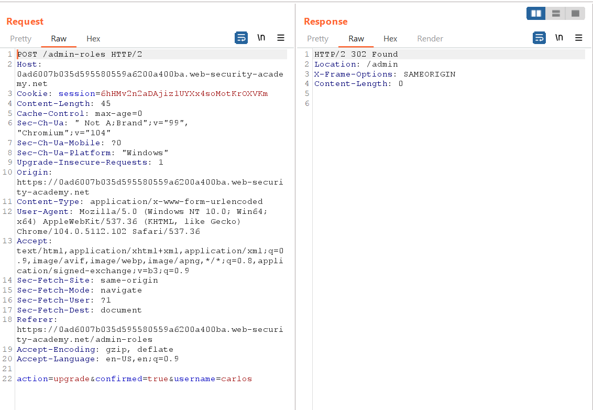

> #### **Referer-based access control**

- Một số trang web kiểm soát quyền truy cập dựa trên tiêu đề `Referer` được gửi trong requesr HTTP. Tiêu đề `Referer` thường được trình duyệt thêm vào các request để chỉ ra trang mà từ đó requesr được bắt đầu.

- Ví dụ: giả sử một ứng dụng thực thi mạnh mẽ quyền kiểm soát truy cập đối với trang quản trị chính tại `/admin`, nhưng đối với các trang phụ như `/admin/deleteUser` chỉ kiểm tra tiêu đề `Referer`. Nếu tiêu đề `Referer` chứa URL là `/admin` thì yêu cầu được cho phép.

## **Cách ngăn chặn lỗ hổng kiểm soát truy cập**

- Không bao giờ chỉ dựa vào che giấu để kiểm soát truy cập.
- Trừ khi một tài nguyên được thiết kế để truy cập công khai, từ chối truy cập theo mặc định.
- Bất cứ khi nào có thể, hãy sử dụng một cơ chế duy nhất trên toàn ứng dụng để thực thi các biện pháp kiểm soát truy cập.
- Ở cấp mã, bắt buộc các nhà phát triển phải khai báo quyền truy cập được phép cho từng tài nguyên và từ chối quyền truy cập theo mặc định.
- Kiểm tra kỹ lưỡng và kiểm tra các biện pháp kiểm soát truy cập để đảm bảo chúng hoạt động như thiết kế.
