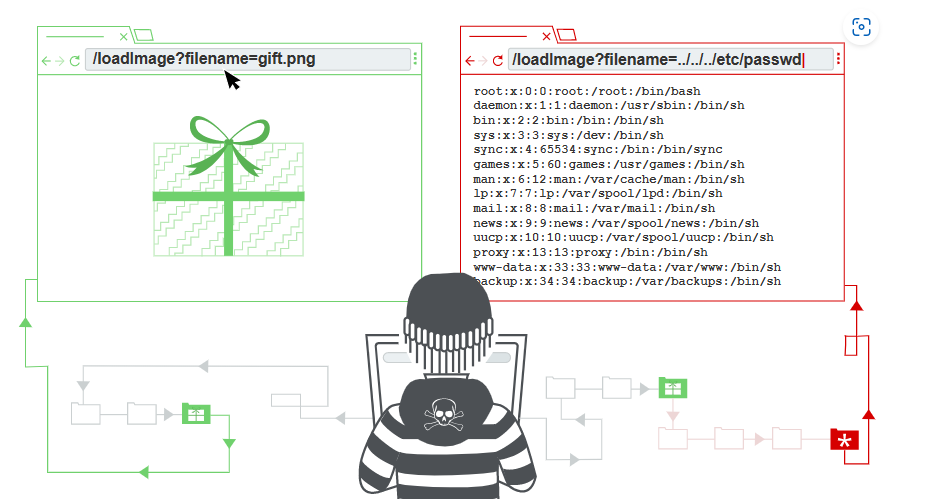
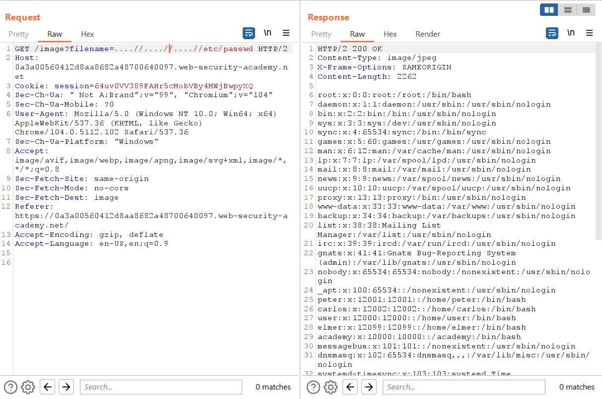
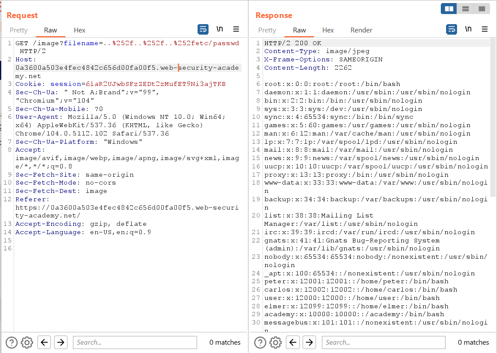
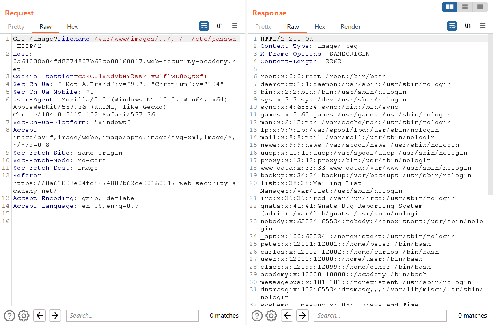
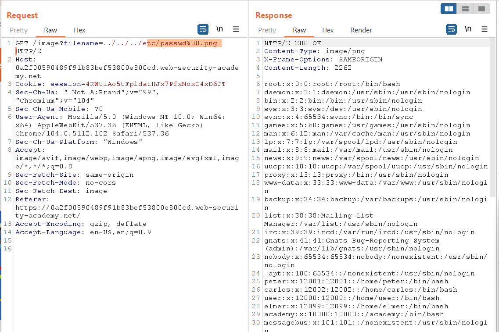

# **Directory traversal - File include**



- [**TỔNG HỢP PAYLOAD INCLUDE FILE**](https://github.com/swisskyrepo/PayloadsAllTheThings/tree/master/File%20Inclusion)
- [**CHEAT SHEET**](https://book.hacktricks.xyz/pentesting-web/file-inclusion)

## **Directory traversal là gì**

- Truyền tải thư mục (còn được gọi là truyền tải đường dẫn tệp) là một lỗ hổng bảo mật web cho phép kẻ tấn công đọc các tệp tùy ý trên máy chủ đang chạy ứng dụng.

- Điều này có thể bao gồm mã ứng dụng và dữ liệu, thông tin đăng nhập cho hệ thống phụ trợ và các tệp hệ điều hành nhạy cảm. Trong một số trường hợp, kẻ tấn công có thể ghi vào các tệp tùy ý trên máy chủ, cho phép chúng sửa đổi dữ liệu hoặc hành vi của ứng dụng và cuối cùng kiểm soát hoàn toàn máy chủ.

> **Đọc các tệp qua truyền tải thư mục**

- Hãy xem xét một ứng dụng mua sắm hiển thị hình ảnh của các mặt hàng để bán. Hình ảnh được tải qua một số HTML như sau:

```

```

- URL loadImage nhận tham số tên tệp và trả về nội dung của tệp đã chỉ định. Bản thân các tệp hình ảnh được lưu trữ trên đĩa ở vị trí /var/www/images/.

```
/var/www/images/218.png
```

- Ứng dụng không triển khai biện pháp bảo vệ chống lại các cuộc tấn công duyệt thư mục, vì vậy kẻ tấn công có thể yêu cầu URL sau để truy xuất một tệp tùy ý từ hệ thống tệp của máy chủ:

```
https://insecure-website.com/loadImage?filename=../../../etc/passwd
```

> **Những trở ngại phổ biến khi khai thác lỗ hổng truyền tải đường dẫn tệp**

- Nếu một ứng dụng loại bỏ hoặc chặn các trình tự duyệt thư mục khỏi tên tệp do người dùng cung cấp, thì có thể vượt qua lớp bảo vệ bằng nhiều kỹ thuật khác nhau.

- Sử dụng các trình tự truyền tải lồng nhau, chẳng hạn như `....//` hoặc `....\/`, sẽ trở lại các trình tự truyền tải đơn giản khi trình tự bên trong bị loại bỏ.



- Mã hóa URL hoặc thậm chí mã hóa URL kép, các ký tự ../, dẫn đến %2e%2e%2f hoặc %252e%252e%252f tương ứng. Nhiều mã hóa không chuẩn khác nhau, chẳng hạn như ..%c0%af hoặc ..%ef%bc%8f, cũng có thể thực hiện thủ thuật này.

- Tôi đã encode 2 lần như sau:



- Nếu một ứng dụng yêu cầu tên tệp do người dùng cung cấp phải bắt đầu bằng thư mục cơ sở dự kiến, chẳng hạn như /var/www/images, thì có thể bao gồm thư mục cơ sở được yêu cầu, sau đó là trình tự truyền tải phù hợp. Ví dụ:

```
filename=/var/www/images/../../../etc/passwd
```



- Nếu một ứng dụng yêu cầu tên tệp do người dùng cung cấp phải kết thúc bằng phần mở rộng tệp dự kiến, chẳng hạn như .png, thì có thể sử dụng byte rỗng để chấm dứt hiệu quả đường dẫn tệp trước phần mở rộng được yêu cầu. Ví dụ:

```
filename=../../../etc/passwd%00.png
```



## **Làm thế nào để ngăn chặn một cuộc tấn công duyệt thư mục**

- Ứng dụng phải xác thực đầu vào của người dùng trước khi xử lý. Lý tưởng nhất là việc xác thực phải so sánh với `whilelist` các giá trị được phép. Nếu điều đó là không thể đối với chức năng được yêu cầu, thì quá trình xác thực sẽ xác minh rằng đầu vào chỉ chứa nội dung được phép, chẳng hạn như các ký tự chữ và số thuần túy.
- Sau khi xác thực đầu vào được cung cấp, ứng dụng sẽ nối đầu vào thư mục cơ sở và sử dụng API hệ thống tệp nền tảng để chuẩn hóa đường dẫn. Nó sẽ xác minh rằng đường dẫn được chuẩn hóa bắt đầu với thư mục cơ sở dự kiến.

```
File file = new File(BASE_DIRECTORY, userInput);
if (file.getCanonicalPath().startsWith(BASE_DIRECTORY)) {
    // process file
}
```
