# **HTTP và Web**

- Từ khi Internet ra đời, sự phát triển về các giao thức trao đổi thông tin và dữ liệu giữa các máy tính là điều tối cần thiết. HTTP (Hypertext Transfer Protocol) chắc chắn sẽ là giao thức nổi tiếng nhất, trang web các bạn đang xem chính là sử dụng HTTP đấy.

## **HTTP hoạt động như thế nào?**

- Thông thường mỗi HTTP Request sẽ sử dụng một kết nối TCP (TCP Connection). Các bước sẽ trải qua đại khái như sau:

1. Phía client sẽ khởi tạo một kết nối TCP đến server.
2. Sau khi kết nối thành công, client sẽ gửi request đến server.
3. Server tiếp nhận request, tiến hành tìm kiếm và trả về cho client thông qua kết nối TCP.
4. Client tiếp nhận response từ server.
5. Client đóng kết nối TCP.
6. Nếu client cần thêm các object từ server, mỗi object sẽ cần thực hiện lại các bước 1 đến 5.

- Ở đây chúng ta cần lưu ý rằng, bản chất TCP Connection khi được thiết lập sẽ cần 3 bước (TCP 3-Way Handshake Process).
- Tức là giữa client và server cần trao đổi (gửi và nhận) 3 messages trước khi kết nối được thiết lập. Tương tự khi kết nối đóng lại cũng cần thực hiện lại quy trình 3 bước này.

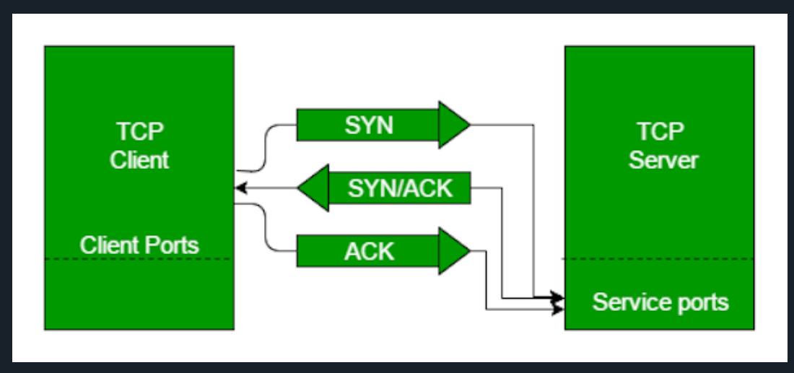

## **Giao thức HTTP/1 (v1.1)**

- Giao thức HTTP sau đó được phát triển lên HTTP/1 (version 1.1) vào năm 1999. HTTP chính thức được sử dụng rộng rãi hơn rất nhiều vì không những cho Web mà còn cả các thiết bị khác.

- HTTP/1 hỗ trợ nhiều method hơn (GET , HEAD , POST , PUT , DELETE , TRACE , OPTIONS), có HEADER và quan trọng nhất đó là TCP Connection có thể được giữ lại (keep-alive hay persistent connection) để phục vụ các request tiếp theo.

> `HTTP Pipelining`

- Đây là tính năng giúp HTTP 1.1 có thể tận dụng được một connection cho nhiều request. Phía client cứ gọi liên tiếp các request mà không cần đợi response. Server sẽ nhận một loạt các request này để xử lý rồi trả về sau.

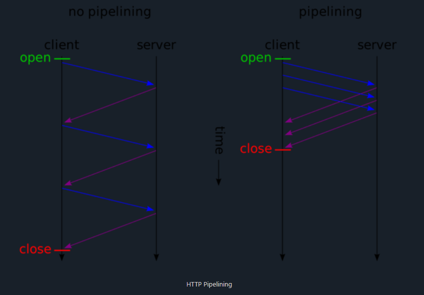

- Tuy nhiên cơ chế này mang đến một phiền phức khác. Giả sử nếu các request đến đồng thời và xử dụng chung một connection, các response trả về không theo thứ tự sẽ khiến client không thể phân biệt được response nào của request nào. Vì thế quy tắc là request thứ tự ra sao thì phải trả về đúng theo thứ tự đó.

- Thêm vào đó, nếu request có gói tin bị thất lạc (có thể là do gói tin lớn hoặc chất lượng đường truyền kém) sẽ khiến toàn bộ các request đang nối đuôi theo sau bị chặn lại cho tới khi request đó được giải quyết. Vấn đề này được biết với tên TCP Head-of-line blocking (HOL).

> `HTTP persistent connection (HTTP keep-alive)`

- Thay vì gửi một lượt các request vào một connection rồi đợi về một mớ response lộn xộn. Chúng ta có thể dùng HTTP keep-alive để gửi từng cặp request/response.

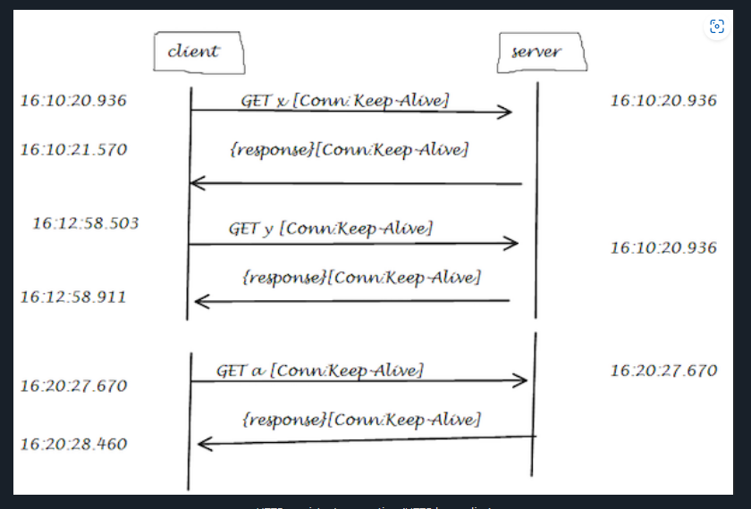

> `Hỗ trợ Compression/Decompression (Encoding)`

- Đây là chức năng cho phép Client và Server tối ưu được tốc độ và băng thông khi trao đổi thông tin. Cơ chế compress (nén) phổ biến nhất là gzip và Deflate.

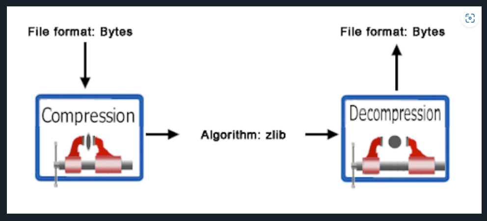

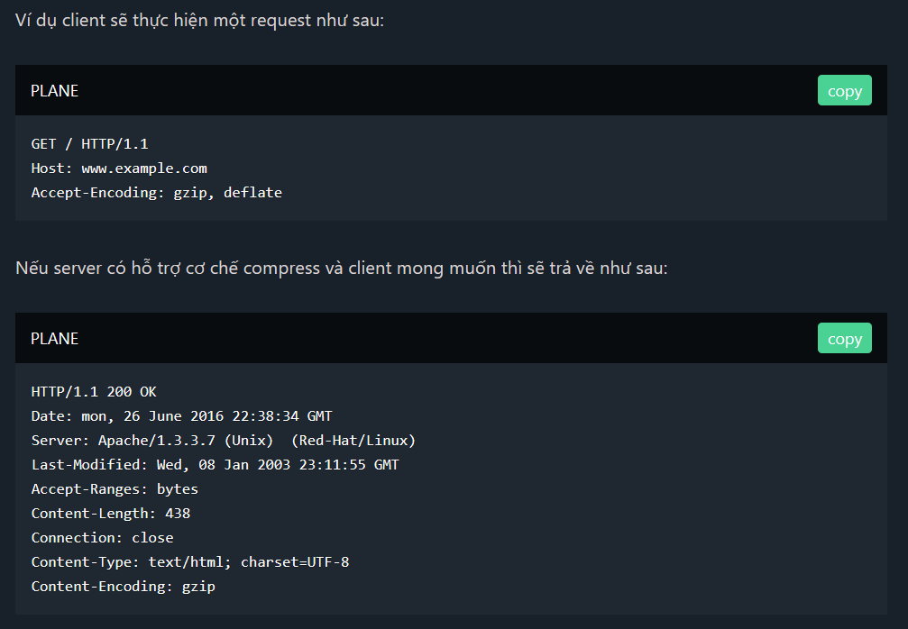

> `SPDY là gì?`

- SPDY (đọc là "speedy") được phát triển bởi Google bắt đầu từ năm 2009 (v1) và 2012 (v2). Mục đích giao thức SPDY ra đời để tăng tốc độ tải trang và tính bảo mật cho website.

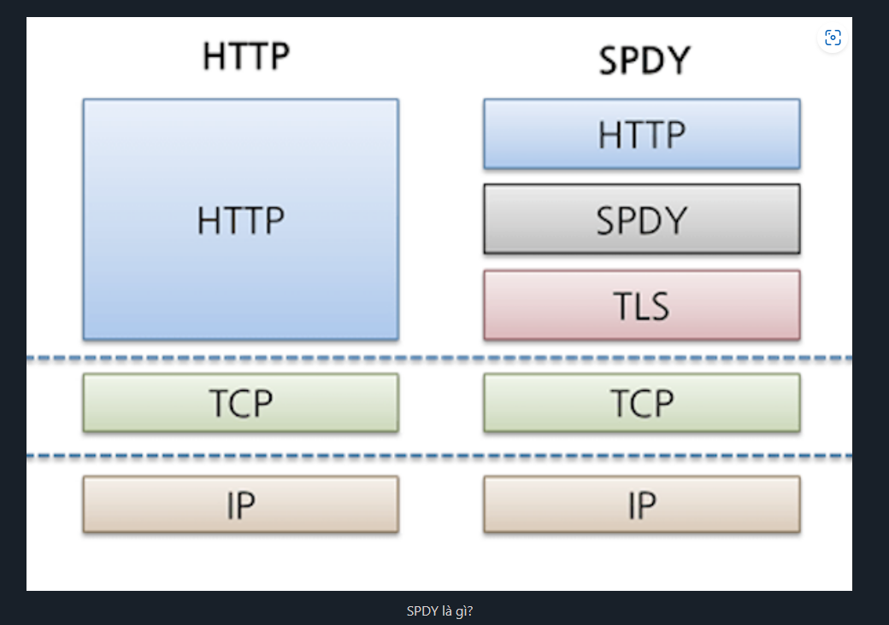

- Một số vấn đề từ HTTP/1 mà SPDY ra đời để giải quyết:
  - `Single request per connection`: HTTP chỉ có thể tải về từng resource với từng request, mỗi cái là một connection tương ứng. Việc này gây làm tăng thời gian chờ cũng như không tận dụng được băng thông. SPDY cho phép một connection có thể xử lý được đồng thời nhiều request.
  - `Client-initiated requests`: HTTP hoạt động theo kiểu "hỏi-đáp", client request dữ liệu nào thì được server trả về dữ liệu nấy. Với SPDY, server có thể chủ động "push" dữ liệu về client mà không cần client gửi request đến.
  - `Redundant headers`: HTTP headers là những metadata mô tả cách thức vận hành của một request HTTP. Trong nhiều trường hợp, rất nhiều request với những header lập đi lập lại giống nhau. SPDY có thể loại bỏ những header không cần thiết này để giải lượng băng thông cần thiết.
  - `Uncompressed data`: Compression (nén) sẽ giúp dữ liệu có dung lượng nhỏ hơn khi trao đổi thông tin, với HTTP thì nó là optional, còn SPDY bắt buộc sử dụng nén dữ liệu cho mọi request.

## **HTTP/2 là gì?**

- HTTP/2 là tên gọi chính thức cho phiên bản tiếp theo của HTTP dựa trên công nghệ lõi từ SPDY được phát triển bởi Google.

- Tính ưu việt từ SPDY đã thu hút rất nhiều sự quan tâm từ các nhà phát triển giao thức và trình duyệt web hàng đầu. Vào thời điểm này, nhóm phát triển SPDY cho biết họ đang chuẩn hoá giao thức. Các bên đã đi đến thống nhất là phát triển hẳn lên HTTP/2 dựa trên SPDY.

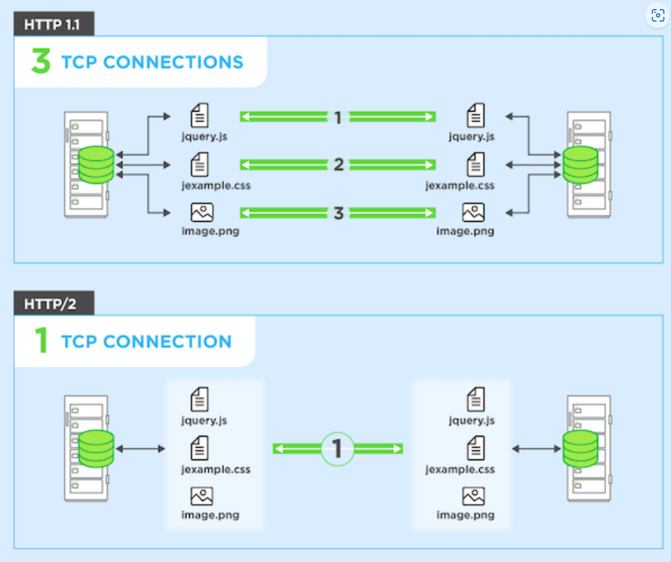

> `HTTP/2 sử dụng binary thay cho dạng văn bản`

- Binary Protocol (giao thức nhị phân) sẽ hiệu quả hơn để phân tích (parse), gọn nhẹ hơn để giao tiếp và quan trọng nhất là chúng sẽ ít bị lỗi hơn so với dạng text (văn bản). Đơn giản là bởi vì dữ liệu nhị phân không cần xử lý những trường hợp như khoảng trắng, in hoa, xuống dòng, dòng trống, emoji,…

> `Request Response Multiplexing`

- Trong HTTP/1, cụ thể là Pipelining, khi client muốn tối ưu connection bằng cách thực hiện nhiều request một lượt rồi đợi response trả về. Điểm hạn chế chúng ta đã biết response phải đúng thứ tự so với request. Việc này gây hiện tượng HOL.

- Để khắc phục việc này, HTTP/2 sử dụng Multiplexing cho cả Request và Response. Có thể tạm hiểu rằng chúng được định danh để biết được response nào của request nào. Từ đó chúng có thể hoạt động độc lập mà không cần tuân thủ thứ tự như trước.

- Trên thực tế phương thức này chia dữ liệu giữa Client và Server thành từng data frame xen kẽ. Phía client sẽ có nhiệm vụ "lắp ghép" chúng lại để có được toàn bộ dữ liệu hoàn chỉnh.

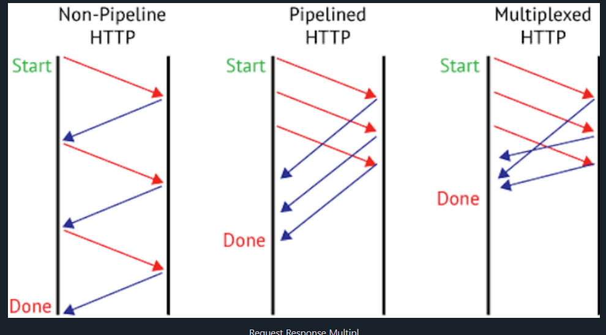

> `Streams`

- Kết nối HTTP/2 sẽ bao gồm nhiều Stream (luồng dữ liệu). Các streams này chứa một dãy các Data Frame cần giao tiếp giữa client và server. Các Data Frame có thể được đặt xen kẽ bất kể chúng từ đâu đến.

- Mặc dù là vậy, thứ tự của Data Frame vẫn rất quan trọng và phía nhận sẽ phải xử lý theo đúng thứ tự này. Ở cả 2 phía nhận và gửi data đều có thể đóng hoặc khởi tạo một stream mới. Khi Stream mới được thiết lập, nó sẽ có ID là một số nguyên (integer).

> `Stream Prioritization`

- HTTP/2 cho phép client cung cấp mức độ ưu tiên cho các luồng dữ liệu cụ thể (stream). Mặc phía server không bị ràng buộc phải tuân theo ưu tiên này, nhưng cơ chế này cho phép server tối ưu hóa việc phân bổ tài nguyên dựa trên các yêu cầu của người dùng cuối.

> `Stateful Header Compression`

- Trong lúc client thực hiện các request đến server sẽ có vô số các header bị dư thừa và lặp đi lặp lại. HTTP/2 sử dụng HPACK như một cách tiếp cập đơn giản và an toàn để compress (nén) các header này.

- Ở cả client và server đều phải lưu trữ các head đã được sử dụng trước đó, từ head đã được nén, chúng sẽ tra cứu thông tin và tiến hành khôi phục lại header đầy đủ. Việc này mang lại hiệu năng cao và tối ưu băng thông đáng kể.

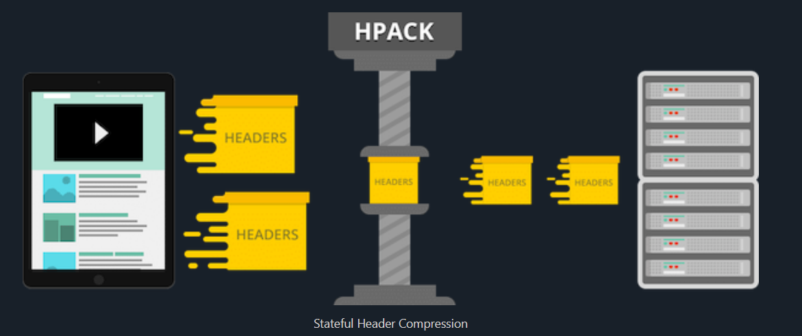

> `Server Push`

- Trong HTTP/2 server có thể gửi về nhiều response với chỉ một request từ client. Cơ chế này gọi là Server Push, giúp trình duyệt tiết kiệm được các requests không cần thiết.

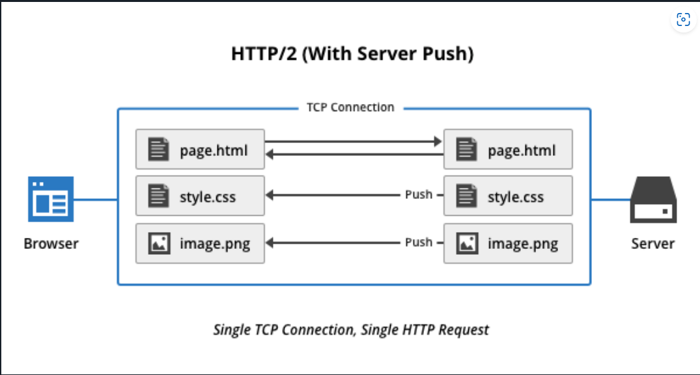

## **Transport Layer Security (TLS)**

- TLS, là một giao thức bảo mật được áp dụng rộng rãi được thiết kế để hỗ trợ quyền riêng tư và bảo mật dữ liệu cho các liên lạc qua Internet.
- Trường hợp sử dụng chính của TLS là mã hóa giao tiếp giữa ứng dụng web và máy chủ, chẳng hạn như trình duyệt web đang tải trang web.
- TLS cũng có thể được sử dụng để mã hóa các thông tin liên lạc khác như email, nhắn tin và thoại qua IP (VoIP).

- Có ba yếu tố chính của giao thức TLS:
  - `Mã hóa`: ẩn dữ liệu được chuyển từ bên thứ ba.
  - `Xác thực`: đảm bảo rằng các bên trao đổi thông tin là người mà họ tuyên bố.
  - `Tính toàn vẹn`: xác minh rằng dữ liệu không bị giả mạo.

## **TLS certificate?**

- Để một trang web hoặc ứng dụng sử dụng TLS, nó phải được cài đặt chứng chỉ TLS trên máy chủ gốc của nó (còn được gọi là "chứng chỉ SSL").

- Chứng chỉ TLS do cơ quan cấp chứng chỉ cấp cho cá nhân hoặc doanh nghiệp sở hữu miền. Chứng chỉ chứa thông tin quan trọng về người sở hữu miền, cùng với public key của máy chủ, cả hai đều quan trọng để xác thực danh tính của máy chủ.

> `TLS hoạt động như thế nào?`

- Kết nối TLS được bắt đầu bằng cách sử dụng trình tự bắt tay TLS (TLS handshake). Khi người dùng điều hướng đến một trang web sử dụng TLS, quá trình bắt tay TLS sẽ bắt đầu giữa thiết bị của người dùng (client) và máy chủ web.

- Quá trình bắt tay TLS thiết lập một bộ mật mã cho mỗi phiên liên lạc.
  - Bộ mật mã là một tập hợp các thuật toán chỉ định các chi tiết như encryption keys hoặc session keys nào sẽ được sử dụng cho phiên cụ thể đó.
  - TLS có thể đặt các khóa phiên phù hợp trên một kênh không được mã hóa nhờ công nghệ được gọi là public key cryptography.

- Quá trình bắt tay cũng xử lý xác thực, thường bao gồm máy chủ chứng minh danh tính của nó cho máy khách. Điều này được thực hiện bằng cách sử dụng public key.
  - Public key là khóa mã hóa sử dụng mã hóa một chiều, nghĩa là bất kỳ ai có public key đều có thể xắp xếp lại dữ liệu được mã hóa bằng private key của máy chủ để đảm bảo tính xác thực của nó, nhưng chỉ người gửi ban đầu mới có thể mã hóa dữ liệu bằng private key.
  - Public key của máy chủ là một phần của chứng chỉ TLS.

- Sau khi dữ liệu được mã hóa và xác thực, dữ liệu sẽ được ký bằng mã xác thực tin nhắn (Message Authentication Code). Sau đó, người nhận có thể xác minh MAC để đảm bảo tính toàn vẹn của dữ liệu.

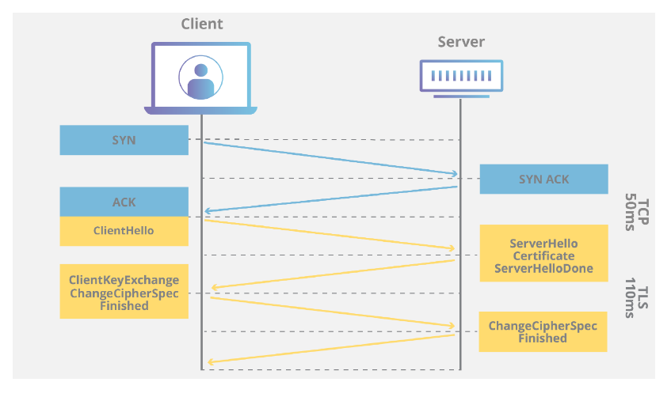

1. `Tin nhắn 'client hello'`: Máy khách bắt đầu bắt tay bằng cách gửi tin nhắn "xin chào" đến máy chủ. Thông báo sẽ bao gồm phiên bản TLS nào mà máy khách hỗ trợ, bộ mật mã được hỗ trợ và một chuỗi byte ngẫu nhiên được gọi là "client random".
2. `Tin nhắn 'server hello'`: Để trả lời tin nhắn xin chào máy khách, máy chủ sẽ gửi một tin nhắn chứa chứng chỉ SSL của máy chủ, bộ mật mã được chọn của máy chủ và "server random", một chuỗi byte ngẫu nhiên khác do máy chủ tạo ra.
3. `Authentication`: Máy khách xác minh chứng chỉ SSL của máy chủ với tổ chức phát hành chứng chỉ đó. Điều này xác nhận rằng máy chủ đúng như thông báo và máy khách đang tương tác với chủ sở hữu thực sự của miền.
4. `Premaster secret`: Máy khách gửi thêm một chuỗi byte ngẫu nhiên "premaster secret". Premaster secret được mã hóa bằng public key và chỉ có thể được máy chủ giải mã bằng private key. (Máy khách nhận public key từ chứng chỉ SSL của máy chủ.)
5. `Private key used`: Máy chủ giải mã premaster secret.
6. `Session keys created`: Cả máy khách và máy chủ tạo khóa phiên từ client random, server random và premaster secret. Họ sẽ đạt được kết quả tương tự.
7. `Client is ready`: Máy khách gửi tin nhắn "finished" được mã hóa bằng khóa phiên.
8. `Server is ready`: Máy chủ gửi tin nhắn "finished" được mã hóa bằng khóa phiên.
9. `Secure symmetric encryption achieved`: Quá trình bắt tay hoàn tất và quá trình liên lạc tiếp tục sử dụng các khóa phiên.
