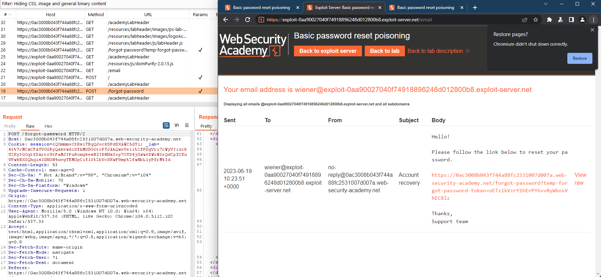
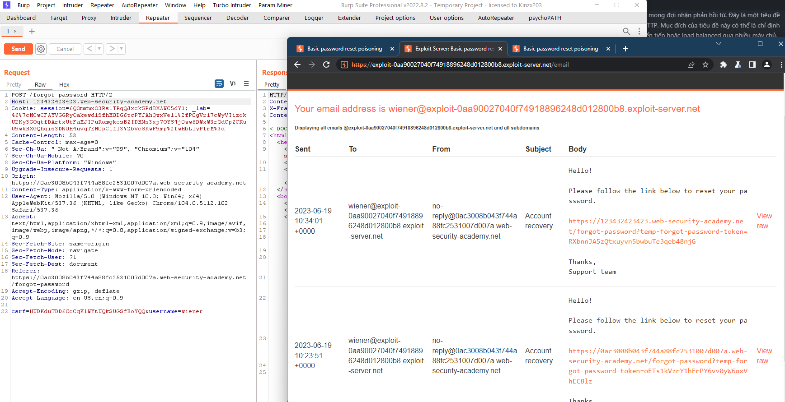
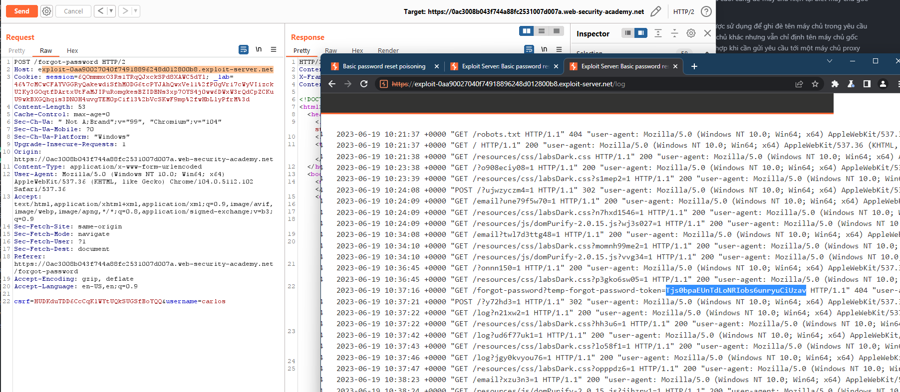
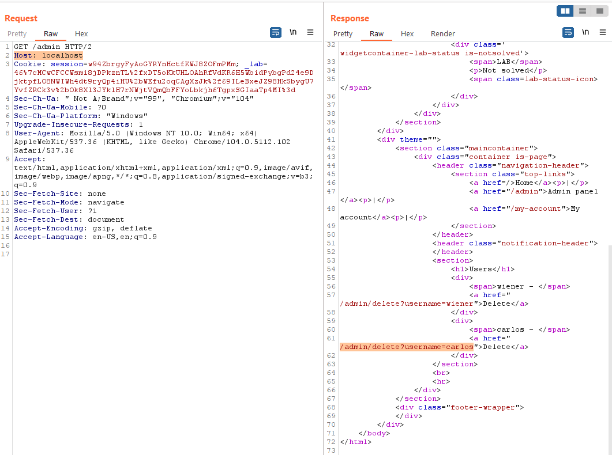
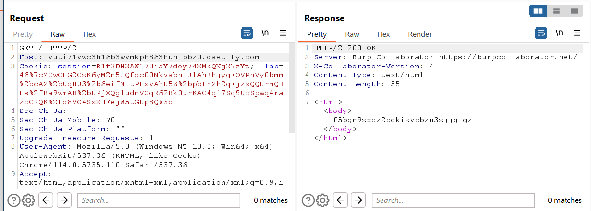
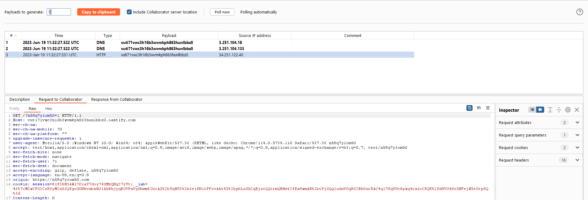
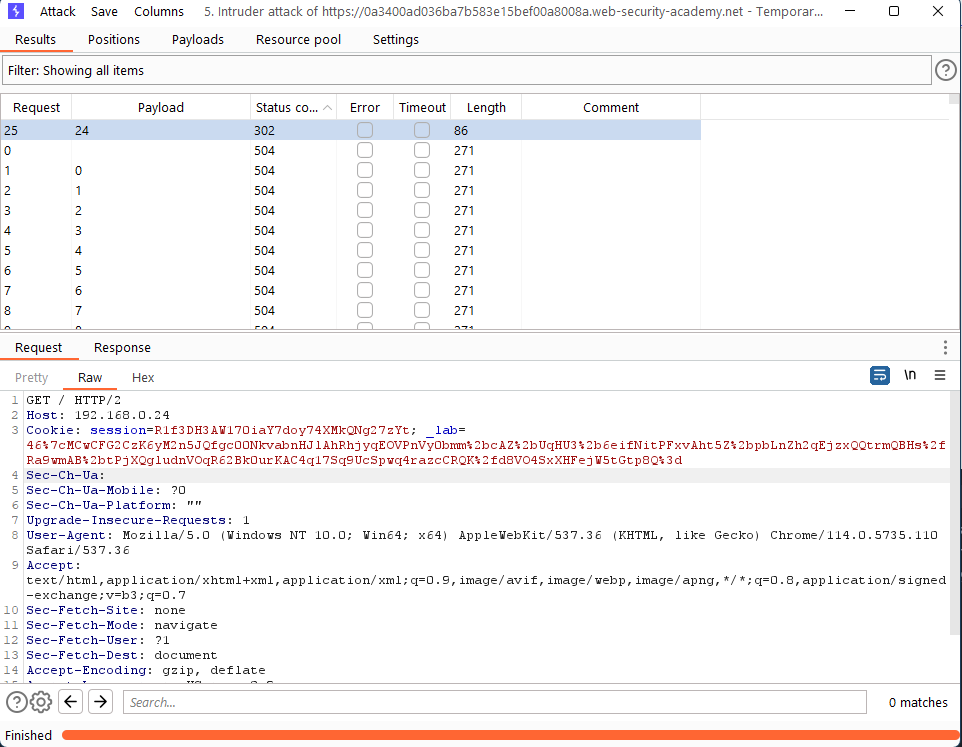
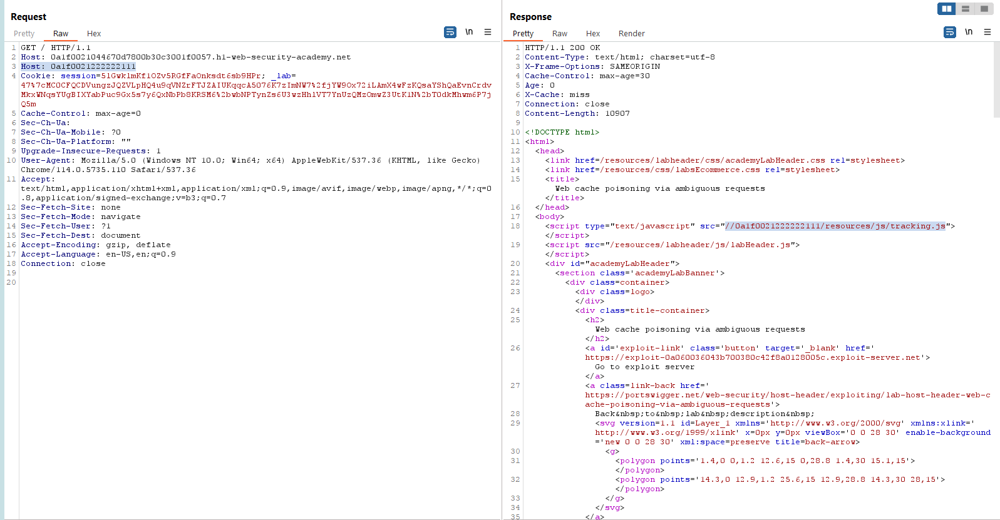
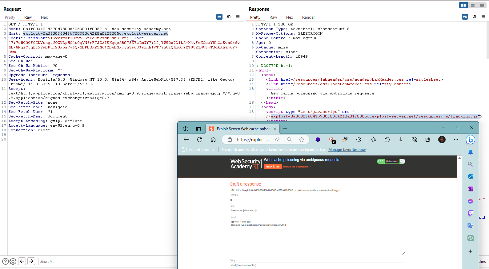

# **HTTP Host header attacks**

## **HTTP Host header là gì?**

- Tiêu đề server HTTP là tiêu đề yêu cầu bắt buộc kể từ HTTP/1.1. Nó chỉ định tên miền mà khách hàng muốn truy cập.
- Ví dụ: khi người dùng truy cập <https://portswigger.net/web-security>, trình duyệt của họ sẽ soạn yêu cầu chứa tiêu đề server như sau:

```
GET /web-security HTTP/1.1
Host: portswigger.net
```

### Mục đích của HTTP Host header:
- Xác định thành phần back-end nào mà client muốn giao tiếp.

## **Các cách khai thác HTTP Host header**

> `Inject duplicate Host headers:`
- Các hệ thống và công nghệ khác nhau sẽ xử lý trường hợp này theo cách khác nhau, nhưng thông thường một trong hai tiêu đề sẽ được ưu tiên hơn tiêu đề còn lại, ghi đè giá trị của nó một cách hiệu quả.

```
GET /example HTTP/1.1
Host: vulnerable-website.com
Host: bad-stuff-here
```

> `Supply an absolute URL:`
- Sự không rõ ràng do cung cấp cả URL tuyệt đối và tiêu đề server lưu trữ cũng có thể dẫn đến sự khác biệt giữa các hệ thống khác nhau.
- Dòng yêu cầu phải được ưu tiên khi định tuyến yêu cầu, nhưng trên thực tế, điều này không phải lúc nào cũng đúng. Bạn có khả năng có thể khai thác những điểm khác biệt này theo cách tương tự như các tiêu đề server trùng lặp.

```
GET https://vulnerable-website.com/ HTTP/1.1
Host: bad-stuff-here
```

> `Add line wrapping:`
- Bạn cũng có thể khám phá hành vi kỳ quặc bằng cách thụt lề các tiêu đề HTTP bằng ký tự khoảng trắng. Một số server sẽ diễn giải tiêu đề được thụt lề dưới dạng một dòng được bao bọc và do đó, coi nó như một phần giá trị của tiêu đề trước đó. Các server khác sẽ hoàn toàn bỏ qua tiêu đề được thụt vào.

```
GET /example HTTP/1.1
    Host: bad-stuff-here
Host: vulnerable-website.com
```

> `Inject host override headers`
  - `X-Host`: Tiêu đề X-Host chứa tên server mà client mong đợi nhận phản hồi từ. Đây là một tiêu đề tùy chỉnh và không phải là một tiêu chuẩn chung trong HTTP. Mục đích của tiêu đề này có thể là chỉ định server mong đợi nhận phản hồi khi yêu cầu được chuyển tiếp hoặc load balanced qua nhiều server.
  - `X-Forwarded-Server`: Tiêu đề X-Forwarded-Server được sử dụng bởi các proxy server để chỉ định tên server gốc mà yêu cầu đã đi qua trước khi đến server hiện tại. Tiêu đề này thường được sử dụng trong kịch bản chuyển tiếp yêu cầu từ một proxy server đến server cuối cùng để server hiện tại biết server gốc mà yêu cầu ban đầu đã được gửi tới.
  - `X-HTTP-Host-Override`: Tiêu đề X-HTTP-Host-Override được sử dụng để ghi đè tên server trong yêu cầu HTTP. Nó cho phép khách hàng gửi yêu cầu tới một server khác nhưng vẫn chỉ định tên server gốc trong tiêu đề này. Điều này hữu ích trong một số trường hợp khi cần gửi yêu cầu tới một server proxy hoặc tạo ra yêu cầu tùy chỉnh mà tên server không thay đổi.
  - `Forwarded`: Tiêu đề Forwarded được sử dụng để truyền thông tin về các proxy server đã xử lý yêu cầu. Nó chứa các thông tin như địa chỉ IP, cổng và giao thức của proxy server. Tiêu đề này được sử dụng để theo dõi và xác minh các yêu cầu khi chúng đi qua nhiều proxy server hoặc bị chuyển tiếp qua các mạng.

## **Thực hành LAB**

> `Lab: Basic password reset poisoning`

- Trang web này có một chức năng quên mật khẩu và thay đổi mật khẩu. Khi tôi thực hiện quên mật khẩu web sẽ gửi về email của tôi một token với host là host trên request. Vậy điều gì sẽ xảy ra khi tôi thay đổi host.





- Từ đấy, tôi có thể lấy được mã token bằng cách thay đổi host thành host của kẻ tấn công.



> `Lab: Host header authentication bypass`

- Trang web này sau khi tôi tìm kiếm thông tin ở robots.txt, tôi biết một đường đẫn đến `/admin`.
- Nhưng khi tôi đi đến `/admin` nó thông báo rằng tôi phải là local mới truy cập thành công trang web. Tôi đã thực hiện bypass bằng cách thay đổi host và có quyền admin như sau:



> `Lab: Routing-based SSRF`

- Ở trang web này tôi đã thử thay đổi host với url của burp collaborator thì tôi nhận được request chứng tỏ ở đây có một lỗ hổng về ssrf.
- Vậy làm thế nào thôi có thể biết được ip website. Tôi sẽ thực hiện bruteforce địa chỉ ip để tìm ra địa chỉ ip thật. Sau đó, thực hiện ssrf với quyền admin.





- Tôi đã tìm ra được địa chỉ ip và thực hiện SSRF với địa chỉ ip.



> `Lab: Web cache poisoning via ambiguous requests`

- Như ta đã thấy tôi đã thử sử dụng kĩ thuật `Inject duplicate Host headers`, quan sát tôi đã thấy nó được ghi đè lên đường dẫn lấy file js.



- Vận dụng điều ấy cộng thêm web sử dụng web cache tôi sẽ thực hiện tấn công như sau:
  - Tạo một url có đường dẫn file mã độc để lấy cookie người dùng.
  - Vì web có sử dụng web cache và có khả năng có lỗ hổng web cache poisoning. Nên có khả năng mọi người cũng sẽ có thể nhiễm mã độc.


