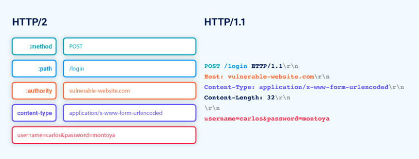
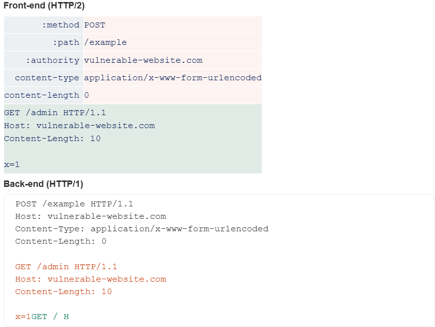
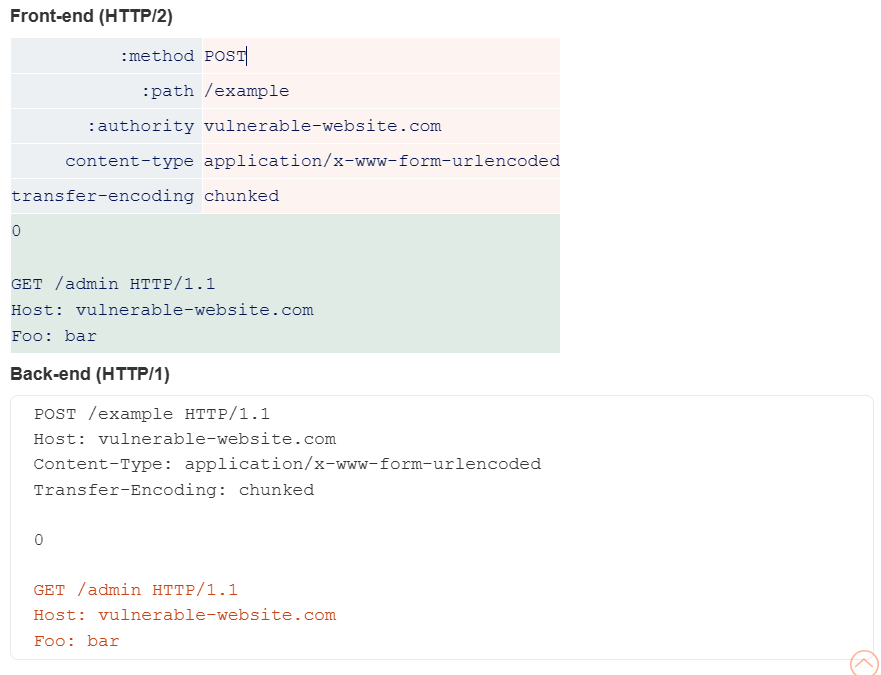
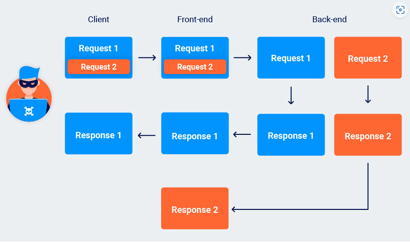
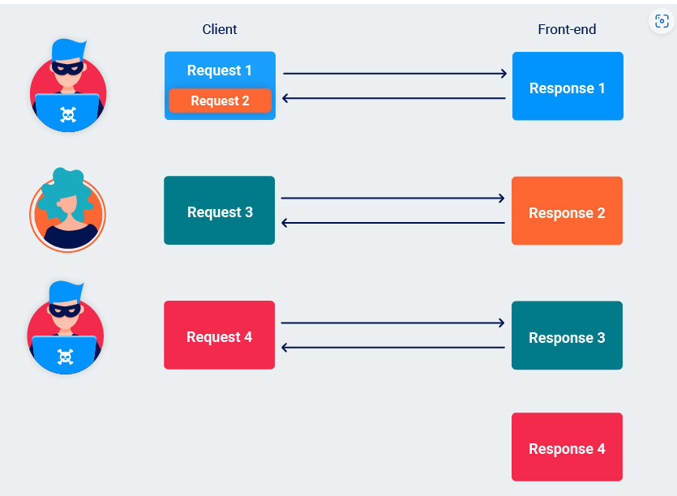
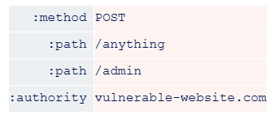
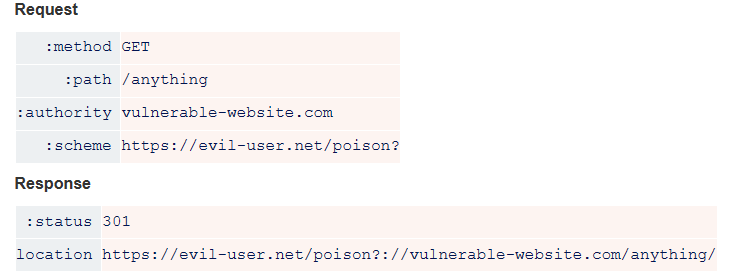
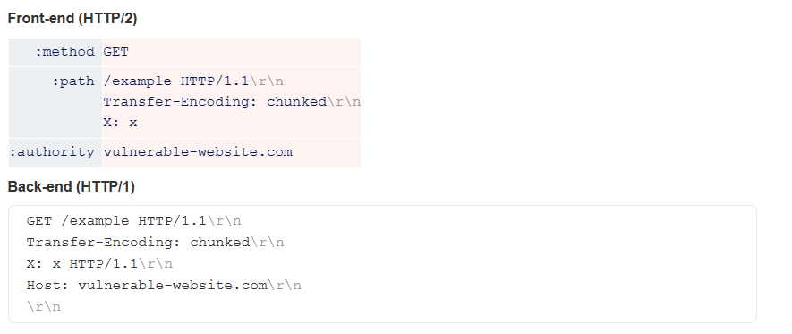

## **HTTP/2 request smuggling**

### **HTTP/2 message length**

- Request smuggling về cơ bản là khai thác sự khác biệt giữa cách các máy chủ khác nhau diễn giải độ dài của yêu cầu. HTTP/2 giới thiệu một cơ chế duy nhất, mạnh mẽ để thực hiện điều này, cơ chế này từ lâu đã được cho là giúp nó vốn dĩ miễn nhiễm với request smuggling.

- Mặc dù bạn sẽ không thấy điều này trong Burp, nhưng các thông báo HTTP/2 được gửi qua dây dưới dạng một loạt các "khung" riêng biệt. Trước mỗi frame là một trường độ dài rõ ràng, trường này cho máy chủ biết chính xác có bao nhiêu byte cần đọc. Do đó, độ dài của yêu cầu là tổng độ dài frame của nó.

- Về lý thuyết, cơ chế này có nghĩa là kẻ tấn công không có cơ hội đưa ra sự mơ hồ cần thiết để request smuggling, miễn là trang web sử dụng HTTP/2 từ đầu đến cuối. Tuy nhiên, trong thực tế, điều này thường không xảy ra do thực tiễn hạ cấp HTTP/2, phổ biến nhưng nguy hiểm.

### **HTTP/2 downgrading**

- HTTP/2 downgrading là quá trình viết lại các yêu cầu HTTP/2 bằng cách sử dụng cú pháp HTTP/1 để tạo ra một yêu cầu HTTP/1 tương đương.
- Các máy chủ web và reverse proxy thường làm điều này để cung cấp hỗ trợ HTTP/2 cho các máy khách trong khi giao tiếp với các máy chủ back-end chỉ nói HTTP/1.
- Thực tiễn này là điều kiện tiên quyết cho nhiều cuộc tấn công được đề cập trong phần này.

- Khi back-end nói HTTP/1 đưa ra phản hồi, máy chủ front-end sẽ đảo ngược quá trình này để tạo phản hồi HTTP/2 mà nó trả về cho máy khách.
  - Điều này hoạt động vì mỗi phiên bản của giao thức về cơ bản chỉ là một cách khác nhau để biểu diễn cùng một thông tin.
  - Mỗi mục trong thông báo HTTP/1 có giá trị tương đương gần đúng trong HTTP/2.

### **H2.CL vulnerabilities**

- Các yêu cầu HTTP/2 không cần phải chỉ định rõ ràng độ dài của chúng trong tiêu đề.
  - Trong quá trình hạ cấp, điều này có nghĩa là các máy chủ front-end thường thêm tiêu đề Độ dài nội dung HTTP/1, lấy giá trị của nó bằng cách sử dụng cơ chế độ dài tích hợp của HTTP/2.
  - Thật thú vị, các yêu cầu HTTP/2 cũng có thể bao gồm tiêu đề độ dài nội dung của riêng chúng.
  - Trong trường hợp này, một số máy chủ front-end sẽ chỉ sử dụng lại giá trị này trong kết quả yêu cầu HTTP/1.

- Thông số kỹ thuật quy định rằng mọi tiêu đề có độ dài nội dung trong yêu cầu HTTP/2 phải khớp với độ dài được tính bằng cơ chế tích hợp, nhưng điều này không phải lúc nào cũng được xác thực đúng cách trước khi hạ cấp.
  - Do đó, có thể smuggle các request bằng cách đưa vào tiêu đề độ dài nội dung gây hiểu lầm.
  - Mặc dù giao diện người dùng sẽ sử dụng độ dài HTTP/2 ngầm định để xác định vị trí kết thúc yêu cầu, nhưng giao diện người dùng HTTP/1 phải tham chiếu đến tiêu đề Độ dài nội dung bắt nguồn từ tiêu đề được chèn của bạn, dẫn đến việc không đồng bộ hóa.

### **H2.TE vulnerabilities**

- Chunked transfer encoding không tương thích với HTTP/2 và thông số kỹ thuật khuyến nghị rằng bất kỳ tiêu đề `transfer-encoding: chunked` nào mà bạn cố gắng đưa vào đều phải bị loại bỏ hoặc yêu cầu bị chặn hoàn toàn.
- Nếu máy chủ front-end không thực hiện được điều này và sau đó hạ cấp yêu cầu đối với một HTTP/1 back-end hỗ trợ mã hóa khối, điều này cũng có thể kích hoạt các cuộc tấn công request smuggling.

### **Response queue poisoning**

- Response queue poisoning là một hình thức tấn công request smuggling mạnh mẽ khiến máy chủ giao diện người dùng bắt đầu ánh xạ các phản hồi từ back-end đến các yêu cầu sai.
- Trong thực tế, điều này có nghĩa là tất cả người dùng của cùng một kết nối front-end/back-end đều được phân phối liên tục các phản hồi dành cho người khác.

- Điều này đạt được bằng cách smuggle một request hoàn chỉnh, do đó gọi ra hai phản hồi từ back-end khi máy chủ front-end chỉ mong đợi một phản hồi.

> `Desynchronizing the response queue`
  
- Khi bạn gửi request smuggling hoàn chỉnh, máy chủ front-end vẫn cho rằng nó chỉ chuyển tiếp một yêu cầu duy nhất. Mặt khác, back-end nhìn thấy hai yêu cầu riêng biệt và sẽ gửi hai phản hồi tương ứng:

- Giao diện người dùng ánh xạ chính xác phản hồi đầu tiên tới yêu cầu "shell" ban đầu và chuyển tiếp yêu cầu này tới máy khách.
- Vì không có thêm yêu cầu nào đang chờ phản hồi, nên phản hồi thứ hai không mong muốn được giữ trong hàng đợi trên kết nối giữa front-end và giao diện người dùng.

- Khi front-end nhận được một yêu cầu khác, nó sẽ chuyển tiếp yêu cầu này đến back-end như bình thường.
- Tuy nhiên, khi đưa ra phản hồi, nó sẽ gửi phản hồi đầu tiên trong hàng đợi, tức là phản hồi còn sót lại cho smuggled request.

- Sau đó, phản hồi chính xác từ back-end sẽ không có yêu cầu phù hợp.
- Chu kỳ này được lặp lại mỗi khi một yêu cầu mới được chuyển tiếp xuống cùng một kết nối tới back-end.

> `Stealing other users' responses`

- Họ không kiểm soát được phản hồi nào họ nhận được vì họ sẽ luôn được gửi phản hồi tiếp theo trong hàng đợi, tức là phản hồi cho yêu cầu của người dùng trước đó.
  - Trong một số trường hợp, điều này sẽ được quan tâm hạn chế. Tuy nhiên, bằng cách sử dụng các công cụ như Burp Intruder, kẻ tấn công có thể dễ dàng tự động hóa quá trình phát hành lại yêu cầu.
  - Bằng cách đó, họ có thể nhanh chóng lấy được nhiều loại phản hồi dành cho những người dùng khác nhau, ít nhất một số trong số đó có khả năng chứa dữ liệu hữu ích.

- Kẻ tấn công có thể tiếp tục đánh cắp các phản hồi như thế này miễn là kết nối front-end/back-end vẫn mở.
  - Thời điểm đóng kết nối chính xác khác nhau giữa các máy chủ, nhưng một mặc định phổ biến là chấm dứt kết nối sau khi nó đã xử lý 100 yêu cầu.
  - Việc đầu độc lại một kết nối mới sau khi kết nối hiện tại bị đóng cũng là chuyện nhỏ.

### **Request smuggling via CRLF injection**

- `Injecting via header names`

- `Supplying an ambiguous host`

- `Supplying an ambiguous path`

- `Injecting a full request line`

- `Injecting a URL prefix`

- `Injecting newlines into pseudo-headers`

### **Browser-powered request smuggling**

- `CL.0 request smuggling`

- Trong ví dụ sau, yêu cầu tiếp theo cho trang chủ đã nhận được phản hồi 404.
- Điều này cho thấy chắc chắn rằng máy chủ back-end diễn giải phần thân của yêu cầu POST (GET /hopefully404...) là phần bắt đầu của một yêu cầu khác.

