# **HTTP request smuggling**

## **HTTP request smuggling là gì?**

- HTTP request smuggling là một kỹ thuật can thiệp vào cách một trang web xử lý các chuỗi yêu cầu HTTP nhận được từ một hoặc nhiều người dùng. Các lỗ hổng HTTP request smuggling về bản chất thường rất nghiêm trọng, cho phép kẻ tấn công vượt qua các biện pháp kiểm soát bảo mật, giành quyền truy cập trái phép vào dữ liệu nhạy cảm và trực tiếp xâm phạm những người dùng ứng dụng khác.

### HTTP request smuggling phát sinh như thế nào

- Đặc điểm kĩ thuật HTTP có 2 cách khác nhau để kết thúc request:
  - Header `Content-Length`: nó chỉ định độ dài của nội dung thư tính bằng byte
  - Header `Transfer-Encoding`: Giá trị "chunked" của trường Transfer-Encoding chỉ ra rằng dữ liệu đang được truyền dưới dạng các khối (chunks) có kích thước động.

- Khi sử dụng mã hóa "chunked", dữ liệu được chia thành các khối nhỏ và gửi theo từng khối. Mỗi khối được gửi đi kèm với thông tin về kích thước của khối đó. Quá trình này cho phép truyền dữ liệu mà không cần xác định kích thước tổng thể của nó trước khi bắt đầu truyền.

```
POST /search HTTP/1.1
Host: normal-website.com
Content-Type: application/x-www-form-urlencoded
Transfer-Encoding: chunked

b
q=smuggling
0
```

## **Cách thực hiện tấn công HTTP request smuggling**

Xem thêm ở [HTTP1 request smuggling](./HTTP1_request_smuggling.md)

## **HTTP/2 request smuggling**

Xem thêm ở [HTTP2 request smuggling](./HTTP2_request_smuggling.md)

## Lab-Exploit

> `Lab: HTTP request smuggling, basic CL.TE vulnerability`

- Ở lab này phía front-end không hỗ trợ Transfer-Encoding. Từ đấy, nó sẽ tạo ra sự bất đồng với phía back-end bằng tấn công như sau:


> `Lab: HTTP request smuggling, basic TE.CL vulnerability`

- Ở lab này phía front-end hỗ trợ Transfer-Encoding. Từ đấy, nó sẽ tạo ra sự bất đồng với phía back-end bằng tấn công như sau:

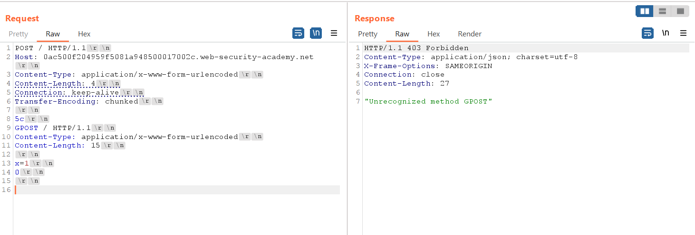

> `Lab: HTTP request smuggling, obfuscating the TE header`

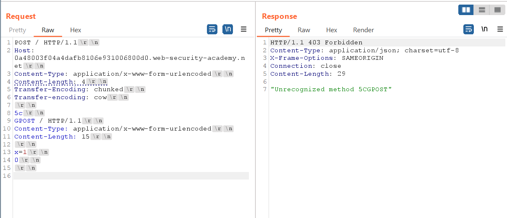

> `Lab: HTTP request smuggling, confirming a CL.TE vulnerability via differential responses`

- Như ta đã thấy với một request thường nó sẽ trả về cho chúng ta với mã 200 OK.

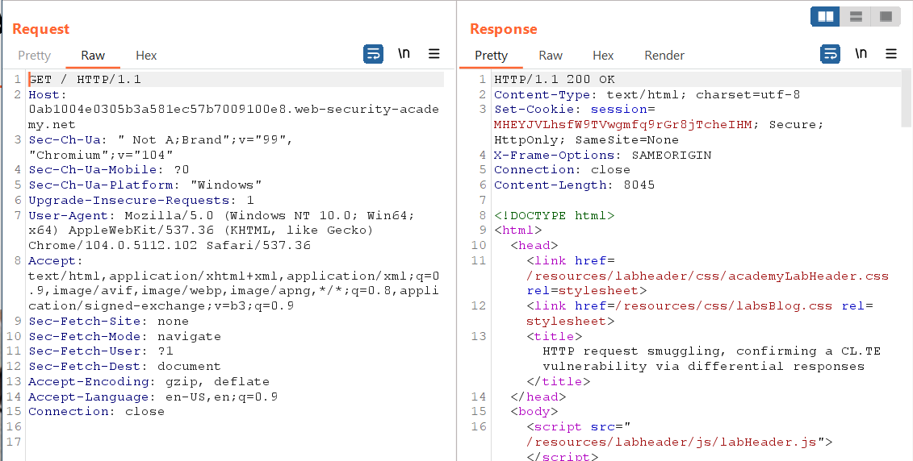

- Còn sau đây, là một request tấn công:

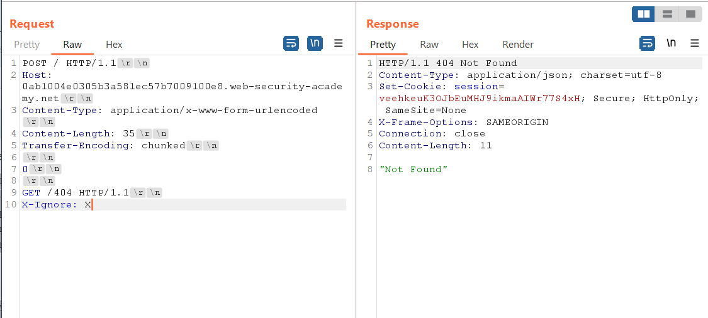

> `Lab: HTTP request smuggling, confirming a TE.CL vulnerability via differential responses`

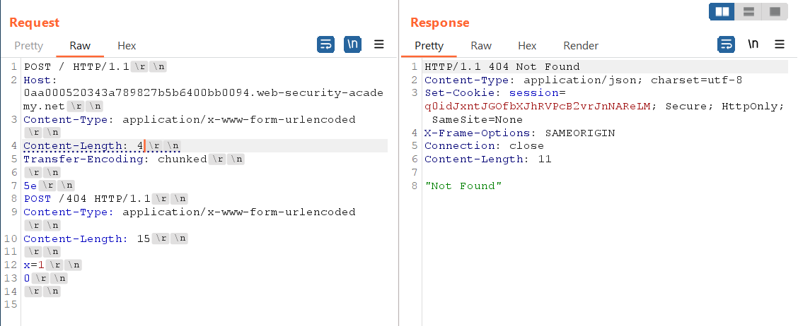

> `Lab: Exploiting HTTP request smuggling to bypass front-end security controls, CL.TE vulnerability`

- Khi tôi thử vào trang web /admin nó đã bị chặn như sau:


- Tôi đã thực hiện bypass access control như sau bằng HTTP request smuggling.

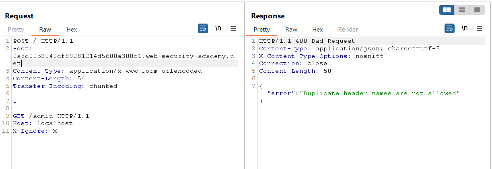

- Và sau đó tôi đã sửa sao cho 2 tiêu đề giống nhau và thực hiện xem trang web dưới quyền admin.

- Mọi người sẽ đặt ra câu hỏi vì sao tôi sử dụng host là local. Vì khi tôi không sử dụng host để tấn công có một thông báo như sau:

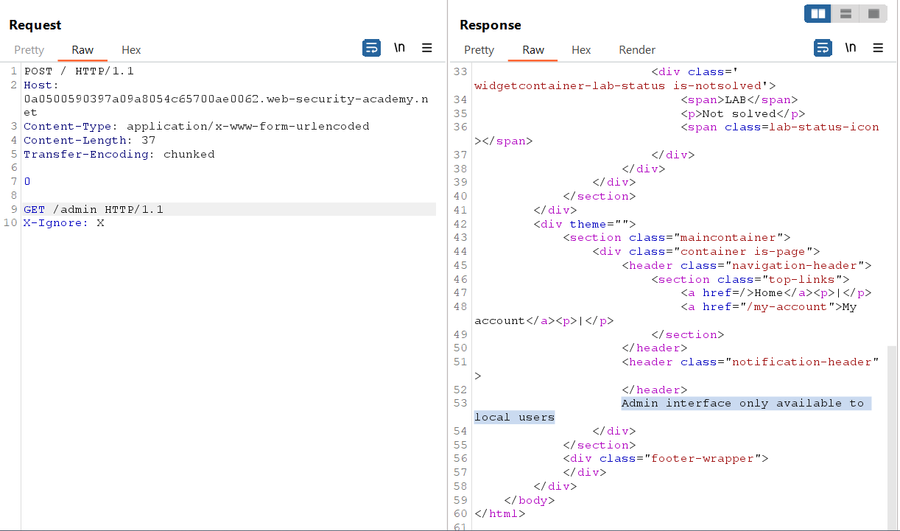

- Nên tôi đã thêm host là localhost và tấn công như sau:

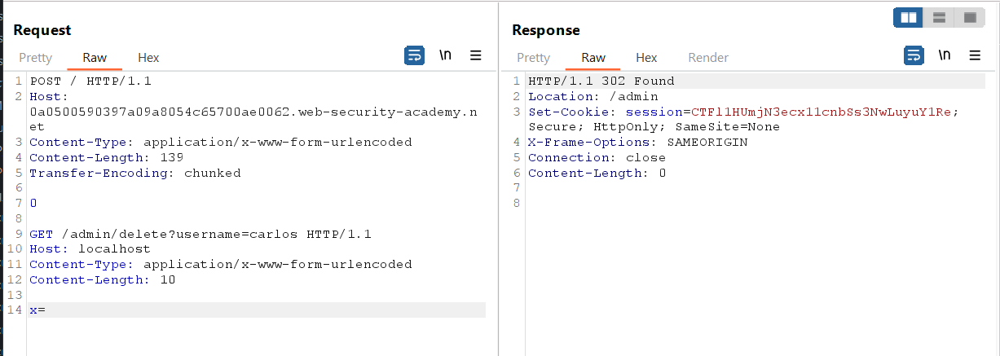

> `Lab: Exploiting HTTP request smuggling to bypass front-end security controls, CL.TE vulnerability`

- Tương tự bài trên ta thực hiện tấn công như sau:

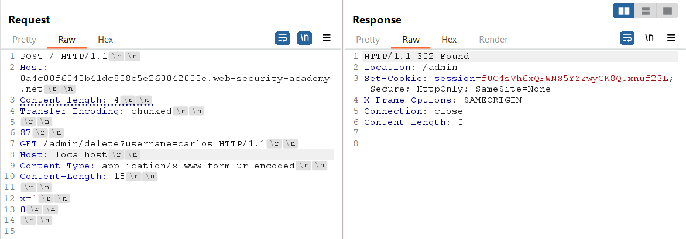

> `Lab: Exploiting HTTP request smuggling to capture other users' requests`

- Ở đây chúng ta có chức năng nhận xét bài blog.

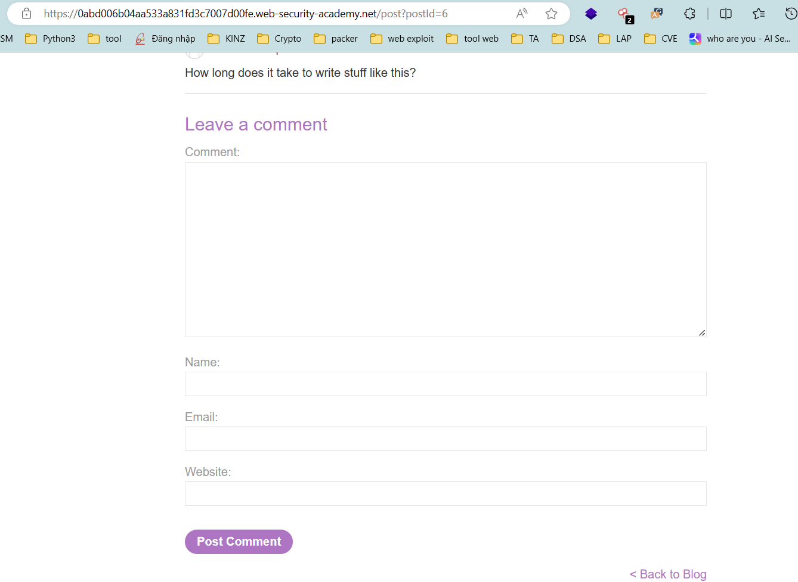

- Bằng kĩ thuật tôi đã giải thích ở trên tôi có thể đánh cắp được phiên người dùng khác một cách như sau:

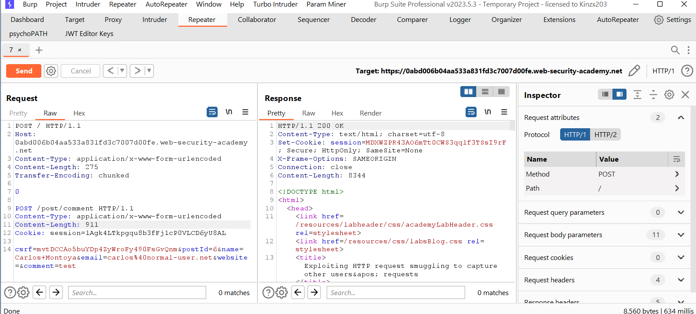

- Khi người dùng khác thực hiện post comment tôi đã có thể đọc được cookie của họ.

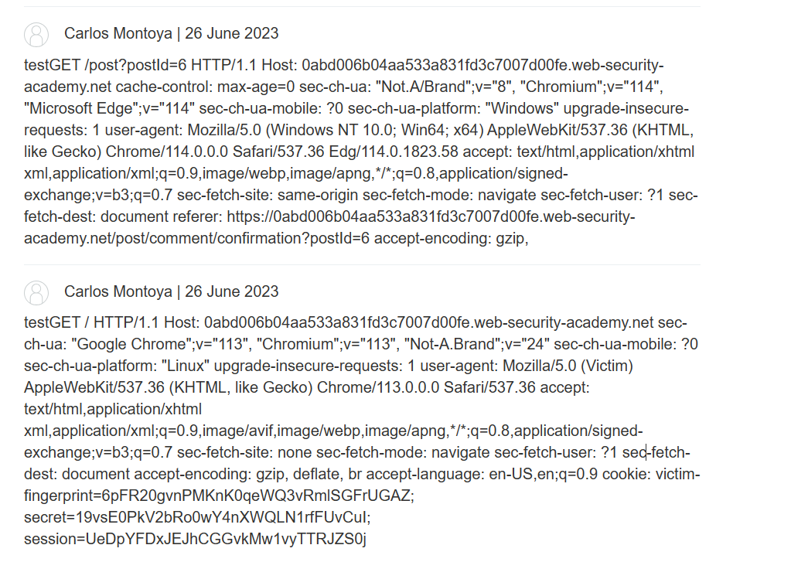

### **Using HTTP request smuggling to exploit reflected XSS**

> `Lab: Exploiting HTTP request smuggling to deliver reflected XSS`

- Bằng kĩ thuật trên tôi cũng có thể tấn công kèm theo payload XSS.

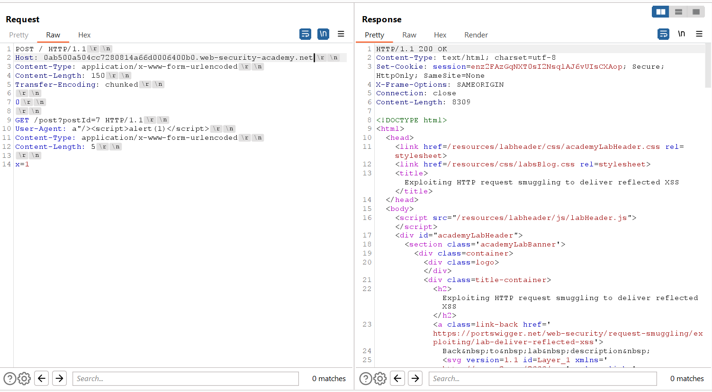


> `Lab: H2.CL request smuggling`

- Ở lab này tôi đã thực hiện tấn công request smuggling sau khi tắt update Content-Length.
- Tôi quan sát phàn hồi và biết rằng phía front-end đã thực hiện chuyển tiếp request.

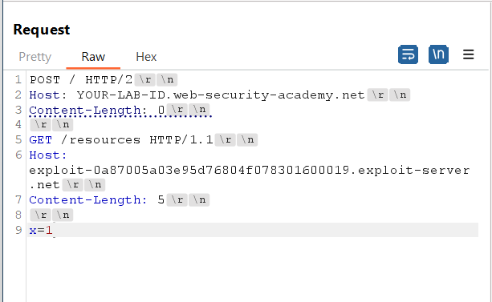

- Tôi đã tạo một trang web vs một payload độc hại và đợi người dùng truy cập vào trang web tôi sẽ lấy được cookie của người dùng.


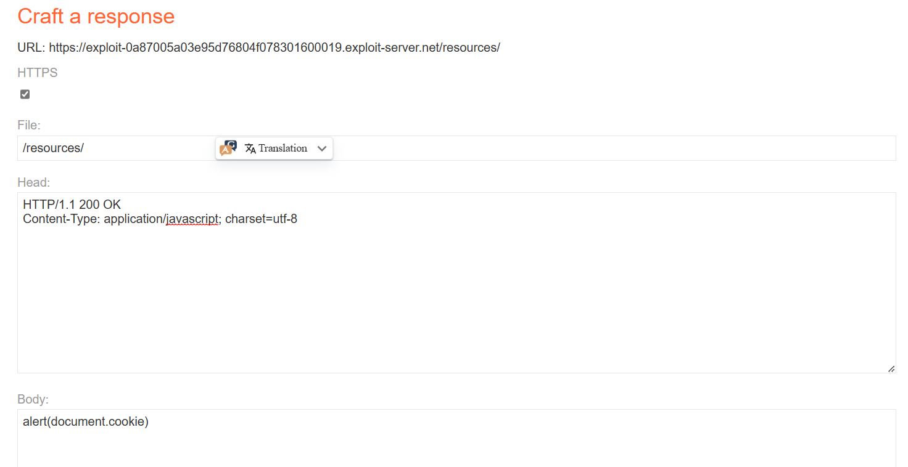

> `Lab: Response queue poisoning via H2.TE request smuggling`

- Ở bài này mục tiêu của chúng ta đánh cắp phản hồi của admin và từ đấy sẽ lấy được cookie của admin và xóa tài khoản người dùng.
- Bằng kĩ thuật giải thích ở trên tôi đã thực hiện tấn công bằng H2 request smuggling.

- Yêu cầu này chuyển một yêu cầu hoàn chỉnh tới server back-end.
  - Lưu ý rằng đường dẫn trong cả hai yêu cầu đều trỏ đến một điểm cuối không tồn tại.
  - Điều này có nghĩa là yêu cầu của bạn sẽ luôn nhận được phản hồi 404.
  - Khi bạn đã đầu độc hàng đợi phản hồi, điều này sẽ giúp bạn dễ dàng nhận ra bất kỳ phản hồi nào của người dùng khác mà bạn đã nắm bắt thành công.

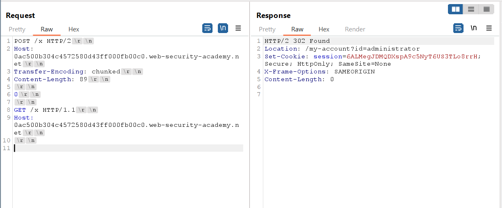


## **Cách phòng chống HTTP request smuggling**

- Sử dụng HTTP/2 end to end và tắt tính năng hạ cấp HTTP nếu có thể. HTTP/2 sử dụng một cơ chế mạnh mẽ để xác định độ dài của yêu cầu và khi được sử dụng từ đầu đến cuối, vốn đã được bảo vệ request smuggling.
- Nếu bạn không thể tránh được việc hạ cấp HTTP, hãy đảm bảo rằng bạn xác thực yêu cầu được viết lại theo thông số kỹ thuật HTTP/1.1. Ví dụ: từ chối các yêu cầu chứa dòng mới trong tiêu đề, dấu hai chấm trong tên tiêu đề và khoảng trắng trong phương thức yêu cầu.
- Đừng bao giờ cho rằng các yêu cầu sẽ không có phần thân. Đây là nguyên nhân cơ bản của cả CL.0 và lỗ hổng giải mã phía client.
- Nếu bạn định tuyến lưu lượng truy cập qua proxy chuyển tiếp, hãy đảm bảo rằng reverse HTTP/2 được bật nếu có thể.
