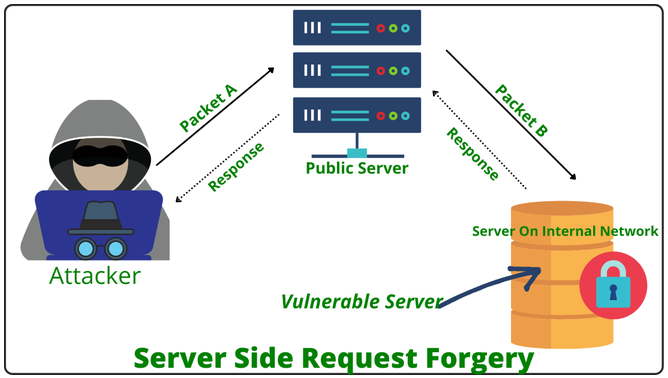
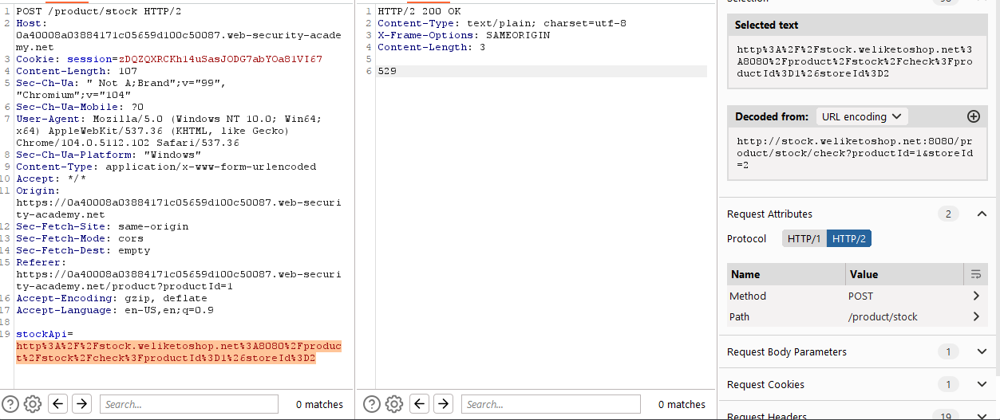
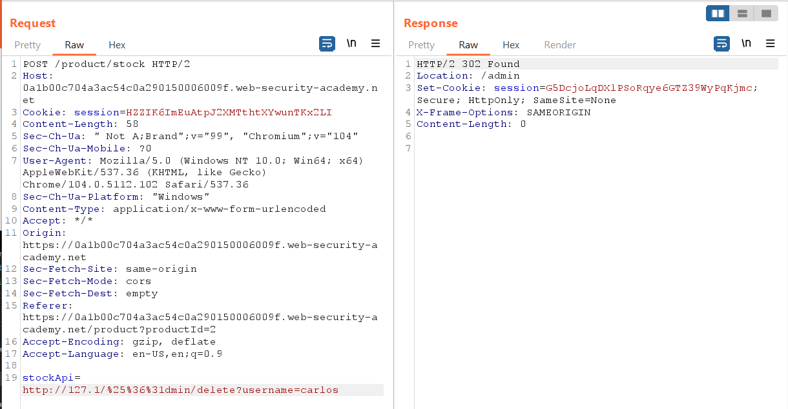
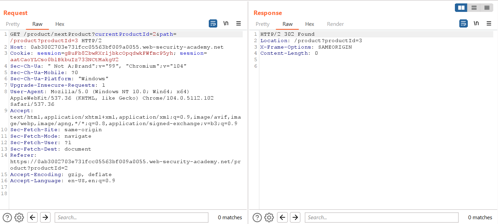
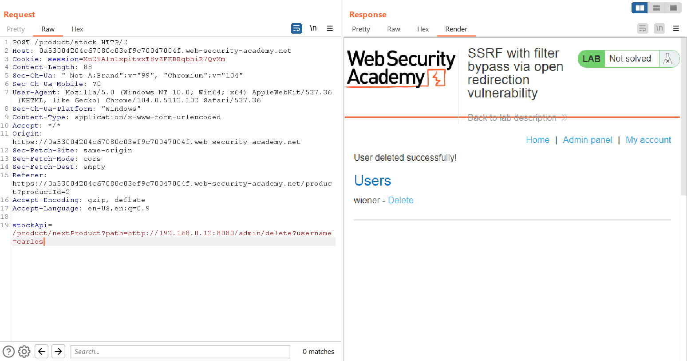
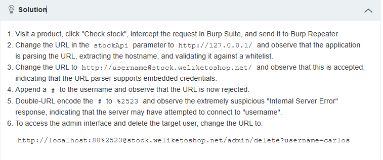
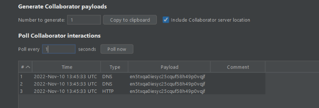

# **Server-side request forgery (SSRF)**

## **SSRF là gì ?**

- Server-side request forgery (thường được gọi là SSRF) là một dạng tấn công trong đó kẻ tấn công lợi dụng một tính năng của server public nhằm truy xuất trái phép dữ liệu từ một trang web chỉ định khác, thường là các trang web back-end ở chính server đó. Để các bạn có thể hình dung rõ hơn về dạng lỗ hổng này, chúng ta cùng xét ví dụ sau:



## **Tác động của các cuộc tấn công SSRF là gì?**

- Một cuộc tấn công SSRF thành công thường có thể dẫn đến các hành động hoặc quyền truy cập trái phép vào dữ liệu trong tổ chức, trong chính ứng dụng dễ bị tổn thương hoặc trên các hệ thống back-end khác mà ứng dụng có thể giao tiếp. Trong một số trường hợp, lỗ hổng SSRF có thể cho phép kẻ tấn công thực hiện lệnh tùy ý.

## **Một số loại tấn công SSRF điển hình**

>### **SSRF tấn công vào chính máy chủ**

- Trong một cuộc tấn công SSRF, kẻ tấn công khiến ứng dụng thực hiện yêu cầu HTTP trở lại máy chủ đang lưu trữ ứng dụng. Điều này thường liên quan đến việc cung cấp một URL có tên máy chủ như 127.0.0.1 (địa chỉ IP dành riêng trỏ đến bộ điều hợp loopback) hoặc localhost (tên thường được sử dụng cho cùng một bộ điều hợp).

- Tôi sẽ đưa ra một ví dụ như sau:


- Đây là một trang web giúp chúng ta tìm xem số lượng hàng hóa còn tồn tại của sản phẩm này khi tôi gửi request để check stock sản phẩm này thì request như sau:



- Nó đã gửi request đến trang và thực hiện check. Vậy tôi sẽ thử thay đổi để gửi đến localhost. Và tôi đã đến dc trang admin và có thể xóa tài khoản người dùng


- Vậy tại sao máy chủ luôn luôn tin tưởng đến máy chủ cục bộ:
  - Access control có thể được triển khai trong một thành phần khác nằm phía trước máy chủ ứng dụng. Khi một kết nối được thực hiện trở lại chính máy chủ, quá trình kiểm tra sẽ bị bỏ qua.
  - Đối với mục đích khắc phục thảm họa, ứng dụng có thể cho phép truy cập quản trị mà không cần đăng nhập đối với bất kỳ người dùng nào đến từ máy cục bộ. Điều này cung cấp một cách để quản trị viên khôi phục hệ thống trong trường hợp họ mất thông tin đăng nhập. Giả định ở đây là chỉ người dùng hoàn toàn đáng tin cậy mới đến trực tiếp từ chính máy chủ.

>### **Các cuộc tấn công SSRF chống lại các hệ thống back-end khác**

- Trong nhiều trường hợp, hệ thống back-end nội bộ chứa chức năng nhạy cảm có thể được truy cập mà không cần xác thực bởi bất kỳ ai có khả năng tương tác với hệ thống.

- Trong ví dụ trước, giả sử có một giao diện quản trị tại URL phía sau <https://192.168.0.185/admin>. Tại đây, kẻ tấn công có thể khai thác lỗ hổng SSRF để truy cập giao diện quản trị bằng cách gửi yêu cầu sau:


## **Vượt qua các biện pháp phòng thủ SSRF phổ biến**

>### **SSRF with blacklist-based input filters**

- Đây là một ví dụ về việc lọc các black list:

```python
from flask import *
import requests

app = Flask(__name__)

@app.route('/ssrf')
def follow_url():
    url = request.args.get('url', '')
    blacklist = ['127.0.0.1', 'localhost']
    for check in blacklist:
        if check in urk:
            return "Attack SSRF detected!"
    return (requests.get(url).text)

if __name__ == '__main__':
    app.run(host = "0.0.0.0", port = 9999)
```

- Một số ứng dụng chặn đầu vào có chứa tên máy chủ như 127.0.0.1 và localhost hoặc các URL nhạy cảm như /admin. Trong tình huống này, bạn thường có thể phá vỡ bộ lọc bằng các kỹ thuật khác nhau:
  - Bypass với domain redirection:

```js
http://spoofed.burpcollaborator.net
http://localtest.me
http://customer1.app.localhost.my.company.127.0.0.1.nip.io
http://mail.ebc.apple.com redirect to 127.0.0.6 == localhost
http://bugbounty.dod.network redirect to 127.0.0.2 == localhost
```

- Bypass với decimal IP location:

```js
http://2130706433/ = http://127.0.0.1
http://3232235521/ = http://192.168.0.1
http://3232235777/ = http://192.168.1.1
http://2852039166/  = http://169.254.169.254
```

- Bypass với rare address:

```js
http://0/
http://127.1
http://127.0.1

```

- Bypass bằng URL encoding:

```js
http://127.0.0.1/%61dmin
http://127.0.0.1/%2561dmin
```

- Tôi đã có một request về localhost và sử dụng path admin nhưng dường như trang web đã cho những điều ấy vào danh sách đen, và tôi đã bypass nó như sau:



> ### **Bypassing SSRF filters via open redirection**

- Đôi khi có thể phá vỡ bất kỳ loại phòng thủ dựa trên bộ lọc nào bằng cách khai thác lỗ hổng chuyển hướng mở.

- Giả sử URL do người dùng gửi được xác thực nghiêm ngặt để ngăn hành vi SSRF có ác ý khai thác. Tuy nhiên, ứng dụng có URL được phép chứa lỗ hổng chuyển hướng mở. Miễn là API được sử dụng để tạo yêu cầu HTTP phía sau hỗ trợ chuyển hướng, bạn có thể tạo một URL đáp ứng bộ lọc và dẫn đến yêu cầu được chuyển hướng đến mục tiêu phía sau mong muốn.



- Ở đây chúng ta đã thấy có một chức năng chuyển tiếp sản phẩm và nó sẽ lọc theo path vậy chúng ta có thể bypass nó đến admin.



> ### **SSRF và bypass white-based input filters**

- Bên cạnh sử dụng black list, một số trang web sử dụng white list gồm các phần tử bắt buộc phải xuất hiện trong các tham số. Việc sử dụng white list thường mang lại hiệu quả tốt hơn black list, tuy nhiên các nhà phát triển cần cập nhật white list liên tục mỗi khi có chức năng hoặc các phần tử mới cần bổ sung. Việc cài đặt cơ chế ngăn chặn dựa theo white list vẫn có khả năng bị kẻ tấn công vượt qua bởi các ký tự có chức năng đặc biệt trong URL.

```python
from flask import *
import requests

app = Flask(__name__)

@app.route('/ssrf')
def follow_url():
    url = request.args.get('url', '')
    whitelist = ['google.com', 'youtube.com']
    check = 0
    for i in whitelist:
        if i in url:
            check = 1
    if check:
        return (requests.get(url).text)
    else:
        return ("SSRF Attack detected!")

if __name__ == '__main__':
    app.run(host = "0.0.0.0", port = 1234)
```

- Thực hiện bằng các ký tự đặc biệt như @, #, &, .. Kết quả sau đúng với phần lớn các ứng dụng web:
  - <https://expected-host@evil-host>
  - <https://evil-host#expected-host>
  - <https://expected-host.evil-host>



## **Cách kiểm tra lỗ hổng SSRF**

- Một trong những phương pháp kiểm tra phổ biến và đơn giản nhất chính là kỹ thuật out-of-band (OAST). Trong bài viết này tôi sẽ trình bày kỹ thuật với công cụ Burp Collaborator.




## **Cách ngăn chặn lỗ hổng SSRF**

- Kiểm tra các thông tin phản hồi cho người dùng: Thay vì trực tiếp phản hồi các thông tin yêu cầu từ người dùng, chúng ta nên có thêm các bước kiểm tra tính hợp lệ của thông tin, nguồn thông tin và nội dung thông tin.
- Thống nhất các thông báo lỗi, hạn chế kẻ tấn công dựa vào sự khác nhau giữa các thông báo lỗi khai thác thông tin hữu ích.
- Áp dụng kết hợp các biện pháp ngăn chặn lỗ hổng SSRF như blacklist-based, whitelist-based, block IP có dấu hiệu lạ, ...
- Ngăn chặn các wrapper không cần thiết, chẳng hạn file://, gopher://, <ftp://>, ...
