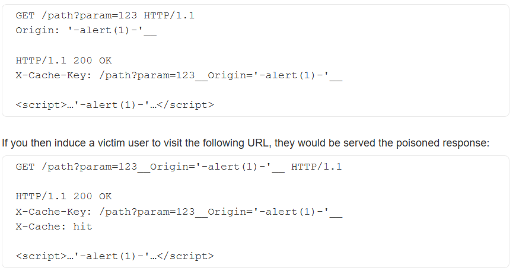
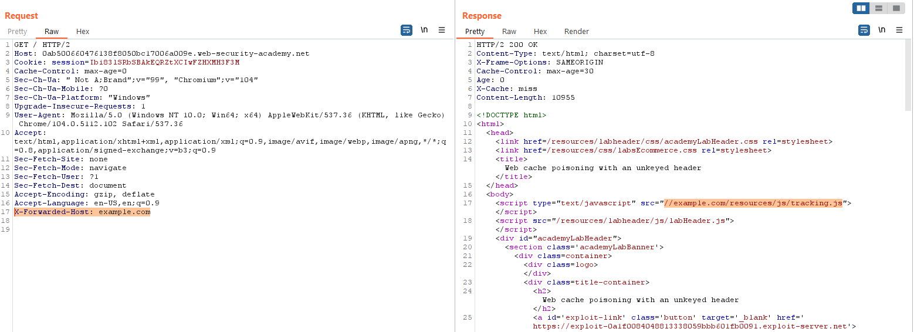
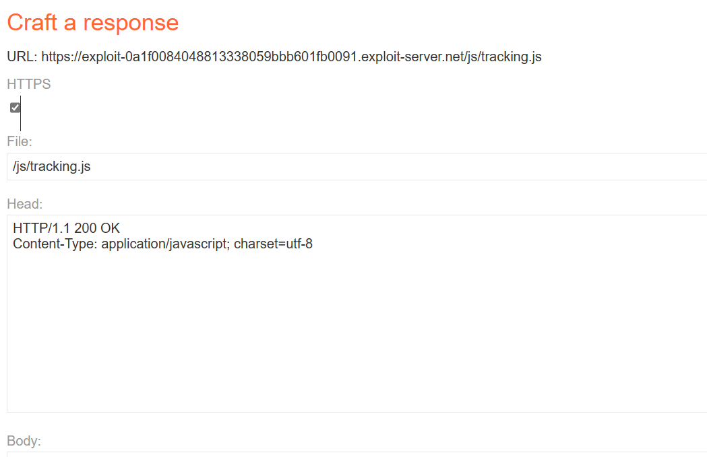
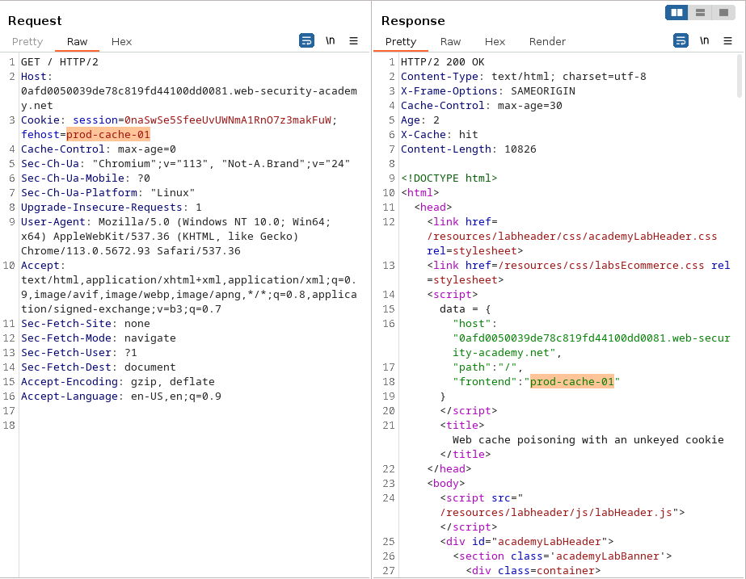
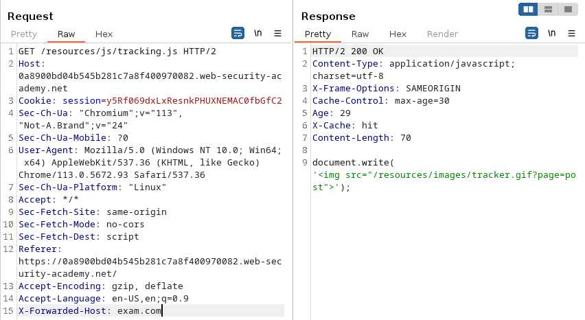
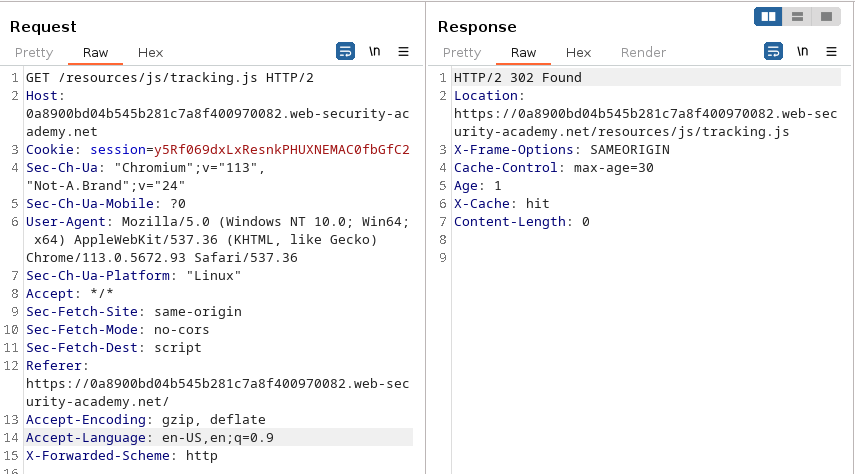
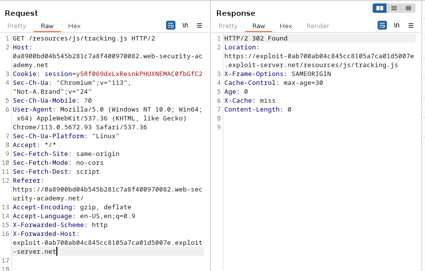

# **Web cache poisoning**

## **Web cache poisoning là gì?**

- Web cache poisoning là một kĩ thuật nâng cao, kẻ tấn công khai thác hành vi của server web và bộ đệm để gửi phản hồi HTTP có hại cho người dùng khác.

- Về cơ bản, Web cache poisoning bao gồm 2 giai đoạn:
  - Đầu tiên, kẻ tấn công phải tìm ra phản hồi từ server.
  - Cần đảm bảo rằng phản hồi của họ được lưu trong bộ nhớ cache và sau đó được gửi tới nạn nhân dự kiến.

## **Cách hoạt động của Web cache**

- Nếu một server phải gửi phản hồi mới cho từng yêu cầu HTTP riêng lẻ, điều này có thể sẽ làm server quá tải dẫn đến các vấn đề về độ trễ và trải nghiệm người dùng kém, đặc biệt là trong thời gian bận rộn.
- Bộ nhớ đệm chủ yếu là một phương tiện để giảm các vấn đề như vậy.


- Bộ đệm nằm giữa server và người dùng. Nơi nó lưu các phản hồi yêu cầu cụ thể, thường được lưu trữ một thời gian cố định.
- Nếu một người dùng khác gửi yêu cầu tương đương, thì bộ nhớ đệm chỉ cần cung cấp phản hồi đã lưu trước đó.
- Bộ đệm kiểm tra yêu cầu có tương đương với yêu cầu đã lưu trong cache hay không bằng cách so sánh các `Cache keys`.

## **Xây dựng một cuộc tấn công Web cache poisoning**

### **Xác định và đánh giá unkeyed inputs**

- Bất kì 1 cuộc tấn công bộ đệm nào đều dựa vào `unkeyed inputs`, chẳng hạn như `headers`.
- Bộ đệm đều bỏ qua các `unkeyed inputs` khi quyết định có cung cấp phản hồi được lưu trong bộ nhớ cache hay không.
- Hành vi này có nghĩa là bạn có thể sử dụng chúng để đưa vào payload của mình và tạo ra phản hồi "cache poisoning", nếu được lưu vào bộ đệm ẩn nó sẽ được phân phát cho tất cả người dùng yêu cầu có cache keys phù hợp.
- Do đó, bước đầu tiên khi xây dựng một cuộc tấn công web cache poisoning là xác định các `unkeyed inputs` được server hỗ trợ.

### **Khai thác phản hồi có hại từ back-end server**

- Khi bạn đã xác định được `unkeyed inputs`, bước tiếp theo là đánh giá chính xác cách trang web xử lý input đó.
- Hiểu điều này là điều cần thiết để khai thác thành công một phản hồi có hại.
- Nếu một input được phản ánh trong phản hồi từ server mà không được làm sạch đúng cách hoặc được sử dụng để tạo động dữ liệu khác, thì đây là một đầu vào tiềm ẩn cho Web cache poisoning.

- Việc phản hồi có được lưu vào bộ đệm ẩn hay không có thể phụ thuộc vào tất cả các loại yếu tố, chẳng hạn như phần mở rộng tệp, loại nội dung, path, mã trạng thái và tiêu đề phản hồi.
- Có thể bạn sẽ cần dành một chút thời gian đơn giản là để giải quyết các yêu cầu trên các trang khác nhau và nghiên cứu cách thức hoạt động của bộ nhớ cache.
- Sau khi tìm ra cách nhận biết phản hồi được lưu trong bộ nhớ đệm có chứa input độc hại của bạn, bạn đã sẵn sàng triển khai khai thác cho các nạn nhân tiềm năng.

## **Cách ngăn chặn lỗ hổng Web cache poisoning**

- Cách dứt khoát để ngăn chặn Web cache poisoning rõ ràng là vô hiệu hóa hoàn toàn bộ nhớ đệm.

- Vô hiệu hóa các header không cần thiết để trong trang web.

## **Khai thác lỗ hổng Web cache poisoning**

### **Exploiting cache implementation flaws**

#### Phương pháp thăm dò bộ đệm:
- Xác định một oracle cache phù hợp. `Cache oracle` là một trang hoặc một endpoint cung cấp phản hồi về hành vi của bộ đệm. Nó cần phải "cacheable" và phải cho biết nơi bạn nhận được cache response hoặc phản hồi trực tiếp từ server .
    - `An HTTP header that explicitly tells you whether you got a cache hit`
    - `Observable changes to dynamic content`
    - `Distinct response times`

- Probe key handling:
  - Đối với mỗi trường hợp mà bạn muốn kiểm tra, gửi hai yêu cầu tương tự và so sánh các phản hồi. Để xác định xem yếu tố nào được loại khỏi cache key

- Identify an exploitable gadget:
  - Các tiện ích này thường là các lỗ hổng cổ điển phía client side.

#### Khai thác các lỗi cache keys:
  - `Unkeyed port`
  - `Unkeyed query string`:

## **LAB Web cache poisoning**

> `Lab: Web cache poisoning via an unkeyed query string`

- Trong một số trường hợp, có thể chèn payload độc hại vào tham số truy vấn và lưu vào cache response từ server, nếu tham số truy vấn là `unkeyed` và được phản ánh trong phản hồi.
- Sau đó, người dùng sẽ nhận được phản hồi bị đầu độc nếu họ gửi yêu cầu phù hợp mà không có chuỗi truy vấn.

- Phương pháp này chuyển reflected XSS thành stored XSS vì cuộc tấn công là một kiểu XSS và script được lưu trong bộ nhớ cache của web.
- Mặc dù phương pháp này có thể dễ dàng bị phát hiện khi được thực hiện trực tiếp, nhưng có thể tránh bị phát hiện trong các tình huống phức tạp hơn nhiều.

- Các bước để thực thi tấn công:
  - Chèn các tham số truy vấn tùy ý vào URL request.
  - Quan sát xem các tham số được đưa vào của bạn được phản ánh lại trong phản hồi khi yêu cầu bị cache miss.
  - Chèn một truy vấn tùy ý để thoát khỏi chuỗi được phản ánh và thêm payload XSS.


### Unkeyed query parameters

> `Lab: Web cache poisoning via an unkeyed query parameter`

- Một số trang web loại trừ query string hoàn chỉnh khỏi cache key.
- Tuy nhiên, một số trang web loại trừ các tham số truy vấn không liên quan đến chương trình back-end, chẳng hạn như các tham số để theo dõi hoặc quảng cáo.
- Các tham số UTM như utm_content là mục tiêu tuyệt vời để kiểm tra lỗ hổng này ([**Utm_tracking**](https://bkhost.vn/blog/utm-tracking/))

- Các bước để thực thi tấn công:
  - Chèn các tham số truy vấn tùy ý `utm_content=abc123` vào URL yêu cầu.
  - Quan sát xem các tham số được đưa vào của bạn được phản ánh lại trong phản hồi khi yêu cầu bị cache miss.
  - Chèn một truy vấn tùy ý để thoát khỏi chuỗi được phản ánh và thêm payload XSS.


### Cache parameter cloaking (Che giấu tham số bộ đệm)

- Nếu bạn có thể tìm ra cách bộ đệm phân tích cú pháp URL để xác định và xóa các tham số không mong muốn, thì bạn có thể tìm thấy một số điểm thú vị.

> `Lab: Parameter cloaking`

- Chèn tham số utm_content và gửi yêu cầu.


- Như ta đã thấy việc thực hiện cache poisoning ở đây dường như không thể
- Sử dụng công cụ Param miner, phát hiện ra script /js/geolocate.js có sử dụng web cache


- Thực hiện tấn công với payload xss
- Cả dấu và (&) và dấu chấm phẩy (;) đều được coi là dấu phân cách
    


### Exploiting fat GET support

- Trong một số trường hợp, method HTTP sẽ là `unkeyed`. Ví dụ:

```
GET /?param=innocent HTTP/1.1
Host: innocent-website.com
X-HTTP-Method-Override: POST
...
param=bad-stuff-here
```

- Kẻ tấn công có thể đưa một payload độc hại vào yêu cầu GET, vì nội dung yêu cầu không được bao gồm trong cache key nên phản hồi sẽ được lưu vào bộ đệm.
- Sau đó, nếu một người dùng hợp pháp thực hiện một yêu cầu GET thông thường khớp với cùng một cache key, họ sẽ nhận được phản hồi bị đầu độc từ bộ đệm.

> `Lab: Web cache poisoning via a fat GET request`

- Trong Burpsuite, điều hướng đến HTTP History, quan sát GET /js/geolocate.js?callback=setCountryCookie và gửi nó đến tab Repeater.
- Tự động hóa quy trình này với parameter miner, nhấp chuột phải vào < parameter miner < select fat GET scan.


### Normalized cache keys

- Hành vi này có thể cho phép bạn khai thác các lỗ hổng XSS.
- Nếu bạn gửi một yêu cầu độc hại bằng Burp Repeater, bạn có thể đầu độc bộ đệm bằng payload XSS chưa được mã hóa.
- Khi nạn nhân truy cập URL độc hại, payload sẽ vẫn được trình duyệt của họ mã hóa URL
- Tuy nhiên, sau khi URL được chuẩn hóa bởi bộ nhớ cache, nó sẽ có cùng cache key với phản hồi chứa payload chưa được mã hóa của bạn.

### Cache key injection

- Các thành phần có key thường được nhóm lại với nhau thành một chuỗi để tạo cache key.
- Nếu bộ nhớ đệm không thực hiện thoát các dấu phân cách giữa các thành phần đúng cách, bạn có khả năng khai thác hành vi này để tạo hai yêu cầu khác nhau có cùng cache key.



> `Lab: Cache key injection`

- Chèn utm_content vào param và quan sát phản hồi.


- Quan sát `/js/localize.js.` Ta biết được trang web có sử dụng web cache. Thực hiện cache injection


### Using web cache poisoning to exploit unsafe handling of resource imports

- Một số trang web sử dụng `unkeyed headers` để tự động tạo URL nhập tài nguyên, chẳng hạn như tệp JavaScript được lưu trữ bên ngoài.
- Trong trường hợp này, nếu kẻ tấn công thay đổi giá trị của `unkeyed headers` phù hợp thành domain mà chúng kiểm soát, thì có khả năng thao túng URL để trỏ đến tệp JavaScript độc hại.

> `Lab: Web cache poisoning with an unkeyed header`

- Gửi yêu cầu và quan sát thấy rằng tiêu đề X-Forwarded-Host đã được sử dụng để tạo động một URL tuyệt đối để nhập tệp JavaScript được lưu trữ tại /resources/js/tracking.js.



- Thực hiện khai thác qua url kẻ tấn công




### Using web cache poisoning to exploit cookie-handling vulnerabilities

- Lỗi xử lý cookie bằng bộ đệm cũng có thể bị khai thác bằng cách sử dụng các kỹ thuật Web cache poisoning.
- Tuy nhiên, trên thực tế, vectơ này tương đối hiếm so với header-based Web cache poisoning.
- Khi tồn tại các lỗ hổng cookied-based Web cache poisoning, chúng có xu hướng được xác định và giải quyết nhanh chóng do người dùng hợp pháp đã vô tình đầu độc bộ đệm.

> `Lab: Web cache poisoning with an unkeyed cookie`

- Chúng ta sẽ thấy rằng cookie được phản ánh trong phản hồi, từ đó chúng ta sẽ thực hiện XSS vào và để `X-cache:hit`




> `Lab: Web cache poisoning with multiple headers`

- Khi tôi thực hiện `X-Forwarded-Host`, quan sát thì tôi không thấy bất kì điều gì xảy ra.



- Khi tôi thực hiện `X-Forwarded-Schema`, tôi thấy trang web đã bắt tôi chuyển hướng tới https.



- Từ đấy, tôi đã thực hiện tấn công để trang web có thể lấy từ trang web độc hại.


